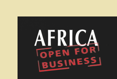
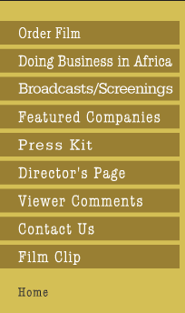
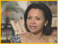
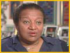
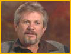
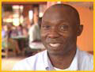

 
 
 
 
 
 

**
New Films**

 

 

|     |     |     |
| --- | --- | --- |
| **Featured Companies ** |     |     |
| **RUFF ‘N’ TUMBLE Adenike Ogunlesi, Founder**    "We don’t export now. Export to the West African coast, yes, all along the West African coast, yes, but to say, America or to England, I’m not interested in it at all. If 40 percent of the 120 million people in Nigeria are children, I have the potential of a huge market here.**" RUFF ‘N’ TUMBLE 23A Isaac John Street, G.R.A. Ikeja Lagos Nigeria Tel. 234 1 270 0817 Fax: 234 1 497 2010 Mobile: 234 (0)803 436 5507 [ruffntumblekids@yahoo.com](https://mail.google.com/mail/?view=cm&fs=1&tf=1&to=ruffntumblekids@yahoo.com) [adenikernt@yahoo.com](http://www.africaopenforbusiness.com/mailtoadenikernt@yahoo.com)** ** HFC BANK GHANA LTD Stephanie Baeta Ansah, Managing Director**  **(recently retired)**     "HFC Bank Ghana limited is the largest provider of housing finance in Ghana today, and we became listed on the Ghana Stock Exchange in 1995. We have a track record of paying dividends every year since our establishment." **Edusel Derkyl, Deputy Managing Director ****(recently retired)**   "The market is just phenomenal. The last census in 2000 puts the housing unit deficit at around 900,000. The mass market is not being addressed by the estate developers. They are all going for the up-market, high margin houses."  **HFC BANK GHANA LTD 35, Sixth Avenue North Ridge Accra Ghana Tel. 233 (21) 242 0904 Fax: 233 (21) 242 095  [http://www.hfcbank-gh.com](http://www.hfcbank-gh.com/)** ** HOMEGROWN Richard Fox, Managing Director**    "Homegrown is a Kenyan company. It’s unusual in the respect that it is a business that started in Africa and then has expanded outside of Africa. It started with about 250 kilos of French beans in 3 kilo boxes and has developed now into exports of flowers and vegetables of around 13,000 tons a year, roughly 40 tons every night all to the UK supermarkets.**" FLAMINGO UK LTD (Homegrown parent company) Unit D Cockerill Close Stevenage SG1 2NB United Kingdom Tel. (UK) 44(0)1438 375 000 Tel. (Kenya) 254 2 387 3800 [www.f-h.biz](http://www.f-h.biz/)** ** SHINING CENTURY Jennifer Chen, Managing Director**    "In 1989, there were few factories in this area. And now, the textile garment industry employs about 50,000 workers, through AGOA, Africa Growth Opportunity Act. It’s a trade agreement for duty free, quota free for the products from the Sub-Saharan countries to America. Lesotho is the top one for export to the US market." **SHINING CENTURY Site No. 9 Maseru Industrial Area PO Box 15507 Maseru 100 Lesotho Tel. 266 (0) 2232 1823 Tel. 266 (0) 2232 1877 [jennifer.chen@carrywealth.com](https://mail.google.com/mail/?view=cm&fs=1&tf=1&to=jennifer.chen@carrywealth.com)** ** PICTOON Pierre Sauvalle, Artistic Director    ** "Pictoon is the only animation design studio in Africa that produces television series and feature films. Our goal is to produce for the international market while respecting the international standards for quality, just like the studios in Asia, the United States and Europe."  **Aida Ndiaye, Executive Producer    **"We were very, very proud of our first film, but now, for us, it is something accomplished. Animation has been done in Africa. It’s a reality."**  PICTOON BP 17123 Dakar, Senegal Tel. 221 820 8742 [pictoon@sentoo.sn](https://mail.google.com/mail/?view=cm&fs=1&tf=1&to=pictoon@sentoo.sn)** ** SCHACHTER & NAMDAR BOTSWANA, LTD. Willie Conradie, Production Manager    **"Schachter and Namder bought this company in Botswana in 1998. The factory wasn’t productive at all at that time. They started training people and now, we have 271 people working here. We do approximately 300 stones, polished stones a day, almost two thousand karats a month."** SCHACHTER & NAMDAR BOTSWANA, LTD. Private Bag. 0024 Molepolole Botswana Tel. 267 592 0815 Tel. 267 320 815 Fax 267 592 1159** ** 1000 CUPS COFFEE HOUSE Michael Kijjambu, Owner **   "In the second year I saw the business growing and growing. I had to do a lot of field work, going out to hotels, restaurants, up-market, whatever, trying to educate them. That’s when we started introducing the flavored coffees and the specialty coffees. These do appeal to the young, free-spending Ugandans."  **1000 CUPS COFFEE HOUSE Plot 18 Buganda Rd PO Box 6563 Kampala Uganda 256 (0)77 505 619 256 (0)78 254 4313 [coffeestm@hotmail.com](https://mail.google.com/mail/?view=cm&fs=1&tf=1&to=coffeestm@hotmail.com)** **TOUCH ADVENTURE Ndaba Ndlovu, Managing Director**   "Touch Adventure is a very small, dynamic company. We emphasize on what we call hardcore adventure activities, white water rafting which happens to be our main product. We also have the soft-core adventure activities."** TOUCH ADVENTURE (Livingstone Way & Parkway Dr.) P.O. Box CT112 Victoria Falls Zimbabwe Tel: 263 13 40073/5 Tel/Fax: 263 13 40075 Cell: 263 11 209 746 [http://www.touchadventure.com](http://www.touchadventure.com/) Reservations: [res@touchadventure.com](https://mail.google.com/mail/?view=cm&fs=1&tf=1&to=res@touchadventure.com) Enquiries: [info@touchadventure.com](https://mail.google.com/mail/?view=cm&fs=1&tf=1&to=info@touchadventure.com)** ** DAALLO AIRLINES**  **Mohammed Yassin Olad, CEO    **"We started in 1991 after the collapse of Somali government and the collapse of Somali airlines after the war started in Somalia and the people were in real need for air transportation. That’s when we started Daallo Airlines. When we started there wasn’t anyone and now there are five carriers in Somalia competing in that market."** DAALLO AIRLINES Executive Office: Free Zone (FLC) Dubai Airport Dubai UAE Tel. 971 4 299 4485 Fax 971 4 299 4486 Sales Office: Tel: 971 4 273 3808 Fax: 971 4 273 4464 Email: [gm@daallo.com](https://mail.google.com/mail/?view=cm&fs=1&tf=1&to=gm@daallo.com) Web: [www.daallo.com](http://www.daallo.com/)** ** VODACOM CONGO Alieu Conteh, Chairman    **"We are number one in Congo. We have forty-nine percent market share. The week that we launched we had 35,000 people lineup. At two years of operation we are about 850,000 subscribers. We realized that the mama in the market, going around selling bananas, she has about ten or twelve dollars worth of bananas. If that lady were able to buy a scratch card for two dollars we’d revolutionize the market. When we did the two dollar card our sales tripled."  **VODACOM CONGRO SPRL Contact: Mrs. Baba Bond Monsheju Tel: 243 81 444 0182 Fax: 243 81 313 1600 Email: [baba.bondiu@vodacom.cd](https://mail.google.com/mail/?view=cm&fs=1&tf=1&to=baba.bondiu@vodacom.cd) Web: [http://www.vodacom.cd](http://www.vodacom.cd/)** **  ****  ** |
| [Watch the Trailer](http://africaopenforbusiness.com/linkchangenotice.html) © Carol Pineau, 2008 |

 
