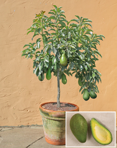

|     |
| --- |
| [Home](http://www.logees.com/default.asp)  > [Fruiting Plants](http://www.logees.com/Fruiting-Plants/departments/474/) > [Tropical Fruits](http://www.logees.com/Tropical-Fruits/products/461/) |

|     |
| --- |
| # Avocado ‘Day’ (Persea americana) |

 

 [***View Large Image***](#)

|     |
| --- |
| Item Number: R2129-6G |
|  |
|     |
|  Review Average: |
|  Number of Reviews: 2 |
|     |
|  [**View Reviews**](http://www.logees.com/Avocado-Day-Persea-americana/productinfo/R2129-6G/#reviews) \| [**Review this item**](http://www.logees.com/writeReview.asp?number=R2129-6G) |
|     |
| Unit Price: $39.95 |
|     |
| In Stock |
|     |
|     |
|     |
| Quantity |
|     |
|     |

|     |
| --- |
|  Detailed Description |
| **Avocado ‘Day’ (Persea americana)** Our ‘Day’ avocado is by far the easiest avocado to fruit in a pot. Plants will fruit at about 3 feet in height and will produce a medium-sized tapered-neck avocado that is easy to peel and has a delicious, buttery sweet taste. The fruit will hold on the plant for six months with ripening occurring from July to September. Another plus for ‘Day’ is its cold tolerance taking temperatures down into the low twenties. We sell grafted plants that will start bearing fruit in 2 to 3 years. **Hardy to Zone 9 and higher for outdoors.** Full sun, grows to 4-6' in container, minimum temperature indoors 40°, Spring bloomer. [Persea Plant Care](http://www.logees.com/ftg/Persea.pdf) |

|     |
| --- |
|  Product Reviews[*Click here to review this item*](http://www.logees.com/writeReview.asp?number=R2129-6G) |
|     | **My Pride and Joy** |
| Recd this plant the ending of May 2012. I was so surprised with the packing for it came in such good condition with no problem. I planted it the last week of May and it is already 3 tall with lots of branches. The only reason I havent given it a 5 Star rating was because I still have to wait for the tree to fruit. I cant wait!!!!!! Love it and is purchasing another one. |
| *- Annette, HI* |
|     |
|     | **hardy plant** |
| The plant i purchased was from the Logees retail store. It looked and was extremely healthy. It traveled with me 2hrs home and became a little stress after transplanting and adapting to the new climate of my house. The top half began to turn black and die off. I was beside my self with grief. I trimmed off the dead stuff and the plant came back! It is a beautiful and hardy plant. I am so happy i invested this plant in to my collection. |
| *- Ashley, CT* |
|     |

 Recently Viewed Items

|  |
|  |