**Your cart is empty.**

|     |     |     |     |     |
| --- | --- | --- | --- | --- |
|  |  |  |  |     |

|     |
| --- |
|  |

- [Aromatherapy](http://www.ktbotanicals.com/aromatherapy-c-41.html)
- [Beta Testing and R&D Products](http://www.ktbotanicals.com/beta-testing-and-rd-products-c-295.html)
- [Books, Media and Posters](http://www.ktbotanicals.com/books-media-and-posters-c-10.html)
- [Bulk Herbal Extracts](http://www.ktbotanicals.com/bulk-herbal-extracts-c-130.html)
- [Capsule Makers & Capsules](http://www.ktbotanicals.com/capsule-makers-capsules-c-86.html)
- [Clearance Products](http://www.ktbotanicals.com/clearance-products-c-136.html)
- [Donations](http://www.ktbotanicals.com/donations-c-109.html)
- [Ethnobotanicals](http://www.ktbotanicals.com/ethnobotanicals-c-1.html)
- [Extracts](http://www.ktbotanicals.com/extracts-c-4.html)
- [Herbal Accessories](http://www.ktbotanicals.com/herbal-accessories-c-113.html)
- [Herbal Pharmacy](http://www.ktbotanicals.com/herbal-pharmacy-c-5.html)
- [Incense Products](http://www.ktbotanicals.com/incense-products-c-49.html)
- [Liquid Extracts](http://www.ktbotanicals.com/liquid-extracts-c-218.html)
- [Live Plants](http://www.ktbotanicals.com/live-plants-c-3.html)
- [Mythical Blends](http://www.ktbotanicals.com/mythical-blends-c-135.html)
- [Natural Body Care](http://www.ktbotanicals.com/natural-body-care-c-171.html)
- [Nootropics and Anti-Aging](http://www.ktbotanicals.com/nootropics-and-antiaging-c-89.html)
- [Spices and Seasonings](http://www.ktbotanicals.com/spices-and-seasonings-c-141.html)
- [Teas and Coffees](http://www.ktbotanicals.com/teas-and-coffees-c-9.html)
- [Vendor Products](http://www.ktbotanicals.com/vendor-products-c-251.html)
- [Viable Seeds](http://www.ktbotanicals.com/viable-seeds-c-2.html)
- [Wholesale](http://www.ktbotanicals.com/wholesale-c-87.html)

|     |
| --- |
|     |

- [Specials ...](http://www.ktbotanicals.com/specials.html)
- [New Products ...](http://www.ktbotanicals.com/products_new.html)
- [Featured Products ...](http://www.ktbotanicals.com/featured_products.html)
- [All Products ...](http://www.ktbotanicals.com/products_all.html)

|     |
| --- |
|  |

- [Shipping & Returns](http://www.ktbotanicals.com/shippinginfo.html)
- [Privacy Notice](http://www.ktbotanicals.com/privacy.html)
- [Conditions of Use](http://www.ktbotanicals.com/conditions.html)
- [Contact Us](http://www.ktbotanicals.com/contact_us.html)
- [Site Map](http://www.ktbotanicals.com/site_map.html)
- [Newsletter Unsubscribe](http://www.ktbotanicals.com/index.php?main_page=unsubscribe)

|     |
| --- |
|  |

[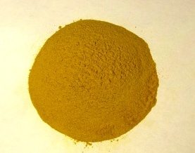 Tynanthus panurensis (Clavo Huascat) 5X Extract](http://www.ktbotanicals.com/tynanthus-panurensis-clavo-huascat-5x-extract-p-14695.html)

|     |
| --- |
|  |

[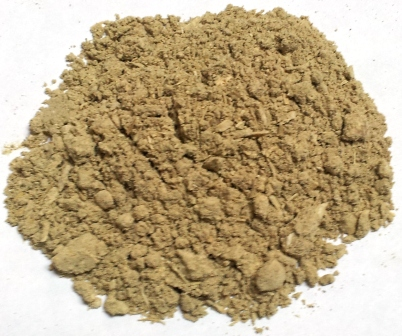 This is a the best quality kava I've seen, It is potent and ..](http://www.ktbotanicals.com/index.php?main_page=product_reviews_info&products_id=91&reviews_id=40)

KT Botanicals
P.O. Box 1222
Fair Oaks, Ca 95628

1-866-681-1082
Email: KTBotanicals@aol.com

**Please Read Our [**FAQ**](http://www.ktbotanicals.com/faq.html)** Before Contacting Us...****

**We Will NOT Respond To Questions That Have Already Been Addressed In Our [**FAQ**](http://www.ktbotanicals.com/faq.html)**!****

**We do not provide customer service via telephone if the issue can be resolved through email!  This is addressed in our **[**FAQ!**](http://ktbotanicals.com/faq)

**We Will NOT Respond To Questions That Have Already Been Addressed In Our [**FAQ**](http://www.ktbotanicals.com/faq.html)**!****

** Contacting us about an estimated time of arrival, does not hasten the delivery of your order!**

**We Will NOT Respond To Questions That Have Already Been Addressed In Our **[**FAQ**](http://www.ktbotanicals.com/faq.html)**!**

**Thank you for understanding and helping us to remain efficient and better serve you!**

**We are a legitimate, tax paying, ethnobotanical research company.  Many of our products are not intended for human consumption.  We respectfully request that you not ask us any questions whatsoever regarding the consumption of ANY of our products.  Furthermore, regardless of historical and cultural use of our products, none of them are marketed or sold as products that are intended for human consumption. We WILL NOT entertain ANY questions, even theoretical in nature, regarding the consumption of our products PERIOD.  PLEASE do not inquire on these topics or your money will be refunded and your account with us will be permanently deleted.  Thank you,**

**Sincerely,**
**KT Botanicals**
Contact Us
* Required information

Full Name:*
Email Address:*
Message:*

|     |
| --- |
|  |

|     |     |
| --- | --- |
| [Deutsch](http://translate.google.com/translate?u=http://www.ktbotanicals.com/&langpair=en%7Cde) |  |
| [Français](http://translate.google.com/translate?u=http://www.ktbotanicals.com/&langpair=en%7Cfr) |  |
| [Italiano](http://translate.google.com/translate?u=http://www.ktbotanicals.com/&langpairp=en%7Cit) |  |
| [Español](http://translate.google.com/translate?u=http://www.ktbotanicals.com/&langpair=en%7Ces) |  |
| [Russian](http://www.google.com/translate?u=http%3A%2F%2Fktbotanicals.com&langpair=en%7Cru) |  |
| [Portuguese](http://translate.google.com/translate?u=http://www.ktbotanicals.com/&langpair=en%7Cpt) |  |
| [Chinese](http://translate.google.com/translate?u=http://www.ktbotanicals.com/&langpair=en%7Czh) |  |
| [Korean](http://translate.google.com/translate?u=http://www.ktbotanicals.com/&langpair=en%7Cko) |  |
| [Japanese](http://translate.google.com/translate?u=http://www.ktbotanicals.com/&langpair=en%7Cja) |  |

|     |
| --- |
|  |

|     |
| --- |
|  |

[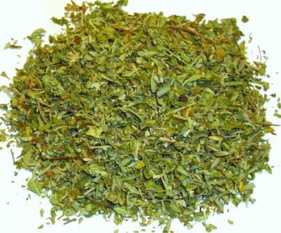 Damiana Leaf (Turnera diffusa) 1lb...](http://www.ktbotanicals.com/damiana-leaf-turnera-diffusa-1lb-cs-wc-p-8938.html)

[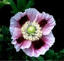 Papaver Somniferum (Opium Poppy)...](http://www.ktbotanicals.com/papaver-somniferum-opium-poppy-seeds-p-98.html)

[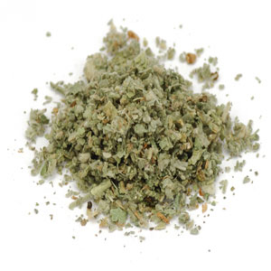 Marshmallow Leaf (Althaea...](http://www.ktbotanicals.com/marshmallow-leaf-althaea-officinalis-1-lb-cs-p-8826.html)

[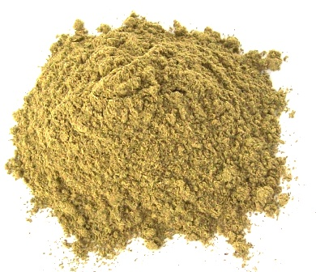 Mitragyna Speciosa - Superior...](http://www.ktbotanicals.com/mitragyna-speciosa-superior-green-vein-bali-kratom-p-112.html)

[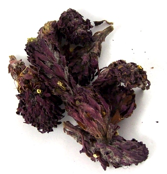 Pedicularis Densiflora (Indian...](http://www.ktbotanicals.com/pedicularis-densiflora-indian-warrior-buds-p-96.html)

[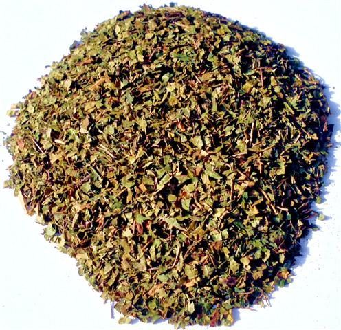 Mitragyna Speciosa - Superior Red...](http://www.ktbotanicals.com/mitragyna-speciosa-superior-red-vein-thai-maeng-da-kratom-p-7136.html)

[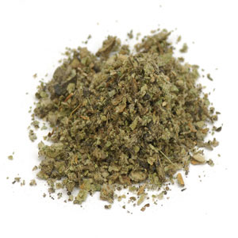 Mullein Leaf (Verbascum thapsus)...](http://www.ktbotanicals.com/mullein-leaf-verbascum-thapsus-1lb-cs-wc-p-8916.html)

[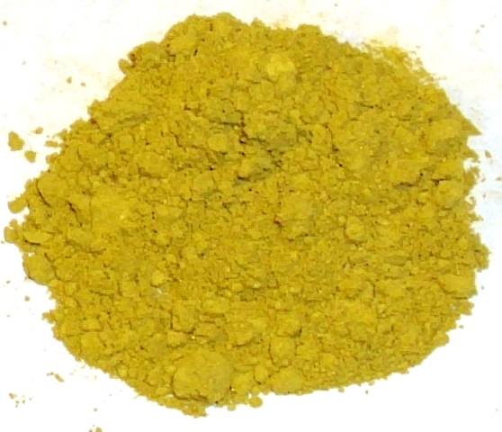 Mitragyna Speciosa (Kratom) True...](http://www.ktbotanicals.com/mitragyna-speciosa-kratom-true-full-spectrum-kratom-50x%C3%82%E2%84%A2-p-12544.html)

[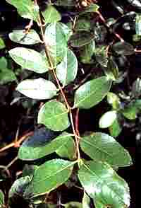 Catha Edulis (Khat) Seeds](http://www.ktbotanicals.com/catha-edulis-khat-seeds-p-157.html)

[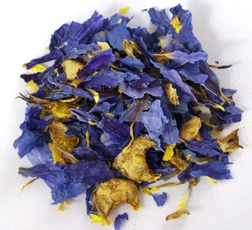 Nymphaea Caerulea (Blue Lilly Of...](http://www.ktbotanicals.com/nymphaea-caerulea-blue-lilly-of-the-nile-blue-lotus-p-100.html)

|     |
| --- |
| [Specials  [more]](http://www.ktbotanicals.com/specials.html) |

[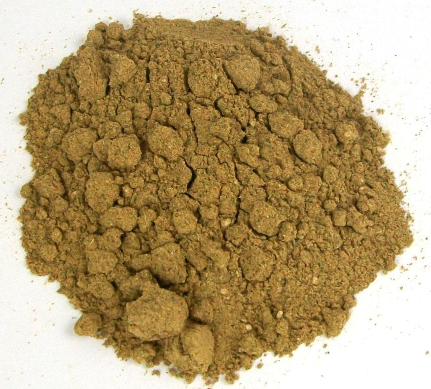 Banisteriopsis Caapi (Yage) 5X Extract](http://www.ktbotanicals.com/banisteriopsis-caapi-yage-5x-extract-p-8184.html)

|     |
| --- |
| [Home](http://www.ktbotanicals.com/) :: [Environmental Sustainability](http://www.ktbotanicals.com/environmental-sustainability-ezp-7.html) :: [Ethnobotanical Blog](http://ktbotanicals.wordpress.com/) :: [Ethnobotanical Resources](http://www.ktbotanicals.com/ethnobotanical-resources-ezp-2.html) :: [Newsletters and Announcements](http://ktbotanicals.com/November%202009%20News%20And%20Updates.mht) |

 

### Proud Members or Supporters Of:

   [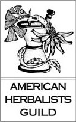](http://americanherbalistsguild.com/)      [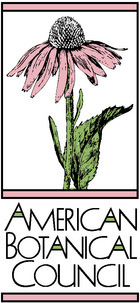](http://abc.herbalgram.org/)  

Your IP Address is: 94.10.252.158

Copyright © 2012 [KT Botanicals](http://www.ktbotanicals.com/). Powered by [Zen Cart](http://www.zen-cart.com/)