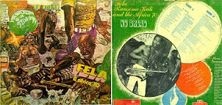
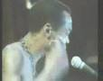
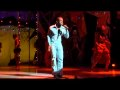
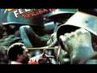
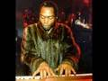

# FELA KUTI: YABIS, LYRICS AND PIDGIN ENGLISH

Discussion about the influence and contribution of Afrobeat, Highlife and other African music lyrics to the PIDGIN ENGLISH vocabulary, as spoken in West Africa. The lyrics of Afrobeat legend, FELA KUTI would be the primary focus, but other musicians who sang in Pidgin English will be featured too.

- [Home](http://felakuti-lyrics-and-pidgin-english.blogspot.co.uk/)

## Thursday, June 3, 2010

### [NA FIGHT O! (Everybody say, YEAH-YEAH-YEAH-EAH!)](http://felakuti-lyrics-and-pidgin-english.blogspot.co.uk/2010/06/na-fight-o-everybody-say-yeah-yeah-yeah.html)

**SYNOPSIS:**

In this tune, FELA KUTI  is "FIGHTING" everything and everybody that he detests...

Religious leaders (Christian & Islamic) and their subjects for trying to brainwash him and his crowd.

This is the very first time that FELA uttered his trademark "EVERYBODY SAY, YEAH-YEAH" slogan.

He boasts about his skills in the martial arts and boxing that he would employ in these "fights."

**HERE's THE LYRICS, IF YOU WANT TO SING-ALONG:**
**NA FIGHT O**
**
*Hooo-heey!*

 *Sho waja mi ni o, Rasaki-o*
 *Sho waja mi ni o, Alhaji*
 *Sho waja mi ni o, Jonathan-i-o*
 *Sho waja mi ni o, Reveren-i*
 *Sho waja mi ni o, wo mi o dada*
 *Sho waja mi ni o, Oya common now-haaaah!*

 *Mo nja gidigbo bi were, sho gbo o,*
 *Mo nja Ka-ra-te bi were, sho gbo o*
 *Mo nja boxer bi were, sho gbo o*
 *Mo nja gidigbo bi were, sho gbo o,*
 *Mo nja Ka-ra-te bi were, sho gbo o*

 *Eelo-helo, he-lo-lo-lo, oh*
 *He-lo, helo, he-lo-lo-lo, hooh!*

 *Heeey-heey!*

 *Sho waja mi ni o, Rasaki-o*
 *Sho waja mi ni o, Lemomu*
 *Sho waja mi ni o, Peter-o*
 *Sho waja mi ni o, Bishop-u*
 *Sho waja mi ni o, wo mi o, Afrika ni,*
 *Sho waja mi ni o, Oya common now...*

 *Oooh-hooo!*

 *Mo nja gidigbo bi were, sho gbo o,*
 *Mo nja Ka-ra-te bi were, sho gbo o*
 *He-lo, helo, he-lo-lo-lo, hooh!*
 *He-lo, helo, he-loooo...*

 *Haaa!*

 *[Instrumental interlude...]*

 *Ohh...*
 *Sho fe bamija ni o, ma-a bo...  huuh-ooh!*
 *Sho fe bamija ni o, ma-a bo...  huuh-huh!*
 *Ma so fun e bi mo se je,  ye-ye, ye-ye-ye...  keh-reh!*
 *Ma so fun e bi mo se je,  ye-ye, ye-ye-ye...  keh-reh!*

 *Oooh...*

 *Mo nja gidigbo bi were, l'ati e*
 *Mo nja Ka-ra-te bi were, sho gbo o*
 *Mo nja boxer bi were, sho gbo o*
 *Mo nja bo-ox bi were, sho gbo o*
 *Mo mo nipa ifa o, bi were l'ati e*
 *Mo wa'mo nipa ifa o, bi were sho gbo o*

 *Ma na e pa s'Eko yi o bi were, sho gbo o*
 *Mo nja feshelu bi were, sho gbo o*
 *Ma na e pa s'Eko yi o bi were, sho gbo o*

 *O ma s'are o, O ma f'eti e*
 *O ma s'are o, O ma f'eti e*
 *O ma s'are o, O ma f'eti e*
 *Hey-jay-jay-jay-jay-jay-jay...  haaaah!*
 *Oooh, oh-lo-lo-lo, lo-lo, lo-looooh*

 *Now...*
 *I'm gonna speak in English now for the benefit of the everybody crowd!*
 *How do you like that, Everybody crowd?   Yeah-Yeah...*
 *Now please sing with me now like brothers and sisters,*
 *Now together now, listen...*

 *Haaaa....*
 *Everybody, everybody now*
 *Everybody, everybody now!*
 *Everybody, everybody now*
 *Everybody, everybody now*

 *Everybody say - Yeah-Yeah-eah!*
 *Common -   Yeah-Yeah-eah!*
 *Everybody say - Yeah-Yeah-eah!*
 *Common -   Yeah-Yeah-eah*
 *One more time...  Yeah-Yeah-eah! *
 *Common -   Yeah-Yeah-eah!*

 *Ohh-hooh...*

 *For the benefit of the Everybody crowd, *
 *Outside of this record*
 *Now listen, let us sing together now,*
 *Like brothers and like sisters, now listen...*
 *With the whole band...*

 *Ooh, common, common...*

 *Everybody! - Yeah-Yeah-eah!*
 *Yeah-Yeah-eah!*
 *Yeah-Yeah-eah!*
 *Yeah-Yeah-eah!*
 *Yeah-Yeah-eah!*
 *Yeah-Yeah-eah!*

 *Oooohhh!*
**

**
**

Posted by [Deeni](http://www.blogger.com/profile/15560611969579089583)  at [3:35 PM](http://felakuti-lyrics-and-pidgin-english.blogspot.co.uk/2010/06/na-fight-o-everybody-say-yeah-yeah-yeah.html)  [0 comments](http://felakuti-lyrics-and-pidgin-english.blogspot.co.uk/2010/06/na-fight-o-everybody-say-yeah-yeah-yeah.html#comment-form)  [Links to this post](http://felakuti-lyrics-and-pidgin-english.blogspot.co.uk/2010/06/na-fight-o-everybody-say-yeah-yeah-yeah.html#links)

### [IGBE - Fela Kuti & Africa '70 (1973)](http://felakuti-lyrics-and-pidgin-english.blogspot.co.uk/2010/06/igbe-fela-kuti-africa-70-1973.html)

**SYNOPSIS:**
**
**

In this title "IGBE" (Sh*t), FELA describes a friend that betrays to be like "SH*T"...  someone you want to expel or excrete like SH*T.    He then evokes that in various Nigerian native languages to drive that home.

He also describes anybody that lacks self-respect as "sh*t" too.

Yeah-Yeah!

-Deen-

Posted by [Deeni](http://www.blogger.com/profile/15560611969579089583)  at [3:21 PM](http://felakuti-lyrics-and-pidgin-english.blogspot.co.uk/2010/06/igbe-fela-kuti-africa-70-1973.html)  [1 comments](http://felakuti-lyrics-and-pidgin-english.blogspot.co.uk/2010/06/igbe-fela-kuti-africa-70-1973.html#comment-form)  [Links to this post](http://felakuti-lyrics-and-pidgin-english.blogspot.co.uk/2010/06/igbe-fela-kuti-africa-70-1973.html#links)

Labels: [Fela Afrobeat Nigeria](http://felakuti-lyrics-and-pidgin-english.blogspot.co.uk/search/label/Fela%20%20Afrobeat%20%20Nigeria), [Fela Kuti Afrobeat music lyrics Pidgin English highlife music](http://felakuti-lyrics-and-pidgin-english.blogspot.co.uk/search/label/Fela%20Kuti%20Afrobeat%20music%20lyrics%20Pidgin%20English%20highlife%20music)

## Friday, April 2, 2010

### [FOGO FOGO (BOTTLE BREAKERs)](http://felakuti-lyrics-and-pidgin-english.blogspot.co.uk/2010/04/fogo-fogo-bottle-breakers.html)

SYNOPSIS:

The essence of the tune's lyrics is about him having a big party featuring his band, where performed his hit songs and served assortments of liquor until his guests consumed them all and left him with empty bottles. He got broke as a result.

When he couldn't afford to buy any more liquor for his guests, a riot ensued; the irate and drunk guests started breaking the empty bottles. He got further into debt too as a result of the broken bottles because he could not return them to collect his bottle deposit. Hence, his "FOGO FOGO" dilemma.

"FOGO-FOGO" lyrics
(By FELA Ransome-KUTI & The Nigeria 70)

Mo l'anu mo k'orin...
Mo ko Jeun K'oku
Mo l'anu mo k'orin...
Mo ko Na Fight-e o..
Mo l'anu mo k'orin...
Mo ko Who Are You Re...
Mo l'anu mo k'orin...
Mo ko Alu Jon-Jon Ki-Jon
Mo l'anu mo k'orin...
Mo ni yeeeh, yeh-kee, yeeeeh-yeeh... Hehn!

Mo l'anu mo k'orin...
Mo ko Jeun K'oku
Mo l'anu mo k'orin...
Mo ko Na Fight-e o.."Mo l'anu mo k'orin...
Mo ko Who Are You Re...
Mo l'anu mo k'orin...
Mo ko Alu Jon-Jon Ki-Jon
Mo l'anu mo k'orin...
Mo ni yeeeh, yeh-kee, yeeeeh-yeeh... Hehn!

Gbese t'e fe k'omi si ni mo fe ko l'ese yi o
Gbese t'e fe k'omi si ni mo fe ko l'ese yi o

Maa gbo, maa gboro ti mo fe sho, maaa gbo
Maa gbo, maa gboro ti mo fe sho, maaa gbo
Maa gbo, maa gboro ti mo fe sho, maaa gbo
Maa gbo, maa gbo...

Mo ra beer, t'emu...
Mo ra Stout-u, t'emu...
Mo ra whi-si-ky, t'en-sha!
Mo r'ogogoro, t'en-sha-para!
Mo r'ogogoro, t'en-sha-bora!
Mo r'oguro, t'en-fi-w'enu
Mo w'apomi, apomi gbe!
Mo w'apomi, apomi gbe!

Emu t'emu, t'efi fogo s'ileee, t'efi da gbese simi l'orun...
Ile mo, henh...

Ebe mi o...
Fogo-Fogo ebe mi o... (Fogo-Fogo ebe mi)
Fogo-Fogo ebe mi o... (Fogo-Fogo ebe mi)
T'e Fogo le, t'e p'atewo o (Fogo-Fogo ebe mi)
T'e Fogo le, t'e p'atewo o (Fogo-Fogo ebe mi)
T'e d'agbese le, t'e p'atewo o (Fogo-Fogo ebe mi)

Sisi-sisi n'igo kankan... (Fogo-Fogo ebe mi)
Sisi-sisi n'igo kankan... (Fogo-Fogo ebe mi)

Ati wa control-i, ko l'agbara o (Fogo-Fogo ebe mi)
Sisi-sisi n'igo kankan... (Fogo-Fogo ebe mi)
Henh-henh, ebe mio (Fogo-Fogo ebe mi)
Henh-henh, ebe mio (Fogo-Fogo ebe mi)
Henh-henh, ebe mio (Fogo-Fogo ebe mi)

Henh... maa gbo

Mo l'anu mo k'orin...
Mo ko "Jeun K'oku"
Mo l'anu mo k'orin...
Mo ko "Na Fight-e o..."
Mo l'anu mo k'orin...
Mo ko "Who Are You Re..."
Mo l'anu mo k'orin...
Mo ko "Alu Jon-Jon Ki-Jon"
Mo l'anu mo k'orin...
Mo ni yeeeh, yeh-kee, yeeeeh-yeeh... Hehn!

Gbese t'e fe k'omo si ni moti ko
Te ti gbo yen o... Hehn!

Gbese t'e fe k'omo si ni moti ko
Te ti gbo yen o... Hehn!

-zookat-

Posted by [Deeni](http://www.blogger.com/profile/15560611969579089583)  at [8:02 PM](http://felakuti-lyrics-and-pidgin-english.blogspot.co.uk/2010/04/fogo-fogo-bottle-breakers.html)  [1 comments](http://felakuti-lyrics-and-pidgin-english.blogspot.co.uk/2010/04/fogo-fogo-bottle-breakers.html#comment-form)  [Links to this post](http://felakuti-lyrics-and-pidgin-english.blogspot.co.uk/2010/04/fogo-fogo-bottle-breakers.html#links)

Labels: [Fela Afrobeat Nigeria](http://felakuti-lyrics-and-pidgin-english.blogspot.co.uk/search/label/Fela%20%20Afrobeat%20%20Nigeria)

### [NO BUREDI (NO BREAD)](http://felakuti-lyrics-and-pidgin-english.blogspot.co.uk/2010/04/no-buredi-no-bread.html)

(LP cover by: Ghariokwu Lemi)

[(L)](http://www.blogger.com/%3Cobject%20width=)

">

[(L)](http://www.youtube.com/watch?v=S_P-1jBqfuE)**PREMISE:**

*In the early-70s in Nigeria, oil revenue was flowing and the government coffers busting with the proceeds. The government decided it was time to spread this wealth to workers-- (mainly civil servants) by doubling the prevailing salaries and wages. Thus, the UDOJI PANEL for salary reviews headed by an attorney, JEROME UDOJI, was formed to review and make recommendations to government about the proposed salary boosts for civil servants.

The salaries and wages increase were later implemented following the UDOJI panel recommendations.

However, the government did not make any accommodation about sharing this booty with the non-government workers; the private businesses, market women and shop owners whose goods would soon be chased by the glut of petro-Naira (Nigerian currency), soon to flood the market.

After the so-called UDOJI "salary arrears" were paid out? Private firms like oil companies and other multi-nationals that could afford it, followed suit and paid their employees per the UDOJI recommendation and some even went beyond that.

[SIDE NOTE]:

I worked at BP Nigeria, Ltd. then as an accounts clerk and got my salary doubled too. But, a big section of the population missed out on that.

The markets and shopping goods distributors reacted by doubling or even tripling the prices of goods and staple foods across the board causing the first wave of hyper-inflation in the country.

That act squeezed the common man/woman on the street, who were scraping out a living at the bottom of the socio-economic ladder, who did not receive the "UDOJI AWARD."

Those UDOJI AWARD neglects of society became the subject of FELA's "NO BREAD / NO BUREDI" composition and he used that song to express the plight of those left out of the UDOJI pie.*

**NO BREAD:**
=========

*Raah-raah-raaah, raah-raaah....10x*
*
*
*Look-u, well-e, well-well-e, welle, well-e, well*
*Look-u you well-e, well-e well-e, well-e well-u well x2*

*Look-u you well-e, well-e well-e, well-e well-u well-wellu-well-e well-e weeeelluuu...*

*
*
*Looku you, looku well.. (Looku you, looku well!) X3*
*
*
*Look-u, well-e, well-well-e, welle, well-e, well*
*Look-u you well-e, well-e well-e, well-e well-u well x3*

*Look-u you well-e, well-e well-e, well-e well-u well-wellu-well-e well-e weeeelluuu...*

*
*
*Look-u you, wellu-wellu-well (looku you!) x2*
*
*
*You stand-e for ground, your leg-e dey shake (looku you!) x2*
*
*
*Nah your leg whey keep ground noh dey shake (looku you!)*
*
*
*Your face look like you don reach-e gbeee (looku you!)*
*You si(t)down for chair like e you don reach-e gbee (looku you!)*
*
*
*Your head dey ache, welle-welle*
*Mouth dey dry, welle-welle*
*Stomach dey turn, welle-welle*
*
*
*Hungry dey show him power,*
*Head dey ache, welle-welle*
*Mouth dey dry, welle-welle*
*Stomach dey turn, welle-welle*
*
*
*Hungry dey show him power,*
*You noh get-e power to fight... No Buredi!*
*
*
*Naah now...*
*You noh get-e power to fight... No Buredi!*
*Naah now...*
*You noh get-e power to fight... No Buredi!*
*
*
*Look-u, well-e, well-well-e, welle, well-e, well*
*Look-u you well-e, well-e well-e, well-e well-u well x3*

*Look-u you well-e, well-e well-e, well-e well-u well-wellu-well-e well-e weeeelluuu...*

*
*
*Look-u you, looku wellu-wellu-well (looku you!) x2*
*On the day or the night or the aftertoon (looku you!)*
*The trouble of the world e catch you for road (looku you!)*
*Man must wack nah him put you for the road (looku you!)*
*You noh fit make the thing now for your wack (looku you!)*
*
*
*You start to find excuse for your fault (looku you!)*
*
*
*You mouth dey shake, welle-welle,*
*Music noh dey, welle-welle*
*Eye dey roll, welle-welle,*
*Like thief-u eye, welle-welle,*
*(A beg, nah so e dey do you everytime, abi? henh?)*
*
*
*Mouth dey shake, welle-welle*
*Music noh dey, welle-welle*
*Eye dey roll, welle-welle,*
*Like thief-u eye, welle-welle,*
*
*
*Problem dey show him power,*
*You noh get-e power to fight... No Buredi!*
*Naah-naah-now...*
*You noh get-e power to fight... No Buredi!*
*
*
*One more time... aaaah... No Buredi!*
*
*
*You noh get-e power to fight... No Buredi!*
*
*
*Haahn-haaahnn... No Buredi!*
*
*
*For Africa here e be home... No Buredi! x2*
*Land-e boku-boku from north to south... No Buredi!*
*Food-u boku-boku from top to down... No Buredi!*
*Gold dey underground like water... No Buredi!*
*Diamond dey underground like san-san... No Buredi!*
*Oil dey flow underground like-e river... No Buredi!*
*
*
*Everything for overseas, nah here e dey goooo... No Buredi!*
*Na for here, man-e still dey carry shit-e for head... No Buredi! x2*
*
*
*Na for here we know the thing dem dey call... No Buredi! x2*
*Me I tire for the thing dem dey call... No Buredi! x2*
*
*
*Udota I don tire e... No Buredi!*
*Udorin I don tire e... No Buredi!*
*Udarun I don tire e... No Buredi!*
*Udofa I don tire e... No Buredi!*
*Udoje I don tire e... No Buredi! x2*
*
*
*Me I tire for the thing dem dey call... No Buredi! x3*
*
*
*No Buredi!*
*No Buredi!*
*
*
*Udarun I don tire e... No Buredi!*
*Uderin I don tire e... No Buredi!*
*
*
*No Buredi!*
*No Buredi!*
*
*
*Udoji I don tire e... No Buredi! x2*

--------------------------------------------------------------------

**TRANSLATION FROM "PIDGIN" to ENGLISH:**

Do a thorough self evaluation; look at you!

You now have a shaky standing in the society
You are standing but your legs are shaking
As if it is your legs that are keeping the ground from shaking?

You sit down, with resignation, as if you have reached ("gb-ee") the end of your world.

(You don reach "gb-ee," from Yoruba alphabets.. "gb-ee" has a "thud" sound as if signifying "the END!" )

You have a headache
Your mouth is dry
Your stomach is churning (empty stomach)
Those are manifestations of HUNGER!

You are powerless; no fighting energy; NO BREAD! (No money)

Again, do a self evaluation...

During the day, night or afternoon
All the problems of the world meet you wherever you go
You can't even earn enough living to afford a meal
Now you start to look for excuses for your predicament

You start to stutter
There's no music rhythm in your world
Your eyes are rolling in their sockets, like a thief's eyes
(That's what happens to you in this situation)

Stuttering
No rhythm
Bulging, rolling eyes, like a thief's
Problem manifested
You are powerless; no fight in you-- NO BREAD!

Africa here, is our home
There's plenty of land and space
There's plenty of food from top to bottom
Gold is abundant like water
Plenty of diamonds like sand at the beach
Crude oil is flowing like a river
But we import so much foreign goods

Still no progress here, in some homes, we are still carting human excrement in pails

(Instead of building modern toilets)

It is only here that this nuisance called "NO BREAD" is endemic (In the midst of plenty)

Thus, I am tired of this nuisance called, "NO BREAD" (I am tired of poverty)

UDOJI, I AM TIRED OF YOUR "NO BREAD!" (for the common folks!)

-----------------------------------

NOTE:

FELA did a comical word play on the "UDOJI" name (an Igbo name) using it to count a few Yoruba numerals.

FYI... The last syllable in UDOJI, "JI" sounds like the Yoruba "EJI" (TWO).

Saying... no matter how many multiples of the "UDOJI Salary Awards" doled out, I could care less because I, the common man, did not get any. Of course FELA doubled his nightclub performance entry fee too!

TWO = EJI (UDO-JI)
THREE = ETA (UDO-TA)
FOUR = ERIN (UDO-RIN)
FIVE = ARUN (UDO-RUN)
SIX = EFA (UDO-FA)
SEVEN = EJE (UDO-JE)

**THE POSTED IMAGE OF THE ORIGINAL LP (by Ghariokwu Lemi),
CONVEYS THESE GRAPHICALLY & EXPLAINED BELOW**

Depicted there:

The old, sick and infirm,
The shit carrier, (Dey Carry shit for head)
Mr. Inflation Is In Town"
"Brother, UDOJI No Reach Me o!"
(Brother, I've been left out of the UDOJI Awards!)
"Share National Cake Equally"
A prostitute having to work more and harder to make ends meet
"No UDOJI, No Work" protester carrying picket sign.
(NO UDOJI payment, No Work)

Posted by [Deeni](http://www.blogger.com/profile/15560611969579089583)  at [12:16 AM](http://felakuti-lyrics-and-pidgin-english.blogspot.co.uk/2010/04/no-buredi-no-bread.html)  [1 comments](http://felakuti-lyrics-and-pidgin-english.blogspot.co.uk/2010/04/no-buredi-no-bread.html#comment-form)  [Links to this post](http://felakuti-lyrics-and-pidgin-english.blogspot.co.uk/2010/04/no-buredi-no-bread.html#links)

Labels: [Fela Kuti Afrobeat music lyrics Pidgin English highlife music](http://felakuti-lyrics-and-pidgin-english.blogspot.co.uk/search/label/Fela%20Kuti%20Afrobeat%20music%20lyrics%20Pidgin%20English%20highlife%20music), [NO BREAD afrobeat fela kuti Nigeria](http://felakuti-lyrics-and-pidgin-english.blogspot.co.uk/search/label/NO%20BREAD%20afrobeat%20fela%20kuti%20Nigeria)

## Wednesday, March 24, 2010

### [Everybody say, YEAH-YEAH! Make I yap 'am?](http://felakuti-lyrics-and-pidgin-english.blogspot.co.uk/2010/03/everybody-say-yeah-yeah.html)

Welcome to FELA KUTI Afrobeat lyrics and music discussion blog...

  We will be discussing FELA KUTI's "Yabis," his lyrics in the context of his Afrobeat music and how he coined new pidgin slangs in his songs lyrics that have help enrich the PIDGIN ENGLISH language vocabulary as spoken in West Africa. Other African musicians who sang using Pidgin English will also be discussed, but FELA KUTI's lyrics will be the primary focus of these blogs.

On these blogs, we will be selecting and using random FELA KUTI's songs lyrics to analyze and discuss. We will try to transcribe their meanings and also try to teach people who are trying to learn Pidgin English how to speak and express it. Suggestions of song lyrics from readers for discussion are also welcomed. Other reference materials including text, audio and video will be pulled in to enrich our experience.

Posted by [Deeni](http://www.blogger.com/profile/15560611969579089583)  at [8:04 PM](http://felakuti-lyrics-and-pidgin-english.blogspot.co.uk/2010/03/everybody-say-yeah-yeah.html)  [0 comments](http://felakuti-lyrics-and-pidgin-english.blogspot.co.uk/2010/03/everybody-say-yeah-yeah.html#comment-form)  [Links to this post](http://felakuti-lyrics-and-pidgin-english.blogspot.co.uk/2010/03/everybody-say-yeah-yeah.html#links)

Labels: [Fela Kuti Afrobeat music lyrics Pidgin English highlife music](http://felakuti-lyrics-and-pidgin-english.blogspot.co.uk/search/label/Fela%20Kuti%20Afrobeat%20music%20lyrics%20Pidgin%20English%20highlife%20music)

[Home](http://felakuti-lyrics-and-pidgin-english.blogspot.co.uk/)

Subscribe to: [Posts (Atom)](http://felakuti-lyrics-and-pidgin-english.blogspot.com/feeds/posts/default)

## NOW AVAILABLE @ AMAZON!

## Subscribe To

   Posts

  All Comments

## Search This Blog

|     |     |
| --- | --- |
|     |     |

## Blog Archive

- [▼ ]()  [2010](http://felakuti-lyrics-and-pidgin-english.blogspot.co.uk/search?updated-min=2010-01-01T00:00:00-08:00&amp;updated-max=2011-01-01T00:00:00-08:00&amp;max-results=5)  (5)
    - [▼ ]()  [June](http://felakuti-lyrics-and-pidgin-english.blogspot.co.uk/2010_06_01_archive.html)  (2)
        - [NA FIGHT O! (Everybody say, YEAH-YEAH-YEAH-EAH!)](http://felakuti-lyrics-and-pidgin-english.blogspot.co.uk/2010/06/na-fight-o-everybody-say-yeah-yeah-yeah.html)
        - [IGBE - Fela Kuti & Africa '70 (1973)](http://felakuti-lyrics-and-pidgin-english.blogspot.co.uk/2010/06/igbe-fela-kuti-africa-70-1973.html)
    - [► ]()  [April](http://felakuti-lyrics-and-pidgin-english.blogspot.co.uk/2010_04_01_archive.html)  (2)
    - [► ]()  [March](http://felakuti-lyrics-and-pidgin-english.blogspot.co.uk/2010_03_01_archive.html)  (1)

## Labels

- [Fela Afrobeat Nigeria](http://felakuti-lyrics-and-pidgin-english.blogspot.co.uk/search/label/Fela%20%20Afrobeat%20%20Nigeria)  (2)
- [Fela Kuti Afrobeat music lyrics Pidgin English highlife music](http://felakuti-lyrics-and-pidgin-english.blogspot.co.uk/search/label/Fela%20Kuti%20Afrobeat%20music%20lyrics%20Pidgin%20English%20highlife%20music)  (3)
- [NO BREAD afrobeat fela kuti Nigeria](http://felakuti-lyrics-and-pidgin-english.blogspot.co.uk/search/label/NO%20BREAD%20afrobeat%20fela%20kuti%20Nigeria)  (1)

## Video Bar

|     |
| --- |
| powered by |
|  |

## Followers

## About Me

[Deeni](http://www.blogger.com/profile/15560611969579089583)
NW, United States
AfriKania music enthusiast & writer.
[View my complete profile](http://www.blogger.com/profile/15560611969579089583)

## Revolver Maps