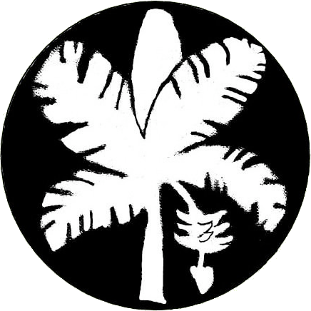
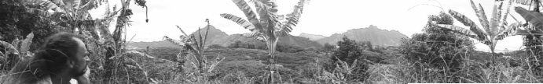

-

# [Tropical Plants](http://www2.hawaii.edu/~strauch/PlantTropics/TropicalPlants.html)

* * *

-

## [Tropical/Temperate](http://www2.hawaii.edu/~strauch/PlantTropics/TempTropPlants.html)

## [Monocot Diversity](http://www2.hawaii.edu/~strauch/PlantTropics/MonocotDiversity.html)

## [Pacific Food Pyramid](http://www2.hawaii.edu/~strauch/PlantTropics/PacificFoodPyramid.html)

## [Growing Hawaiian Plants](http://www2.hawaii.edu/~strauch/PlantTropics/PropCanoePlants.html)

## [Vegetative Reproduction](http://www2.hawaii.edu/~strauch/PlantTropics/VegetativeReproduction.html)

## [Propagation Techniques](http://www2.hawaii.edu/~strauch/PlantTropics/PropagationTech.html)

## [Cultures of Growing](http://www2.hawaii.edu/~strauch/PlantTropics/GrowingCultures.html)

* * *

-

# [*Ka‘imi loa o ka hihi*](http://www.webquest.hawaii.edu/kahihi/)

* * *

-

# [David’s Kahihi Work](http://www2.hawaii.edu/~strauch/kahihi.html)

* * *

## Temperate and Tropical Food-plants

This page shows some of the major food-plants cultivated in temperate and tropical climates.

Climate zones are defined by a combination of factors which include temperature and rainfall as much as latitude. Because temperate and tropical climate zones blend into one another, many of the plants from one part of the world are cultivated in the other, so this is just a rough guide to which plants are found where. Plants listed as temperate crops can be grown in the tropics better than the other way around.

Notes: Plants shown in boldare “canoe plants” which Hawaiians brought from southern Polynesia.

Plants shown in brownare usually propagated from seed.
Plants shown in greenare usually propagated vegetatively.
Plants shown in olivemight be propagated either way.

* * *

|     |     |     |     |
| --- | --- | --- | --- |
|  | Temperate crops | Tropical crops | Botanical family/group |
| M O N O C O T Y L E D O N S | Wheat Corn Oats Barley Rye Millets Wild Rice | Rice  Sugar Bamboo | Poaceae (Graminae) “grains” |
|     | Taro& ‘ape | Araceae |
|     | Coconut Sago | Arecaceae |
|     | Pandanus | Pandanaceae |
|     | Yam | Dioscoreaceae |
| Onions& Garlic Asparagus | Ti Pia  Agave | Asparagales/Liliales |
|     | Vanilla | Orchidaceae |
|     | Banana Ginger & Tumeric | Zingiberales |
|     | Pineapple | Bromeliaceae |
|     | Water chestnut |  Cyperaceae |
|     |     | Avocado  Lotus  Soursop  Kava  & Black Pepper  Cinnamon | Magnoliales |
| D I C O T Y L E D O N S | Figs, Mulberries, Hops | Breadfruit& Jackfruit | Moraceae |
|     | Cassava  &    Kukui | Euphorbiaceae |
|     | Sweet Potato  & Ong Choi | Convolvulaceae |
| Beans, Soybean, Chickpeas, Lentils, Peanut | Tamarind & Carob Jicama Wing & Yard-long beans | Fabaceae (Leguminosae) |
|     | Malunggay | Moringaceae |
| Mustards, Cabbages, Daikon, Radish Broccoli, Cauliflower Choi sum, Watercress |     | Brassicaceae (Cruciferae) |
| Quinoa Beets & Spinach | Amaranth | Chenipodiaceae/  Amarantaceae |
| Carrot, Parsely Cilantro, Cumin, Anise |     | Apiaceae (Umbelliferae) |
| Eggplant, Potato Tomato & Tomatillo Chiles & Peppers |     | Solanaceae |
| Squash, Gourds Melons, Cucumbers |     | Cucurbitaceae |
|     | Mountain apple (‘Ōhi‘a ‘ai)  Guava & Surinam Cherry  Clove & Allspice | Myrtaceae |
| Apple & Pear  Peach & Apricot  Plum & Cherry  Raspberry & Blackberry  Strawberry  Almond |     | Rosiaceae |
| Walnuts & Pecans |     | Juglandaceae |
| Pistacio | Cashew  Mango  & Vi apple | Anacardiaceae |
|     | Orange  Lemon  Lime  Grapefruit  Pomelo  Kumquat  Noni Coffee | Rubiaceae |
|     | Lychee, Longan, Rambutan | Sapindaceae |
| Grape  Blueberry | Papaya Liliko‘i Durian Starfruit | Other fruits |
|     | Cacao (Chocolate) | Sterculaciaeae |
|     | Tea | Theaceae |

Some good webpages to find more information on crops are:

- Purdue University' Horticulture program [indexes plants](http://www.hort.purdue.edu/newcrop/Indices/index_ab.html) and has several references online, including Julia F. Morton's (1987) [Fruits of Warm Climates](http://www.hort.purdue.edu/newcrop/morton/index.html).
- The California Rare Fruit Growers [Fruit Facts](http://www.crfg.org/pubs/ff/) page.
- UC Davis [Fruit & Nut Research & Information Center](http://fruitsandnuts.ucdavis.edu/index.cfm).
- CTAHR’s [Farmer's Bookshelf](http://www.ctahr.hawaii.edu/fb/).

- The Missouri Botanical Garden's [Kemper Center for Home Gardening](http://www.mobot.org/gardeninghelp/plantinfo.shtml).

- Kew Gardens’ [Plant Cultures](http://www.plantcultures.org/plants/plants_landing.html).
- Cherry Farms (UK) descriptions of [Asian greens](http://www.cherryfarms.co.uk/index.html).

For another kind of plant use, see Beatrice Krauss’ book,[Native Plants Used As Medicine in Hawai‘i](http://library.kcc.hawaii.edu/~soma/krauss/plants.html).

[back to top](http://www2.hawaii.edu/~strauch/PlantTropics/TempTropPlants.html#top)

