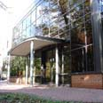

# **4** colleges run **naturopathy training** courses** in London**

There are 4 institutions in London which run Naturopathy training courses. Please use the filter on the left to narrow down your Naturopathy training courses.

**Order by:**

 **Include online/distance courses:**

[More about](http://www.hotcourses.com/uk-courses/British-College-Of-Osteopathic-Medicine-profile/hc_profile.page_pls_profile_details/16180339/0/z/5835/sec_id/1/page.htm)

### British College Of Osteopathic Medicine

[View 1 Naturopathy Training course](http://www.hotcourses.com/uk-courses/naturopathy-training-courses-british-college-of-osteopathic-medicine/16180339/0/5835/PC.4/O,P,B,Z,Y,U,C/any/county/greater+london/all/list.htm)

In London

Naturopathy Diploma [view course](http://www.hotcourses.com/uk-courses/Naturopathy-Diploma-courses/page_pls_user_course_details/16180339/0/w/33695981/page.htm)

Welcome to the British College of Osteopathic Medicine , one of the first educational establishments to be accredited and meet the quality[...more](http://www.hotcourses.com/uk-courses/British-College-Of-Osteopathic-Medicine-profile/hc_profile.page_pls_profile_details/16180339/0/z/5835/sec_id/1/page.htm)

[Visit website](http://www.hotcourses.com/pls/cgi-bin/obj_pls_track_www_redirect?x=16180339&y=&a=0&z=5835&w=&rn=1687221425&p_aff_url=http://www.bcom.ac.uk)[Request info](http://www.hotcourses.com/pls/cgi-bin/page_pls_user_ask_col_reg?x=16180339&y=&z=5835&w=&a=0&area=crs&p_order_item_id=528827&p_suborder_item_id=18003)

### Some of the courses below will include those you can study at home or courses that you can arrange to suit your needs.

[More about](http://www.hotcourses.com/uk-courses/Stonebridge-Associated-Colleges-profile/hc_profile.page_pls_profile_details/16180339/0/z/6171/sec_id/1/page.htm)

146 reviews

### Stonebridge Associated Colleges

[View 1 Naturopathy Training course](http://www.hotcourses.com/uk-courses/naturopathy-training-courses-stonebridge-associated-colleges/16180339/0/6171/PC.4/O,P,B,Z,Y,U,C/any/county/greater+london/all/list.htm)

In London (includes online/distance courses)

Level 3 Naturopathy Award [view course](http://www.hotcourses.com/uk-courses/Level-3-Naturopathy-Award-courses/page_pls_user_course_details/16180339/0/w/50201112/page.htm)

Discover the advantages of distance learning today!   FOR A LIMITED TIME, SPECIAL OFFER FOR HOTCOURSES STUDENTS: Quote HOT22[...more](http://www.hotcourses.com/uk-courses/Stonebridge-Associated-Colleges-profile/hc_profile.page_pls_profile_details/16180339/0/z/6171/sec_id/1/page.htm)

[Visit website](http://www.hotcourses.com/pls/cgi-bin/obj_pls_track_www_redirect?x=16180339&y=&a=0&z=6171&w=&rn=1341346981&p_aff_url=http://www.stonebridge.uk.com)[Request info](http://www.hotcourses.com/pls/cgi-bin/page_pls_user_ask_col_reg?x=16180339&y=&z=6171&w=&a=0&area=crs&p_order_item_id=537432&p_suborder_item_id=23327)

[More about](http://www.hotcourses.com/uk-courses/Bsy-Group-profile/hc_profile.page_pls_profile_details/16180339/0/z/793/sec_id/1/page.htm)

4 reviews

### Bsy Group

[View 1 Naturopathy Training course](http://www.hotcourses.com/uk-courses/naturopathy-training-courses-bsy-group/16180339/0/793/PC.4/O,P,B,Z,Y,U,C/any/county/greater+london/all/list.htm)

In London (includes online/distance courses)

Naturopathy Professional Certificate of Merit [view course](http://www.hotcourses.com/uk-courses/Naturopathy-Professional-Certificate-of-Merit-courses/page_pls_user_course_details/16180339/0/w/50055146/page.htm)

Would you like to start a new career, improve your job prospects or benefit the lives of others? Whatever your aspirations, you’ll find there’s a [...more](http://www.hotcourses.com/uk-courses/Bsy-Group-profile/hc_profile.page_pls_profile_details/16180339/0/z/793/sec_id/1/page.htm)

[Visit website](http://www.hotcourses.com/pls/cgi-bin/obj_pls_track_www_redirect?x=16180339&y=&a=0&z=793&w=&rn=1975918466&p_aff_url=http://www.bsygroup.co.uk)[Request info](http://www.hotcourses.com/pls/cgi-bin/page_pls_user_ask_col_reg?x=16180339&y=&z=793&w=&a=0&area=crs&p_order_item_id=534927&p_suborder_item_id=22139)

### College Of Naturopathic Medicine

[View 1 Naturopathy Training course](http://www.hotcourses.com/uk-courses/naturopathy-training-courses-college-of-naturopathic-medicine/16180339/0/146793/PC.4/O,P,B,Z,Y,U,C/any/county/greater+london/all/list.htm)

In London

Naturopathic Nutrition Diploma [view course](http://www.hotcourses.com/uk-courses/Naturopathic-Nutrition-Diploma-courses/page_pls_user_course_details/16180339/0/w/34170779/page.htm)

- Naturopathy training articles
- Adult learning articles

**Student Story: I Love London**

I Love London: The media student London has so much to offer that you’ll be spoilt for choice – there are thousands of courses available in some fantastic locations across the capital. To help you get the most from our beautiful city, here’s London academy of media, film & tv student Donald Chen’s personal tour… ‘When my wife and I landed in London in October last year, we fell in love with the capital straight away. We enjoy the blue sky,  fresh air, friendly atmosphere, rich historical heritage, and abundance  of parks....

[Read more](http://www.hotcourses.com/study-guide/why-london-has-so-much-to-offer/16180339/0/studyguide.htm)

[**See related Naturopathy training courses in London**]()

Share Naturopathy training courses in London with:

[(L)](http://api.addthis.com/oexchange/0.8/forward/facebook/offer?username=hotcourses&url=http://www.hotcourses.com/uk-courses/Naturopathy-training-courses-in-London/hc2_search.adv_col_do/16180339/0/search_category/PC.4/qualification/O,P,B,Z,Y,U,C/town_city/GREATER+LONDON/page.htm&title=Naturopathy%20training%20courses%20London:%20Naturopathy%20training%20course%20London:%20Naturopathy%20training%20classes%20London) [(L)](http://api.addthis.com/oexchange/0.8/forward/twitter/offer?username=hotcourses&url=http://www.hotcourses.com/uk-courses/Naturopathy-training-courses-in-London/hc2_search.adv_col_do/16180339/0/search_category/PC.4/qualification/O,P,B,Z,Y,U,C/town_city/GREATER+LONDON/page.htm&title=Naturopathy%20training%20courses%20London:%20Naturopathy%20training%20course%20London:%20Naturopathy%20training%20classes%20London) [(L)](http://api.addthis.com/oexchange/0.8/forward/myspace/offer?username=hotcourses&url=http://www.hotcourses.com/uk-courses/Naturopathy-training-courses-in-London/hc2_search.adv_col_do/16180339/0/search_category/PC.4/qualification/O,P,B,Z,Y,U,C/town_city/GREATER+LONDON/page.htm&title=Naturopathy%20training%20courses%20London:%20Naturopathy%20training%20course%20London:%20Naturopathy%20training%20classes%20London)  [(L)](http://api.addthis.com/oexchange/0.8/forward/googlebuzz/offer?username=hotcourses&url=http://www.hotcourses.com/uk-courses/Naturopathy-training-courses-in-London/hc2_search.adv_col_do/16180339/0/search_category/PC.4/qualification/O,P,B,Z,Y,U,C/town_city/GREATER+LONDON/page.htm&title=Naturopathy%20training%20courses%20London:%20Naturopathy%20training%20course%20London:%20Naturopathy%20training%20classes%20London)  [(L)](http://api.addthis.com/oexchange/0.8/forward/live/offer?username=hotcourses&url=http://www.hotcourses.com/uk-courses/Naturopathy-training-courses-in-London/hc2_search.adv_col_do/16180339/0/search_category/PC.4/qualification/O,P,B,Z,Y,U,C/town_city/GREATER+LONDON/page.htm&title=Naturopathy%20training%20courses%20London:%20Naturopathy%20training%20course%20London:%20Naturopathy%20training%20classes%20London)  [(L)](http://api.addthis.com/oexchange/0.8/forward/gmail/offer?username=hotcourses&url=http://www.hotcourses.com/uk-courses/Naturopathy-training-courses-in-London/hc2_search.adv_col_do/16180339/0/search_category/PC.4/qualification/O,P,B,Z,Y,U,C/town_city/GREATER+LONDON/page.htm&title=Naturopathy%20training%20courses%20London:%20Naturopathy%20training%20course%20London:%20Naturopathy%20training%20classes%20London)  [(L)](http://api.addthis.com/oexchange/0.8/forward/stumbleupon/offer?username=hotcourses&url=http://www.hotcourses.com/uk-courses/Naturopathy-training-courses-in-London/hc2_search.adv_col_do/16180339/0/search_category/PC.4/qualification/O,P,B,Z,Y,U,C/town_city/GREATER+LONDON/page.htm&title=Naturopathy%20training%20courses%20London:%20Naturopathy%20training%20course%20London:%20Naturopathy%20training%20classes%20London)  [Share](http://api.addthis.com/oexchange/0.8/offer?username=hotcourses&url=http://www.hotcourses.com/uk-courses/Naturopathy-training-courses-in-London/hc2_search.adv_col_do/16180339/0/search_category/PC.4/qualification/O,P,B,Z,Y,U,C/town_city/GREATER+LONDON/page.htm&title=Naturopathy%20training%20courses%20London:%20Naturopathy%20training%20course%20London:%20Naturopathy%20training%20classes%20London)