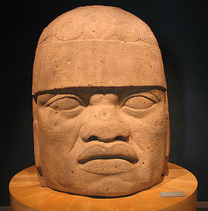
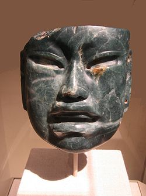
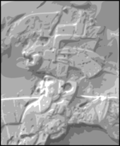

# Olmec alternative origin speculations

From Wikipedia, the free encyclopedia

Jump to: [navigation](http://en.wikipedia.org/wiki/Olmec_alternative_origin_speculations#mw-head),[search](http://en.wikipedia.org/wiki/Olmec_alternative_origin_speculations#p-search)

.jpg)

.jpg)

[San Lorenzo Tenochtitlan](http://en.wikipedia.org/wiki/San_Lorenzo_Tenochtitlan) Colossal Head 6, a 3 meter high Olmec sculpture with lips and nose said to resemble African facial features.

**Olmec alternative origin speculations** are explanations that have been suggested for the formation of [Olmec](http://en.wikipedia.org/wiki/Olmec) civilization which contradict generally accepted scholarly consensus. These origin theories typically involve contact with [Old World](http://en.wikipedia.org/wiki/Old_World) societies. Although these speculations have become somewhat well-known within [popular culture](http://en.wikipedia.org/wiki/Popular_culture), particularly the idea of an African connection to the Olmec, they are not considered credible by the vast majority of [Mesoamerican](http://en.wikipedia.org/wiki/Mesoamerican) researchers.

|     |
| --- |
| ## Contents  [[hide](http://en.wikipedia.org/wiki/Olmec_alternative_origin_speculations#)] - [1  Mainstream scientific consensus](http://en.wikipedia.org/wiki/Olmec_alternative_origin_speculations#Mainstream_scientific_consensus) - [2  African origins](http://en.wikipedia.org/wiki/Olmec_alternative_origin_speculations#African_origins)     - [2.1  Epigraphic evidence](http://en.wikipedia.org/wiki/Olmec_alternative_origin_speculations#Epigraphic_evidence)     - [2.2  Genetic evidence](http://en.wikipedia.org/wiki/Olmec_alternative_origin_speculations#Genetic_evidence)     - [2.3  Osteological evidence](http://en.wikipedia.org/wiki/Olmec_alternative_origin_speculations#Osteological_evidence) - [3  Chinese origins](http://en.wikipedia.org/wiki/Olmec_alternative_origin_speculations#Chinese_origins) - [4  Jaredite origins](http://en.wikipedia.org/wiki/Olmec_alternative_origin_speculations#Jaredite_origins) - [5  Nordic origins](http://en.wikipedia.org/wiki/Olmec_alternative_origin_speculations#Nordic_origins) - [6  See also](http://en.wikipedia.org/wiki/Olmec_alternative_origin_speculations#See_also) - [7  Footnotes](http://en.wikipedia.org/wiki/Olmec_alternative_origin_speculations#Footnotes) - [8  References](http://en.wikipedia.org/wiki/Olmec_alternative_origin_speculations#References) |

## [[edit](http://en.wikipedia.org/w/index.php?title=Olmec_alternative_origin_speculations&action=edit&section=1)]  Mainstream scientific consensus

The great majority of scholars who specialise in Mesoamerican history, archaeology and linguistics remain unconvinced by alternative origin speculations.[[1]](http://en.wikipedia.org/wiki/Olmec_alternative_origin_speculations#cite_note-0) Many are more critical and regard the promotion of such unfounded theories as a form of ethnocentric [racism](http://en.wikipedia.org/wiki/Racism) at the expense of indigenous Americans.[[2]](http://en.wikipedia.org/wiki/Olmec_alternative_origin_speculations#cite_note-1) The [consensus](http://en.wikipedia.org/wiki/Scientific_consensus) view maintained across publications in peer-reviewed academic journals that are concerned with Mesoamerican and other pre-Columbian research is that the Olmec and their achievements arose from influences and traditions that were wholly indigenous to the region, or at least the New World, and there is no reliable material evidence to suggest otherwise.[[3]](http://en.wikipedia.org/wiki/Olmec_alternative_origin_speculations#cite_note-2) They, and their neighbouring cultures with whom they had contact, developed their own characters which were founded entirely on a remarkably interlinked and ancient cultural and agricultural heritage that was locally shared, but arose quite independently of any extra-hemispheric influences.[[4]](http://en.wikipedia.org/wiki/Olmec_alternative_origin_speculations#cite_note-3)

## [[edit](http://en.wikipedia.org/w/index.php?title=Olmec_alternative_origin_speculations&action=edit&section=2)]  African origins

Some writers claim the Olmec were related to peoples of Africa based primarily on their interpretation of facial features of Olmec statues. They additionally contend that epigraphical, genetic, and osteological evidence supports their claims.[*[citation needed](http://en.wikipedia.org/wiki/Wikipedia:Citation_needed)*] The idea was first suggested by José Melgar, who discovered the first [colossal head](http://en.wikipedia.org/wiki/Olmec_colossal_heads) at Hueyapan (now [Tres Zapotes](http://en.wikipedia.org/wiki/Tres_Zapotes)) in 1862 and subsequently published two papers that attributed this head to a "Negro race."[[5]](http://en.wikipedia.org/wiki/Olmec_alternative_origin_speculations#cite_note-4) The view was espoused in the early 20th century by [Leo Wiener](http://en.wikipedia.org/wiki/Leo_Wiener) and others.[[6]](http://en.wikipedia.org/wiki/Olmec_alternative_origin_speculations#cite_note-Ortizde-5) Some modern proponents such as [Ivan van Sertima](http://en.wikipedia.org/wiki/Ivan_van_Sertima) and Clyde Ahmad Winters have identified the Olmecs with the [Mandé](http://en.wikipedia.org/wiki/Mand%C3%A9) people of West Africa.[[6]](http://en.wikipedia.org/wiki/Olmec_alternative_origin_speculations#cite_note-Ortizde-5)

### [[edit](http://en.wikipedia.org/w/index.php?title=Olmec_alternative_origin_speculations&action=edit&section=3)]  Epigraphic evidence

Some researchers claim that the [Mesoamerican writing systems](http://en.wikipedia.org/wiki/Mesoamerican_writing_systems) are related to African scripts. In the early 19th century, [Constantine Samuel Rafinesque](http://en.wikipedia.org/wiki/Constantine_Samuel_Rafinesque) proposed that the Mayan inscriptions were probably related to the [Libyco-Berber](http://en.wikipedia.org/wiki/Libyco-Berber) writing of Africa.[[7]](http://en.wikipedia.org/wiki/Olmec_alternative_origin_speculations#cite_note-6)  [Leo Wiener](http://en.wikipedia.org/wiki/Leo_Wiener)[[8]](http://en.wikipedia.org/wiki/Olmec_alternative_origin_speculations#cite_note-7) and others claim that various Olmec and [Epi-Olmec](http://en.wikipedia.org/wiki/Epi-Olmec_script) symbols are similar to those found in the [Vai script](http://en.wikipedia.org/wiki/Vai_script), in particular, the symbols on the [Tuxtla Statuette](http://en.wikipedia.org/wiki/Tuxtla_Statuette), [Teo Mask](http://en.wikipedia.org/w/index.php?title=Teo_Mask&action=edit&redlink=1),[*[citation needed](http://en.wikipedia.org/wiki/Wikipedia:Citation_needed)*]  [Cascajal Block](http://en.wikipedia.org/wiki/Cascajal_Block),[*[citation needed](http://en.wikipedia.org/wiki/Wikipedia:Citation_needed)*] and the celts in [Offering 4 at La Venta](http://en.wikipedia.org/wiki/La_Venta#Offering_4).

These assertions have found no support among Mesoamerican researchers. While mainstream scholars have made significant progress translating the Maya script, researchers have yet to translate Olmec glyphs.

### [[edit](http://en.wikipedia.org/w/index.php?title=Olmec_alternative_origin_speculations&action=edit&section=4)]  Genetic evidence

Genetic and immunological studies over the past two decades have failed to yield evidence of precolumbian African contributions to the indigenous populations of the Americas.[[9]](http://en.wikipedia.org/wiki/Olmec_alternative_origin_speculations#cite_note-8)[[10]](http://en.wikipedia.org/wiki/Olmec_alternative_origin_speculations#cite_note-9)[[11]](http://en.wikipedia.org/wiki/Olmec_alternative_origin_speculations#cite_note-10) Additionally, the huge mortality associated with the spread of Old World diseases introduced by Europeans suggests long-term immunological isolation which further shows the lack of any contact with African people in the Americas before Columbus.[*[citation needed](http://en.wikipedia.org/wiki/Wikipedia:Citation_needed)*]

### [[edit](http://en.wikipedia.org/w/index.php?title=Olmec_alternative_origin_speculations&action=edit&section=5)]  Osteological evidence

Some researchers have seen evidence for African skeletons at prehistoric sites in Mexico. Constance Irwin and Andrzej Wiercinski have both reported that skeletal remains with African characteristics have been found in Mexico. Irwin, in *Fair Gods and Stone Faces*, says that there are "distinct signs of Negroid ancestry in many a New World skull."[*[citation needed](http://en.wikipedia.org/wiki/Wikipedia:Citation_needed)*] Wiercinski claims that some of the Olmecs were of African origin.[[12]](http://en.wikipedia.org/wiki/Olmec_alternative_origin_speculations#cite_note-11) He supports this claim with [cranial](http://en.wikipedia.org/wiki/Human_cranium) evidence from two Mesoamerican sites: [Tlatilco](http://en.wikipedia.org/wiki/Tlatilco) and [Cerro de las Mesas](http://en.wikipedia.org/wiki/Cerro_de_las_Mesas). Tlatilco is a site in the [Valley of Mexico](http://en.wikipedia.org/wiki/Valley_of_Mexico). Although outside the [Olmec heartland](http://en.wikipedia.org/wiki/Olmec_heartland), Olmec influences appear in the architectural record. The crania were from the Pre-Classic period, contemporary with the Olmec. Cerro de las Mesa is within the Olmec heartland, although according to Wiercinski, "the series . . . is dated on the Classic period."[[13]](http://en.wikipedia.org/wiki/Olmec_alternative_origin_speculations#cite_note-12) The Classic period is generally defined to start around AD 250, or 600 years after the end of the Olmec culture.

| Site | # of Crania | Time Period |
| --- | --- | --- |
| [Tlatilco](http://en.wikipedia.org/wiki/Tlatilco) | 100 | Pre-Classic |
| [Cerro de las Mesas](http://en.wikipedia.org/wiki/Cerro_de_las_Mesas) | 25  | Classic |

To determine the racial heritage of the skeletons, Wiercinski used classic diagnostic traits, determined by [craniometric and cranioscopic](http://en.wikipedia.org/wiki/Craniometry) methods, as well as the Polish Comparative-Morphological School skeletal reference collection. These measurements were then compared against three crania sets from Poland, Mongolia and Uganda to represent three racial categories,[[14]](http://en.wikipedia.org/wiki/Olmec_alternative_origin_speculations#cite_note-13)[[15]](http://en.wikipedia.org/wiki/Olmec_alternative_origin_speculations#cite_note-14)[[16]](http://en.wikipedia.org/wiki/Olmec_alternative_origin_speculations#cite_note-15) which allowed Wiercinski to sort each skull into one or more racial categories.

In his conclusion, Wiercinski presented his findings:[[17]](http://en.wikipedia.org/wiki/Olmec_alternative_origin_speculations#cite_note-16)

| Racial composition: |  % of Tlatilco | % of Cerro |
| --- | --- | --- |
| Laponoid[[18]](http://en.wikipedia.org/wiki/Olmec_alternative_origin_speculations#cite_note-17) | 21% | 32% |
| [Armenoid](http://en.wikipedia.org/wiki/Armenoid)[[19]](http://en.wikipedia.org/wiki/Olmec_alternative_origin_speculations#cite_note-18) | 18% | 4.5% |
| Ainoid-Arctic[[20]](http://en.wikipedia.org/wiki/Olmec_alternative_origin_speculations#cite_note-19) | 11% | 14% |
| Pacific | 36% | 45% |
| Equatorial - [Bushmenoid](http://en.wikipedia.org/wiki/Bushmen) | 14% | 4.5% |

Based on his comparisons, Wiercinski found that 14% of the skeletons from Tlatilco and 4.5% of the skeletons from Cerro de las Mesas had elements of "Black" racial composition.

In the last section of his paper, Wiercinski compared the physiognomy of the skeletons to corresponding examples of Olmec sculptures and bas-reliefs on the [stelas](http://en.wikipedia.org/wiki/Stela). For example, Wiercinski states that the colossal Olmec heads represent the "Dongolan" type.[[21]](http://en.wikipedia.org/wiki/Olmec_alternative_origin_speculations#cite_note-20) The empirical frequencies of the Dongolan type at Tlatilco calculated by Wiercinski was 0.231, more than twice as high as Wiercinski's theoretical figure of 0.101, for the presence of Dongolans at Tlatilco.

Wiercinski summarizes his research by offering the following "ethnogenetical hypotheses":[[22]](http://en.wikipedia.org/wiki/Olmec_alternative_origin_speculations#cite_note-21)

- The indigenous rootstock of Tlatilco and Cerro de las Mesas consists of "Ainoid, Arctic, and Pacific racial elements".
- "A next migratory wave" brought in additional Pacific as well as "Laponoid" elements.
- "Some Chinese influence of Shang Period could penetrate Mesoamerica"
- "A strange transatlantic, more or less sporadic migration" brought [Armenoid](http://en.wikipedia.org/wiki/Armenoid), Equatorial, and [Bushmenoid](http://en.wikipedia.org/wiki/Bushmen) elements.

Wiercinski's research methods and conclusions are not accepted by the vast majority of Mesoamerican scholars, in part because of his reliance on the Polish Comparative-Morphological methodology which limits the placement of skull types within a very narrow spectrum that is often within: Caucasian, Negroid, and Mongoloid. Native Americans are thus made to fit within these groups which often yields false and contradictory assumptions as a result of sample bias.

An interdisciplinary analysis of Native American skulls has shown that there is no real evidence, apart from superficial misjudgments and erroneous conclusions, that Native Americans have any link to an African presence in America before the European encounter.[[23]](http://en.wikipedia.org/wiki/Olmec_alternative_origin_speculations#cite_note-22)

[(L)](http://en.wikipedia.org/wiki/File:Olmec_mask_at_Met.jpg)

A jade Olmec mask. Gordon Ekholm, who was an eminent archaeologist and curator at the [American Museum of Natural History](http://en.wikipedia.org/wiki/American_Museum_of_Natural_History), suggested that the Olmec art style might have originated in [Bronze Age](http://en.wikipedia.org/wiki/Bronze_Age) China.[[24]](http://en.wikipedia.org/wiki/Olmec_alternative_origin_speculations#cite_note-23)

## [[edit](http://en.wikipedia.org/w/index.php?title=Olmec_alternative_origin_speculations&action=edit&section=6)]  Chinese origins

Some researchers have argued that the Olmec civilization came into existence with the help of [Chinese](http://en.wikipedia.org/wiki/China) refugees, particularly at the end of the [Shang dynasty](http://en.wikipedia.org/wiki/Shang_dynasty).[[25]](http://en.wikipedia.org/wiki/Olmec_alternative_origin_speculations#cite_note-24) In 1975, Betty Meggers of the [Smithsonian Institution](http://en.wikipedia.org/wiki/Smithsonian_Institution) argued that the Olmec civilization originated due to Shang Chinese influences around 1200 BC.[[26]](http://en.wikipedia.org/wiki/Olmec_alternative_origin_speculations#cite_note-25) In a 1996 book, Mike Xu, with the aid of Chen Hanping, claimed that the very same La Venta [celts](http://en.wikipedia.org/wiki/Celt_(tool))  [discussed above](http://en.wikipedia.org/wiki/Olmec_alternative_origin_speculations#Epigraphic_evidence) actually bore Chinese characters.[[27]](http://en.wikipedia.org/wiki/Olmec_alternative_origin_speculations#cite_note-26)[[28]](http://en.wikipedia.org/wiki/Olmec_alternative_origin_speculations#cite_note-27) These claims are unsupported by mainstream Mesoamerican researchers.[[29]](http://en.wikipedia.org/wiki/Olmec_alternative_origin_speculations#cite_note-28) The evidence relied on by Mike Xu, including the coincidence of markings on Olmec pottery with those on Chinese oracle bone writings, the significance of jade in both cultures and the shared knowledge of the position of true North, was discussed in an article by Claire Liu in 1997 [[30]](http://en.wikipedia.org/wiki/Olmec_alternative_origin_speculations#cite_note-29)

## [[edit](http://en.wikipedia.org/w/index.php?title=Olmec_alternative_origin_speculations&action=edit&section=7)]  Jaredite origins

See also: [Archaeology and the Book of Mormon](http://en.wikipedia.org/wiki/Archaeology_and_the_Book_of_Mormon)

In the [Book of Mormon](http://en.wikipedia.org/wiki/Book_of_Mormon), a text regarded as [scripture](http://en.wikipedia.org/wiki/Scripture) by churches and members of the [Latter Day Saint (LDS) movement](http://en.wikipedia.org/wiki/Latter_Day_Saint_movement), the [Jaredites](http://en.wikipedia.org/wiki/Jaredite) are described as a people who left the Old World in ancient times and founded a civilization in the Americas. Mainstream American History and Literature specialists place the literary setting for the Book of Mormon among the “[Mound-builders](http://en.wikipedia.org/wiki/Mound_builder_(people))” of North America. The work is therefore classified in the American “Mound-builder” genre of the 19th century.[[31]](http://en.wikipedia.org/wiki/Olmec_alternative_origin_speculations#cite_note-30) LDS scholars and authors seek to demonstrate that events described in the Book of Mormon have a literal foundation. A popular [Book of Mormon geography model](http://en.wikipedia.org/wiki/Limited_geography_model_(Book_of_Mormon)) places the scene of the Jaredite arrival and subsequent development, in lands around the [Isthmus of Tehuantepec](http://en.wikipedia.org/wiki/Isthmus_of_Tehuantepec) in Mesoamerica.[[32]](http://en.wikipedia.org/wiki/Olmec_alternative_origin_speculations#cite_note-31) The tradition leading to this Central American model, however, does not clearly originate with the Book of Mormon (first published in 1830) but with enthusiastic interest in [John Lloyd Stephens](http://en.wikipedia.org/wiki/John_Lloyd_Stephens)’ 1841 bestseller, *Incidents of travel in Central America, Chiapas and Yucatan*.[[33]](http://en.wikipedia.org/wiki/Olmec_alternative_origin_speculations#cite_note-32) LDS founder [Joseph Smith Jr.](http://en.wikipedia.org/wiki/Joseph_Smith_Jr.) placed the arrival of the Jaredites in “the lake country of America” (region of Lake Ontario), allowing for the eventual migration of Book of Mormon peoples to Mexico and Central America.[[34]](http://en.wikipedia.org/wiki/Olmec_alternative_origin_speculations#cite_note-33)

Some LDS scholars identify the Olmec civilization with the Jaredites, citing perceived similarities and noting that the period in which the Olmec flourished and later declined corresponds roughly with the Jaredite civilization timeline.

LDS researcher and anthropology professor [John L. Sorenson](http://en.wikipedia.org/wiki/John_L._Sorenson) is among those authors who have put forward the idea that the Olmec civilization resembles, and may be equated to the Jaredites in the Book of Mormon. Sorenson advances this idea particularly in his 1996 book, *An Ancient American Setting for the Book of Mormon*. Writing in an earlier 1992 article, Sorenson notes some parallels:

- "[La Venta] was one of the great centers of Olmec civilization, whose distribution and dates remind us of Jaredite society."
- "[Stela 3] is thought to date to about 600 B.C., or a little later, at or just after the late Olmec (Jaredite?) inhabitants abandoned the site." [[35]](http://en.wikipedia.org/wiki/Olmec_alternative_origin_speculations#cite_note-34) Sorenson also asserts that the bearded "prominent man" depicted on Stela 3 (see drawing below) "appears to a number of (non-Mormon) art historians like a Jew".[[36]](http://en.wikipedia.org/wiki/Olmec_alternative_origin_speculations#cite_note-35) (Famed artist and ethnographer [Miguel Covarrubias](http://en.wikipedia.org/wiki/Miguel_Covarrubias) also describes this figure, known by the nickname "Uncle Sam", as "strangely Semitic".[[37]](http://en.wikipedia.org/wiki/Olmec_alternative_origin_speculations#cite_note-36))

Conventional Mesoamerican scholarship does not support any proposal that allows for the presence or influence of Old World cultures in pre-Columbian Mesoamerica. No accepted material evidence has been found that would indicate contact between Mesoamerica and Old World cultures.[[38]](http://en.wikipedia.org/wiki/Olmec_alternative_origin_speculations#cite_note-37) Among other criticisms leveled against the belief that the Olmec had Jaredite origins or identity, Mesoamerican archaeologists note that many of the things described in the Book of Mormon are known not to have been part of or present in Olmec culture, including iron, silk, and elephants.

Writing in the Mormon studies journal *[Dialogue](http://en.wikipedia.org/wiki/Dialogue:_A_Journal_of_Mormon_Thought)*, [Yale University](http://en.wikipedia.org/wiki/Yale_University) anthropology professor and eminent Mesoamericanist archaeologist [Michael D. Coe](http://en.wikipedia.org/wiki/Michael_D._Coe) lays out the mainstream archaeological assessment of material claims found in the Book of Mormon, as they relate to the known archaeological record of the New World. Specifically addressing the case for any ancient New World presence of the peoples and technologies described in the Book of Mormon, and whether the Olmec and other ancient Mesoamericans resemble these or bear traces of such external influences, Coe states:

> There is an inherent improbability in specific items that are mentioned in the Book of Mormon as having been brought to the New World by Jaredites and/or Nephites. Among these are the horse (extinct in the New World since about 7,000 B.C.), the chariot, wheat, barley, and metallurgy (true metallurgy based upon smelting and casting being no earlier in Mesoamerica than about 800 A.D.). The picture of this hemisphere between 2,000 B.C. and A.D. 421 presented in the book has little to do with the early Indian cultures as we know them, in spite of much wishful thinking.> [> [> 39> ]](http://en.wikipedia.org/wiki/Olmec_alternative_origin_speculations#cite_note-38)

## [[edit](http://en.wikipedia.org/w/index.php?title=Olmec_alternative_origin_speculations&action=edit&section=8)]  Nordic origins

[(L)](http://en.wikipedia.org/wiki/File:La_Venta_Stela_3_detail.png)
Detail of the carved portrait nicknamed "Uncle Sam" by researchers

According to [Michael Coe](http://en.wikipedia.org/wiki/Michael_Coe), explorer and cultural diffusionist [Thor Heyerdahl](http://en.wikipedia.org/wiki/Thor_Heyerdahl) claimed at least some of the Olmec leadership had Nordic ancestry, a view at least partly inspired by the bearded figure, often referred to as "Uncle Sam",[[40]](http://en.wikipedia.org/wiki/Olmec_alternative_origin_speculations#cite_note-39) carved into La Venta Stela 3, whose apparent [aquiline nose](http://en.wikipedia.org/wiki/Hooknose) has been cited as possible evidence for ancient visitors to the Americas from the Old World:

> "The presence of Uncle Sam inspired Thor Heyerdahl, the Norwegian explorer and author of *> Kon Tiki,*>  among others to claim a Nordic ancestry for at least some of the Olmec leadership... [However], it is extremely misleading to use the testimony of artistic representations to prove ethnic theories. The Olmec were American Indians, not Negroes (as Melgar had thought) or Nordic supermen."> [> [> 41> ]](http://en.wikipedia.org/wiki/Olmec_alternative_origin_speculations#cite_note-40)

## [[edit](http://en.wikipedia.org/w/index.php?title=Olmec_alternative_origin_speculations&action=edit&section=9)]  See also

- [Models of migration to the New World](http://en.wikipedia.org/wiki/Models_of_migration_to_the_New_World)
- [Pre-Columbian trans-oceanic contact](http://en.wikipedia.org/wiki/Pre-Columbian_trans-oceanic_contact)
- [Ancient Egyptian race controversy](http://en.wikipedia.org/wiki/Ancient_Egyptian_race_controversy)

## [[edit](http://en.wikipedia.org/w/index.php?title=Olmec_alternative_origin_speculations&action=edit&section=10)]  Footnotes

1. **[^](http://en.wikipedia.org/wiki/Olmec_alternative_origin_speculations#cite_ref-0)**  See Grove (1976) or Ortiz de Montellano (1997).

2. **[^](http://en.wikipedia.org/wiki/Olmec_alternative_origin_speculations#cite_ref-1)**  *[Robbing Native American Cultures: Van Sertima's Afrocentricity and the Olmecs](http://www.hallofmaat.com/modules.php?name=Articles&file=article&sid=73) an article from *Current Anthropology*.

3. **[^](http://en.wikipedia.org/wiki/Olmec_alternative_origin_speculations#cite_ref-2)**  Taube, p. 17. "There simply is no material evidence of any Pre-Hispanic contact between the Old World and Mesoamerica before the arrival of the Spanish in the sixteenth century."

4. **[^](http://en.wikipedia.org/wiki/Olmec_alternative_origin_speculations#cite_ref-3)**  Diehl (2004); Coe (1968).

5. **[^](http://en.wikipedia.org/wiki/Olmec_alternative_origin_speculations#cite_ref-4)**  Stirling, p. 2, who cites Melgar (1869) and Melgar (1871).

6. ^ [***a***](http://en.wikipedia.org/wiki/Olmec_alternative_origin_speculations#cite_ref-Ortizde_5-0)  [***b***](http://en.wikipedia.org/wiki/Olmec_alternative_origin_speculations#cite_ref-Ortizde_5-1)  Ortíz de Montellano, Bernard & Gabriel Haslip Viera & Warren Barbour 1997

7. **[^](http://en.wikipedia.org/wiki/Olmec_alternative_origin_speculations#cite_ref-6)**  C. S. Rafinesque, "First letter to Mr. Champollion on the Graphic systems of Otolum or Palenque in Central America", in *The Decipherment of Ancient Maya Writing*, Houston, S. et al., Norman, OK: University of Oklahoma Press (2001), (pp. 45-47); and C. S. Rafinesque, "Second letter to Mr. Champollion--Elements of the Glyphs", ibid., pp. 48-53.

8. **[^](http://en.wikipedia.org/wiki/Olmec_alternative_origin_speculations#cite_ref-7)**  [Leo Wiener](http://en.wikipedia.org/wiki/Leo_Wiener), *Africa and the Discovery of America*, Volume 3, Philadelphia, PA: Innes & Sons (1922) p. 271.

9. **[^](http://en.wikipedia.org/wiki/Olmec_alternative_origin_speculations#cite_ref-8)**  http://www.plosgenetics.org/article/info:doi/10.1371/journal.pgen.1000500

10. **[^](http://en.wikipedia.org/wiki/Olmec_alternative_origin_speculations#cite_ref-9)**  Brown, David. ["Among Many Peoples, Little Genomic Variety"](http://www.washingtonpost.com/wp-dyn/content/article/2009/06/21/AR2009062101726_pf.html). *The Washington Post*. Retrieved May 20, 2010.

11. **[^](http://en.wikipedia.org/wiki/Olmec_alternative_origin_speculations#cite_ref-10)**  https://genographic.nationalgeographic.com/genographic/lan/en/atlas.html

12. **[^](http://en.wikipedia.org/wiki/Olmec_alternative_origin_speculations#cite_ref-11)**  Rensberger, B. (September, 1988). "Black kings of ancient America", Science Digest, 74-77 and 122. See also Wiercinski, A. (1972a) "An anthropological study on the origin of 'Olmecs'", Swiatowit, 33, p. 143-174.

13. **[^](http://en.wikipedia.org/wiki/Olmec_alternative_origin_speculations#cite_ref-12)**  Wiercinski (1972b).

14. **[^](http://en.wikipedia.org/wiki/Olmec_alternative_origin_speculations#cite_ref-13)**  Keita (1993,1996); Keita, S.O.Y. (1993). Studies and comments on ancient Egyptian biological relationships, History in Africa, 20, 129-131; Keita,S.O.Y.& Kittles,R.A. (1997). The persistence of racial thinking and the myth of racial divergence, American Anthropologist, 99 (3), 534-544.

15. **[^](http://en.wikipedia.org/wiki/Olmec_alternative_origin_speculations#cite_ref-14)**  Carlson,D. and Van Gerven,D.P. (1979). Diffussion, biological determinism and bioculdtural adaptation in the Nubian corridor,American Anthropologist, 81, 561-580.

16. **[^](http://en.wikipedia.org/wiki/Olmec_alternative_origin_speculations#cite_ref-15)**  MacGaffey,W.(1970). Concepts of race in Northeast Africa. In J.D. Fage and R.A. Oliver, Papers in African Prehistory (pp.99-115), Cambridge: Cambridge University Press.

17. **[^](http://en.wikipedia.org/wiki/Olmec_alternative_origin_speculations#cite_ref-16)**  P. 156.

18. **[^](http://en.wikipedia.org/wiki/Olmec_alternative_origin_speculations#cite_ref-17)**  "Laponoid" refers to those from [Lapland](http://en.wikipedia.org/wiki/S%C3%A1pmi_(area)), or in more general terms northern Europeans.

19. **[^](http://en.wikipedia.org/wiki/Olmec_alternative_origin_speculations#cite_ref-18)**  Wiercinski states that the engraving of the bearded man on La Venta Stela 3 (see [Olmecs as Nordics](http://en.wikipedia.org/wiki/Olmec_alternative_origin_speculations#Olmecs_as_Nordics)) is a "representative of Armenoid" (p. 163).

20. **[^](http://en.wikipedia.org/wiki/Olmec_alternative_origin_speculations#cite_ref-19)**  "Ainoid" refers to the [Ainu](http://en.wikipedia.org/wiki/Ainu_people) while Arctic refers to the general Siberian population.

21. **[^](http://en.wikipedia.org/wiki/Olmec_alternative_origin_speculations#cite_ref-20)**  Wiercinski (1972b), p.160

22. **[^](http://en.wikipedia.org/wiki/Olmec_alternative_origin_speculations#cite_ref-21)**  Wiercinski, p. 158 or p. 171.

23. **[^](http://en.wikipedia.org/wiki/Olmec_alternative_origin_speculations#cite_ref-22)**  http://www.icb.ufmg.br/lbem/pdf/gonzalez2008ajpa-americapeopling.pdf

24. **[^](http://en.wikipedia.org/wiki/Olmec_alternative_origin_speculations#cite_ref-23)**  Pool, p. 92, who cites Gordon Ekholm (1964) "Transpacific Contacts" in *Prehistoric Man in the New World* JD Jennings and E. Norbeck, eds., Chicago: University of Chicago, pp. 489—510.

25. **[^](http://en.wikipedia.org/wiki/Olmec_alternative_origin_speculations#cite_ref-24)**  This theory is mentioned in the history book [The Rise of the West: A History of the Human Community](http://en.wikipedia.org/wiki/The_Rise_of_the_West:_A_History_of_the_Human_Community) (1963) by [William H. McNeill](http://en.wikipedia.org/wiki/William_H._McNeill)

26. **[^](http://en.wikipedia.org/wiki/Olmec_alternative_origin_speculations#cite_ref-25)**  Meggers.

27. **[^](http://en.wikipedia.org/wiki/Olmec_alternative_origin_speculations#cite_ref-26)**  Xu, *Origin of the Olmec civilization*.

28. **[^](http://en.wikipedia.org/wiki/Olmec_alternative_origin_speculations#cite_ref-27)**  [Dr. Mike Xu's Transpacific website](http://www.chinese.tcu.edu/www_chinese3_tcu_edu.htm), comparing Olmec and Chinese Shang period artifacts.

29. **[^](http://en.wikipedia.org/wiki/Olmec_alternative_origin_speculations#cite_ref-28)**  See for example Grove (1976).

30. **[^](http://en.wikipedia.org/wiki/Olmec_alternative_origin_speculations#cite_ref-29)**  [[1]](http://www.taiwan-panorama.com/en/show_issue.php?id=199758605006E.TXT&table=2&h1=History%20and%20Civilization&h2=Ancient%20Civilization).

31. **[^](http://en.wikipedia.org/wiki/Olmec_alternative_origin_speculations#cite_ref-30)**  Roger G. Kennedy, *HIDDEN CITIES – THE DISCOVERY AND LOSS OF ANCIENT NORTH AMERICAN CIVILIZATION*, 1994, pp. 228-231; Robert Silverberg, “and the mound-builders vanished from the earth”,*American Heritage Magazine*, June 1969, Volume 20, Issue 4

32. **[^](http://en.wikipedia.org/wiki/Olmec_alternative_origin_speculations#cite_ref-31)**  Southerton (2004, p.157)

33. **[^](http://en.wikipedia.org/wiki/Olmec_alternative_origin_speculations#cite_ref-32)**  Coon, W. Vincent, *Choice Above All Other Lands – Book of Mormon Covenant Lands According to the Best Sources*, Ch. 4, “Unsigned Articles and a Popular Book”, pp. 64-104

34. **[^](http://en.wikipedia.org/wiki/Olmec_alternative_origin_speculations#cite_ref-33)**  Joseph Smith (editor), “Traits of the Mosaic History Found Among the Aztaeca Nations”, *Times and Seasons*, June 15, 1842, Vol. 3, No. 16, pp 818-820; signed with Joseph Smith’s “ED”. Joseph Smith comments on a chapter from Josiah Priest’s *American Antiquities and Discoveries in the West*. Coon notes that Joseph Smith uses precisely the same description as Priest, Humboldt and others in describing the Great Lakes region as “the lake country”. See, “Lake”, [The Book of Mormon & “Mound-Builder” America](http://www.bookofmormonpromisedland.com/Mound%20Builder%20America.htm)

35. **[^](http://en.wikipedia.org/wiki/Olmec_alternative_origin_speculations#cite_ref-34)**  [Sorenson (1992).](http://farms.byu.edu/display.php?id=3&table=jbms)

36. **[^](http://en.wikipedia.org/wiki/Olmec_alternative_origin_speculations#cite_ref-35)**  [Sorenson (1992)](http://farms.byu.edu/display.php?id=3&table=jbms).

37. **[^](http://en.wikipedia.org/wiki/Olmec_alternative_origin_speculations#cite_ref-36)**  Covarrubias, p. 96.

38. **[^](http://en.wikipedia.org/wiki/Olmec_alternative_origin_speculations#cite_ref-37)**  See Taube (2004, p.17).

39. **[^](http://en.wikipedia.org/wiki/Olmec_alternative_origin_speculations#cite_ref-38)**  Quote is from Coe (1973, pp.40–48); see also as reproduced in Wolverton (2004, pp.88–89), with accompanying further context and commentary.

40. **[^](http://en.wikipedia.org/wiki/Olmec_alternative_origin_speculations#cite_ref-39)**  see Coe (1963, p.59)

41. **[^](http://en.wikipedia.org/wiki/Olmec_alternative_origin_speculations#cite_ref-40)**  Coe. p. 55

## [[edit](http://en.wikipedia.org/w/index.php?title=Olmec_alternative_origin_speculations&action=edit&section=11)]  References

Aguirre Beltrán, Gonzalo (1972). *La población negra de México: Estudio etnohistórico* (2nd edition, with corrections and expansions ed.). México D.F.: [Fondo de Cultura Económica](http://en.wikipedia.org/wiki/Fondo_de_Cultura_Econ%C3%B3mica). [OCLC](http://en.wikipedia.org/wiki/Online_Computer_Library_Center) [781507](http://www.worldcat.org/oclc/781507).  (Spanish)

Alchina-France, J. (1985). *Los origenes de America*, Madrid: Editorial Alhambra.

[Bernal, Ignacio](http://en.wikipedia.org/wiki/Ignacio_Bernal) (1968). ["Views of Olmec Culture"](http://www.doaks.org/olmec.html). In Elizabeth P. Benson (Ed.) ([PDF](http://en.wikipedia.org/wiki/PDF)). *Dumbarton Oaks Conference on the Olmec, October 28th and 29th, 1967*. Washington DC: [Dumbarton Oaks Research Library and Collection](http://en.wikipedia.org/wiki/Dumbarton_Oaks_Research_Library_and_Collection). pp. 135–142. [OCLC](http://en.wikipedia.org/wiki/Online_Computer_Library_Center) [52523439](http://www.worldcat.org/oclc/52523439).

[Coe, Michael D.](http://en.wikipedia.org/wiki/Michael_D._Coe) (1968). *America's First Civilization*. Richard B. Woodbury (consultant). New York: [American Heritage](http://en.wikipedia.org/wiki/American_Heritage_(magazine)), in association with the [Smithsonian Institution](http://en.wikipedia.org/wiki/Smithsonian_Institution); distributed by Van Nostrand (Princeton, NJ). [OCLC](http://en.wikipedia.org/wiki/Online_Computer_Library_Center) [451758](http://www.worldcat.org/oclc/451758).

[Coe, Michael D.](http://en.wikipedia.org/wiki/Michael_D._Coe) (Summer 1973). "Mormons and Archaeology: An Outside View". *[Dialogue: A Journal of Mormon Thought](http://en.wikipedia.org/wiki/Dialogue:_A_Journal_of_Mormon_Thought)* (Stanford, CA: Dialogue Foundation) **8** (2): pp.40–48. [ISSN](http://en.wikipedia.org/wiki/International_Standard_Serial_Number) [0012-2157](http://www.worldcat.org/issn/0012-2157). [OCLC](http://en.wikipedia.org/wiki/Online_Computer_Library_Center) [197923057](http://www.worldcat.org/oclc/197923057).

[Coe, Michael D.](http://en.wikipedia.org/wiki/Michael_D._Coe) (1994). *Mexico: from the Olmecs to the Aztecs* (4th edition, revised and enlarged ed.). London and New York: [Thames & Hudson](http://en.wikipedia.org/wiki/Thames_%26_Hudson). [ISBN](http://en.wikipedia.org/wiki/International_Standard_Book_Number) [0-500-27722-2](http://en.wikipedia.org/wiki/Special:BookSources/0-500-27722-2). [OCLC](http://en.wikipedia.org/wiki/Online_Computer_Library_Center) [29708907](http://www.worldcat.org/oclc/29708907).

[Covarrubias, Miguel](http://en.wikipedia.org/wiki/Miguel_Covarrubias) (1986) [1946]. *Mexico South: The Isthmus of Tehuantepec* (Reprint, Originally published New York: Knopf ©1946 ed.). London: [KPI (Kegan Paul International)](http://en.wikipedia.org/wiki/Kegan_Paul), distributed by [Routledge & Kegan Paul](http://en.wikipedia.org/wiki/Routledge_%26_Kegan_Paul), by arrangement with [Alfred A. Knopf](http://en.wikipedia.org/wiki/Alfred_A._Knopf). [ISBN](http://en.wikipedia.org/wiki/International_Standard_Book_Number) [0-7103-0184-7](http://en.wikipedia.org/wiki/Special:BookSources/0-7103-0184-7). [OCLC](http://en.wikipedia.org/wiki/Online_Computer_Library_Center) [14069879](http://www.worldcat.org/oclc/14069879).

Cuevas, Marco P. Hernadez (2004). *African Mexicans and the discourse on Modern Mexico*. University Press, Oxford.

[Diehl, Richard](http://en.wikipedia.org/wiki/Richard_Diehl) (2004). *The Olmecs: America's First Civilization*. Ancient peoples and places series. London: [Thames & Hudson](http://en.wikipedia.org/wiki/Thames_%26_Hudson). [ISBN](http://en.wikipedia.org/wiki/International_Standard_Book_Number) [0-500-02119-8](http://en.wikipedia.org/wiki/Special:BookSources/0-500-02119-8). [OCLC](http://en.wikipedia.org/wiki/Online_Computer_Library_Center) [56746987](http://www.worldcat.org/oclc/56746987).

Green, L.D., (2000), "[Mitochondrial DNA affinities of the people of North-Central Mexico](http://www.journals.uchicago.edu/AJHG/journal/issues/v74n3/40631/40631.web.pdf?erFrom=2687932162485986048Guest)", *American Journal of Human Genetics*, 66:989-998.

[Grove, David C.](http://en.wikipedia.org/wiki/David_Grove) (September 1976). "Olmec Origins and Transpacific Diffusion: Reply to Meggers" ([JSTOR](http://en.wikipedia.org/wiki/JSTOR) reproduction). *[American Anthropologist](http://en.wikipedia.org/wiki/American_Anthropologist), New Series* (Arlington, VA: [American Anthropological Association](http://en.wikipedia.org/wiki/American_Anthropological_Association) and affiliated societies) **78** (3): pp.634–637. [DOI](http://en.wikipedia.org/wiki/Digital_object_identifier):[10.1525/aa.1976.78.3.02a00120](http://dx.doi.org/10.1525%2Faa.1976.78.3.02a00120). [JSTOR](http://en.wikipedia.org/wiki/JSTOR) [674425](http://www.jstor.org/stable/674425). [OCLC](http://en.wikipedia.org/wiki/Online_Computer_Library_Center) [1479294](http://www.worldcat.org/oclc/1479294).

Gutherie, J. (1996). *The Olmec World: Ritual and Rulership*. Princeton University: University of Princeton Press.

MacLachlan, C.M. & Rodriguez O, J.E., *The Forging of the Cosmic Race: A Reinterpretation of Colonial Mexico*, University of California Press (1980)

Marquez, C. (1956). *Estudios arqueologicas y ethnograficas*. Mexico.

[Meggers, Betty J.](http://en.wikipedia.org/wiki/Betty_Meggers) (March 1975). "The Transpacific Origin of Mesoamerican Civilization: A Preliminary Review of the Evidence and Its Theoretical Implications" ([JSTOR](http://en.wikipedia.org/wiki/JSTOR) reproduction). *[American Anthropologist](http://en.wikipedia.org/wiki/American_Anthropologist), New Series* (Arlington, VA: [American Anthropological Association](http://en.wikipedia.org/wiki/American_Anthropological_Association) and affiliated societies) **77** (1): pp.1–27. [DOI](http://en.wikipedia.org/wiki/Digital_object_identifier):[10.1525/aa.1975.77.1.02a00020](http://dx.doi.org/10.1525%2Faa.1975.77.1.02a00020). [JSTOR](http://en.wikipedia.org/wiki/JSTOR) [674066](http://www.jstor.org/stable/674066). [OCLC](http://en.wikipedia.org/wiki/Online_Computer_Library_Center) [1479294](http://www.worldcat.org/oclc/1479294).

Melgar, Jose (1869) "Antigüedades mexicanas, notable escultura antigua", in *Boletín de la Sociedad Mexicana de Geografía y Estadística*, época 2, vol. 1, pp. 292-297, Mexico.

Melgar, Jose (1871) "Estudio sobre la antigüedad y el origen de la Cabeza Colosal de tipo etiópico que existe en Hueyapan del cantón de los Tuxtlas" in *Boletín de la Sociedad Mexicana de Geografía y Estadística*, época 2, vol. 3, pp. 104-109; Mexico.

Ortiz de Montellano, Bernard; Gabriel Haslip-Viera, and Warren Barbour (Spring 1997). "They Were *NOT* Here before Columbus: Afrocentric Hyperdiffusionism in the 1990s". *[Ethnohistory](http://en.wikipedia.org/wiki/Ethnohistory_(journal))* (Durham, NC: [Duke University Press](http://en.wikipedia.org/wiki/Duke_University_Press), issued by the [American Society for Ethnohistory](http://en.wikipedia.org/w/index.php?title=American_Society_for_Ethnohistory&action=edit&redlink=1)) **44** (2): pp.199–234. [DOI](http://en.wikipedia.org/wiki/Digital_object_identifier):[10.2307/483368](http://dx.doi.org/10.2307%2F483368). [JSTOR](http://en.wikipedia.org/wiki/JSTOR) [483368](http://www.jstor.org/stable/483368). [OCLC](http://en.wikipedia.org/wiki/Online_Computer_Library_Center) [42388116](http://www.worldcat.org/oclc/42388116).

Pool, Christopher A. (2007). *Olmec Archaeology and Early Mesoamerica*. Cambridge World Archaeology. Cambridge and New York: [Cambridge University Press](http://en.wikipedia.org/wiki/Cambridge_University_Press). [ISBN](http://en.wikipedia.org/wiki/International_Standard_Book_Number) [978-0-521-78882-3](http://en.wikipedia.org/wiki/Special:BookSources/978-0-521-78882-3). [OCLC](http://en.wikipedia.org/wiki/Online_Computer_Library_Center) [68965709](http://www.worldcat.org/oclc/68965709).

Rensberger, B. ( September, 1988). "Black kings of ancient America", *Science Digest*, 74-77 and 122.

Salas, Antonio; Richards, Martin; Lareu, María-Victoria; Scozzari, Rosaria; Coppa, Alfredo; Torroni, Antonio; Macaulay, Vincent; Carracedo, Ángel (2004) ["The African Diaspora: Mitochondrial DNA and the Atlantic Slave Trade"](http://www.pubmedcentral.nih.gov/articlerender.fcgi?artid=1182259), American Journal of Human Genetics; March 2004; 74(3): p. 454–465.

[Sorenson, John L.](http://en.wikipedia.org/wiki/John_L._Sorenson) (1992). [*When Lehi's Party Arrived in the Land, Did They Find Others There?*](http://farms.byu.edu/display.php?id=3&table=jbms). Provo, UT: [Neal A. Maxwell Institute for Religious Scholarship](http://en.wikipedia.org/wiki/Neal_A._Maxwell_Institute_for_Religious_Scholarship). Retrieved April 2007.

[Southerton, Simon G.](http://en.wikipedia.org/wiki/Simon_Southerton) (2004). *Losing a Lost Tribe: Native Americans, DNA, and the Mormon Church*. Salt Lake City, UT: [Signature Books](http://en.wikipedia.org/wiki/Signature_Books). [ISBN](http://en.wikipedia.org/wiki/International_Standard_Book_Number) [1-56085-181-3](http://en.wikipedia.org/wiki/Special:BookSources/1-56085-181-3). [OCLC](http://en.wikipedia.org/wiki/Online_Computer_Library_Center) [55534917](http://www.worldcat.org/oclc/55534917).

[Stirling, Matthew W.](http://en.wikipedia.org/wiki/Matthew_Stirling) (1968). Elizabeth P. Benson (ed.). ed ([PDF](http://en.wikipedia.org/wiki/PDF) online reproduction). [*Dumbarton Oaks Conference on the Olmec, October 28th and 29th, 1967*](http://www.doaks.org/olmec.html). Washington DC: [Dumbarton Oaks Research Library and Collection](http://en.wikipedia.org/wiki/Dumbarton_Oaks_Research_Library_and_Collection). pp. 1–8. [OCLC](http://en.wikipedia.org/wiki/Online_Computer_Library_Center) [52523439](http://www.worldcat.org/oclc/52523439).

[Taube, Karl](http://en.wikipedia.org/wiki/Karl_Taube) (2004) ([PDF](http://en.wikipedia.org/wiki/PDF) online reproduction). [*Olmec Art at Dumbarton Oaks*](http://www.doaks.org/OlmecArt.pdf). Pre-Columbian Art at Dumbarton Oaks, no. 2. Washington, DC: [Dumbarton Oaks Research Library and Collection](http://en.wikipedia.org/wiki/Dumbarton_Oaks_Research_Library_and_Collection); Trustees of Harvard University. [ISBN](http://en.wikipedia.org/wiki/International_Standard_Book_Number) [0-88402-275-7](http://en.wikipedia.org/wiki/Special:BookSources/0-88402-275-7). [OCLC](http://en.wikipedia.org/wiki/Online_Computer_Library_Center) [56096117](http://www.worldcat.org/oclc/56096117).

Underhill, P.A., Jin, L., Zemans, R., Oefner, J. and Cavalli-Sforza, L.L.(1996, January). "[A pre-Columbian Y chromosome-specific transition and its implications for human evolutionary history](http://www.pubmedcentral.nih.gov/picrender.fcgi?artid=40205&blobtype=pdf)", *Proceedings of the National Academy of Science USA*, 93, p. 196-200.

Van Sertima, Ivan (1976). *They came before Columbus*. New York.

Wiercinski, A. (1971), "Affinidades raciales de algunas poblaiones antiquas de Mexico", *Anales de Instituto Nacional de Antropología e Historia*, 7a epoca, tomo II, pp. 123-143.

Wiercinski,A. (1972). "Inter- and Intrapopulational Racial Differentiation of Tlatilco, Cerro de Las Mesas, Teothuacan, Monte Alban and Yucatan Maya", XXXlX Congreso Intern. de Americanistas, Lima 1970, Vol. 1, p. 231-252.

Wiercinski,A. (1972b). "An anthropological study on the origin of 'Olmecs'", *Swiatowit*, 33:1972, pp. 143-174.

Wiercinski, A. & Jairazbhoy, R.A. (1975) "Comment", The New Diffusionist, 5 (18),5

Wilford, John Noble; [Mother Culture, or Only a Sister?](http://www.nytimes.com/2005/03/15/science/15olme.html?hp), *The New York Times,* March 15, 2005.

Wolverton, Susan Stansfield (2004). *Having visions: The Book of Mormon Translated and Exposed in Plain English*. New York: [Algora](http://en.wikipedia.org/w/index.php?title=Algora_Publishing&action=edit&redlink=1). [ISBN](http://en.wikipedia.org/wiki/International_Standard_Book_Number) [0-87586-308-6](http://en.wikipedia.org/wiki/Special:BookSources/0-87586-308-6). [OCLC](http://en.wikipedia.org/wiki/Online_Computer_Library_Center) [54806382](http://www.worldcat.org/oclc/54806382).

Xu, H. Mike (1996) *Origin of the Olmec Civilization*, University of Central Oklahoma Press.

View page ratings
Rate this page

[What's this?](http://en.wikipedia.org/wiki/Wikipedia:Article%20Feedback%20Tool)

Trustworthy

Objective

Complete

Well-written

I am highly knowledgeable about this topic (optional)

Submit ratings

[Categories](http://en.wikipedia.org/wiki/Special:Categories):

- [Olmec](http://en.wikipedia.org/wiki/Category:Olmec)
- [Pre-Columbian trans-oceanic contact](http://en.wikipedia.org/wiki/Category:Pre-Columbian_trans-oceanic_contact)
- [Pseudoarchaeology](http://en.wikipedia.org/wiki/Category:Pseudoarchaeology)
- [Origin hypotheses of ethnic groups](http://en.wikipedia.org/wiki/Category:Origin_hypotheses_of_ethnic_groups)