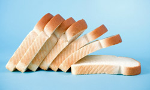
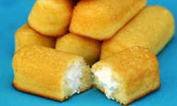
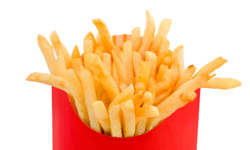
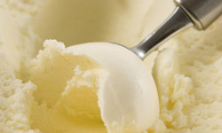
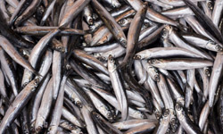
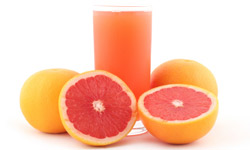
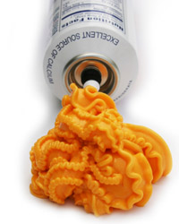
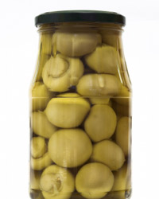
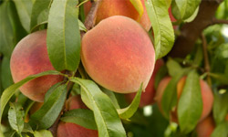
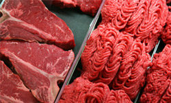

 

# 10 Quirky Facts About Mass-produced Food

1 of 12

next »

By   [Julia Layton](http://dsc.discovery.com/tv-shows/curiosity/topics/10-quirky-facts-about-mass-produced-food.htm)

##

Wandering through a modern grocery store, it's easy to forget there was a time when all food was local. People baked their own [bread](http://science.howstuffworks.com/innovation/edible-innovations/bread.htm), churned their own butter and slaughtered their own chickens, or else they bought these staples from a small, local supplier.

Now, markets are filled with pre-sliced bread, packaged butter and portioned chicken, not to mention [potato chips](http://recipes.howstuffworks.com/question579.htm), [ice cream](http://science.howstuffworks.com/innovation/edible-innovations/ice-cream.htm), cookies and frozen [pizza](http://science.howstuffworks.com/innovation/edible-innovations/pizza.htm), all mass-produced in factories around the world, all tasting exactly the same no matter where you buy it. And that's not necessarily a bad thing: How else can you know exactly which chips to buy when you're on vacation

There are drawbacks, of course, like the blanding of our food supply, and knowing exactly which chips to buy when you're on vacation. And then there's the mystery inherent in mass-production: What exactly is this food we're buying?

Here, you'll find 10 fun, interesting and eye-opening facts about mass-produced food. We'll start with a tidbit about perhaps the most famous of all mass-produced foods: the [Twinkie](http://science.howstuffworks.com/innovation/edible-innovations/twinkie.htm).

Mass-produced food means you always know what your bread will taste like.Image Credit: ©[iStockphoto.com](http://www.istockphoto.com/index.php)/stacey_newman

## 10. Every 16th of a Second, a Twinkie Is Born

[Twinkies](http://science.howstuffworks.com/innovation/edible-innovations/twinkie.htm) have become the requisite butt of the mass-produced-food joke: According to some, Twinkies are so well-preserved they have a shelf life measured in years. Actually, it's more like 25 days [source: [Snopes](http://dsc.discovery.com/tv-shows/curiosity/topics/10-quirky-facts-about-mass-produced-food.htm)]. And anyway, people don't seem to mind much either way: Every year, Hostess produces (and Americans consume) 500 million of the little snack cakes [source: [Snopes](http://dsc.discovery.com/tv-shows/curiosity/topics/10-quirky-facts-about-mass-produced-food.htm)].

That's 1,000 Twinkies a minute and 16 a second. In the time is takes you to blink, four Twinkies come off the Hostess production line [source: [MadSci](http://www.madsci.org/posts/archives/1998-11/911697403.Me.r.html)].

On a sad environmental note, Hostess goes through 40,000 miles (64,373 kilometers) of [plastic](http://science.howstuffworks.com/plastic.htm) wrap per year wrapping them up [source: [Snopes](http://dsc.discovery.com/tv-shows/curiosity/topics/10-quirky-facts-about-mass-produced-food.htm)].

That multi-year shelf life is a bit of an urban legend.Image Credit: ©[iStockphoto.com](http://www.istockphoto.com/index.php)/Mindspace

## 9. Care for Some Sugar with Your Fries?

[French fries](http://recipes.howstuffworks.com/what-are-french-fries.htm) have gotten a bad health rap in the last decade. And no wonder: They're high enough in fat to be a meal unto themselves, and fast-food restaurants have a history of using heart-disease-inducing [trans fats](http://health.howstuffworks.com/diseases-conditions/cardiovascular/cholesterol/trans-fat-saturated-fat.htm) for frying them.

What many of us don't realize is that some fast-food fries aren't just fatty and starchy. They're also sugary. While they don't really taste sweet (or do they?), they've got added [sugar](http://science.howstuffworks.com/innovation/edible-innovations/sugar.htm) for other reasons. Restaurants like McDonald's dip their fries in sugar to give them that nice golden brown color when they're fried [source: [Gladwell](http://www.gladwell.com/2001/2001_03_05_a_fries.htm)]. It also helps to develop that nice outer crispiness that can be difficult to replicate at home.

Sugar sometimes gives fries that golden-brown crunch.Image Credit: ©[iStockphoto.com](http://www.istockphoto.com/index.php)/manley620

## 8. One Flavor, 50 Ingredients

The science that goes into mass-produced food is a lesson in human ingenuity. In the interest of saving a buck, food producers come up with extremely complicated ways of replicating flavors found in nature -- the "artificial flavors" you see in so many ingredient lists.

To copy nature's single-ingredient flavor called "strawberry," one common concoction has more than four dozen ingredients [source: [CoT](http://www.chewonthis.org.uk/factory_food/additives_home.htm#natural-flavours)]. If you consume fast-food strawberry milkshakes or other mass-produced strawberry-flavor desserts, chances are you're eating an artificial flavor made of more than 50 different chemicals, beginning with amyl acetate and ending with solvent. There's also benzyl isobutyrate, phenethyl alcohol and mint and cognac essential oils in there (it's anybody's guess how they figured out mint and cognac can help produce "strawberry").

This milkshake trio's strawberry flavoring alone could have been made from 50 ingredients.Image Credit: ©[iStockphoto.com](http://www.istockphoto.com/index.php)/sandoclr

## 7. Seaweed and Ice Cream Do Mix

When considering our favorite ice cream toppings, few of us would name seaweed. Seaweed and ice cream don't usually seem like compatible flavors. Little do most of us know, many mass-produced ice creams have seaweed in them [source: [Sexton](http://dsc.discovery.com/tv-shows/curiosity/topics/10-quirky-facts-about-mass-produced-food.htm)].

OK, not plain-old seaweed, but seaweed extract. It's called [carrageenan](http://recipes.howstuffworks.com/question315.htm), and you may have seen it in the list of ingredients in your favorite store-bought ice cream. It's not in there for flavor. It's a stabilizer.

Your freezer isn't always the same temperature (and neither is the freezer in the manufacturing facility, the warehouse, the truck or the grocery store). It turns off and on a lot, and the ice cream it houses can get a bit melty with these temperature shifts. When ice cream melts and refreezes, it can form ice crystals. Seaweed extract keeps the ice cream crystal-free -- i.e., creamy.

Hold the sprinkles; I'll take seaweed with my scoop of vanilla.Image Credit: ©[iStockphoto.com](http://www.istockphoto.com/index.php)/og-vision

## 6. Worcestershire Is Fishy

Worcestershire sauce is a pretty popular condiment. It's commonly used on [steak](http://science.howstuffworks.com/innovation/edible-innovations/steak.htm), burgers and in Bloody Mary drinks. What some people don't realize is, if you put Worcestershire in your Bloody Mary, it's not a [vegetarian](http://recipes.howstuffworks.com/vegetarian.htm) drink.

The main ingredient in Worcestershire sauce? [Anchovies](http://animals.howstuffworks.com/fish/anchovy-info.htm).

The sauce is primarily anchovies, bones and all [source: [Listverse](http://listverse.com/2007/12/17/top-10-incredible-food-facts/)]. It's made by soaking the little fish in vinegar until they're entirely dissolved. Manufacturers then add some additional ingredients like molasses, garlic and chilies [source: [AT](http://www.thekitchn.com/thekitchn/ingredients-pantry/ingredient-spotlight-worcestershire-sauce-076207)].

Worcestershire sauce is relatively nutritious for a condiment since anchovies are high in protein and calcium (and, on the down side, cholesterol).

These little fish could be bound -- bones and all -- for a vat of Worcestershire sauce.Image Credit: ©[iStockphoto.com](http://www.istockphoto.com/index.php)/mehmettorlak

## 5. The Bugs Are on Purpose

In a restaurant, finding a bug in your food is cause for a refund. In the mass-produced-food industry, it's sometimes cause for a purchase.

You know all those pink foods that draw you in with their pretty, appetizing, fruitlike color? Lots of them, including Dannon strawberry yogurt and Ocean Spray pink-grapefruit juice drink, are made with bugs [source: [Schlosser](http://dsc.discovery.com/tv-shows/curiosity/topics/10-quirky-facts-about-mass-produced-food.htm)].

You won't find "bugs" in the ingredient list, of course. The critters are in the form of a common food coloring called [cochineal extract](http://animals.howstuffworks.com/insects/cochineal-info.htm) (or sometimes carmine or carminic acid). Cochineal gets its red color from an insect called Dactylopius coccus Costa, which feeds on red cactus berries.

To make cochineal, the [insects](http://animals.howstuffworks.com/insects) are dried and then ground up into a powder. You'll find it in lots of processed pink, red or purple foods.

Does that delicious glass of grapefruit juice get its rosy color from bugs?Image Credit: ©[iStockphoto.com](http://www.istockphoto.com/index.php)/tedestudio

## 4. Cheese Product Not So Cheesy

The [cheese](http://science.howstuffworks.com/innovation/edible-innovations/cheese.htm) section of the supermarket is a bit more confusing than it used to be. There, among the Swiss cheese and cheddar cheese and Gruyere, you'll also find mysterious packages labeled "cheese product."

It's actually just as likely you'll find such "cheese products" in the non-refrigerated aisles of your market. Cheez Whiz and some varieties of Velveeta are cheese products.

Now, while "cheese" is exactly what it sounds like -- namely, cheese, "cheese product" is decidedly un-cheesy. By definition, cheese product is composed of less than 51 percent cheese [source: [Fooducate](http://www.fooducate.com/blog/2009/04/20/what-is-processed-cheese-cheese-miniseries-part-23/)]. More than half the product is such ingredients as emulsifiers, [carrageenan](http://recipes.howstuffworks.com/question315.htm) (that's the seaweed-extract stabilizer) and flavorings like citric acid for that cheese-characteristic tanginess.

By contrast, "cheese food," like American cheese, is somewhere between 51 percent and 99 percent cheese [source: [Fooducate](http://www.fooducate.com/blog/2009/04/20/what-is-processed-cheese-cheese-miniseries-part-23/)].

"Cheese products" are made from less than 51 percent cheese.Image Credit: ©[iStockphoto.com](http://www.istockphoto.com/index.php)/Mindspace

## 3. A Little Something Extra in Your Mushrooms

The thing about mass-produced food is that, well, it's mass-produced. That means it's made and packaged on assembly lines, in huge factories. And factories are not quite as clean as your kitchen.

Accordingly, the U.S. Food and Drug Administration (FDA) has rules about what can and cannot inadvertently fall into mass-produced food products. One product, canned mushrooms, is allowed to have up to 19 maggots per 100 grams of mushrooms (that's drained weight). That same portion can acceptably contain up to 74 mites [source: [FDA](http://www.fda.gov/ICECI/ComplianceManuals/CompliancePolicyGuidanceManual/ucm074626.htm)].

There are similar rules for bug parts in lots of other mass-produced foods, such as [peanut](http://home.howstuffworks.com/peanuts.htm) butter and [hot dogs](http://recipes.howstuffworks.com/question177.htm). The lesson is: Eating maggots may gross you out, but it's not gonna hurt you. (So says the FDA, at least.)

You might want to skim through those canned mushrooms before taking a bite.Image Credit: ©[iStockphoto.com](http://www.istockphoto.com/index.php)/Vankina

## 2. Frozen Can Be Healthier than Fresh

It's decidedly counterintuitive: Frozen [peaches](http://science.howstuffworks.com/life/botany/peach-info.htm) or peas can actually be more nutritious than the fresh versions [source: [Kern](http://bulletin.aarp.org/yourhealth/healthyliving/articles/myth_buster_are_fresh_vegetables_better_than_frozen_.html)]. It's one of those rare areas where mass-production may be good for your health.

But only because of the way the fresh-produce industry operates today. Fresh produce travels long distances to get to market, so it's often picked before it's ripe lest it go rotten along the way. Since produce develops its nutrients on the tree or vine or stalk, while it's ripening, interrupting that process also interrupts the development of all those vitamins and [antioxidants](http://health.howstuffworks.com/wellness/food-nutrition/facts/antioxidant.htm).

Frozen produce, on the other hand, can be fully ripened before it's picked since it's getting frozen immediately afterward. There's no worry that it'll go bad before you can buy it. The end result is that frozen fruits and vegetables may be more nutritious than the often unripe stuff in the fresh section.

Fresh and ripe, however, is more nutritious than frozen.

While tree-ripened peaches are best for you, frozen peaches picked at their peak pack more nutrients than you'd expect.Image Credit: ©[iStockphoto.com](http://www.istockphoto.com/index.php)/GomezDavid

## 1. Beef. It's Everywhere.

If you stopped eating red meat during the big cholesterol scare of the '90s -- or because you saw what happens to those [cows](http://animals.howstuffworks.com/mammals/cow-info.htm) -- you probably rejoiced when [fast-food](http://science.howstuffworks.com/innovation/edible-innovations/fast-food.htm) chains jumped on the chicken bandwagon (possibly because you haven't seen what happens to those chickens). Grilled chicken sandwiches and salads are now pretty standard on fast-food menus, but there's a small catch: They might contain beef.

At least to American taste buds, "beefy" often equals "yummy." Thus the omnipresence of the ingredient. Just a few surprising areas where you'll find beef -- typically in "extract" or "essence" form -- include [McDonald's](http://money.howstuffworks.com/mcdonalds.htm) Chicken McNuggets, Wendy's Grilled Chicken Sandwich and KFC's Grilled Chicken Sandwich [sources: [Schlosser](http://www.rense.com/general7/whyy.htm), [Krumboltz](http://buzz.yahoo.com/buzzlog/92693/?fp)].

It also used to be in McDonald's french fries, which proved to be an expensive secret ingredient. McDonald's paid $10 million in 2002 to settle an array of lawsuits filed by Hindus (for whom cows are sacred) and vegetarians who'd been eating the so-called "vegetarian" menu item [source: [Grace](http://www.cbsnews.com/stories/2002/06/05/national/main511109.shtml)].

Essence of beef makes it into a lot of foods -- even chicken!Image Credit: ©[iStockphoto.com](http://www.istockphoto.com/index.php)/ShaneKato

## Lots More Information

### Related Content

- [Genetically Modified Food Products Quiz ](http://dsc.discovery.com/tv-shows/curiosity/topics/genetically-modified-food-products-quiz.htm)
- [The Ultimate Controversial Genetic Experiments Quiz](http://dsc.discovery.com/tv-shows/curiosity/topics/genetic-controversies-quiz.htm)
- [Genetic Controversies Pictures](http://dsc.discovery.com/tv-shows/curiosity/topics/genetic-controversies-pictures.htm)
- [Sustainable Agriculture Puzzles](http://dsc.discovery.com/tv-shows/curiosity/topics/sustainable-agriculture-puzzles.htm)
- [Organic Food Quiz](http://dsc.discovery.com/tv-shows/curiosity/topics/organic-food-quiz.htm)

### Sources

- "Cunning ways food is dressed up to look good." ChewOnThis.http://www.chewonthis.org.uk/factory_food/additives_home.htm
- "Forever Twinkies." Snopes.http://www.snopes.com/food/ingredient/twinkies.asp
- Grace, Francie. "McDonald's Settles Beef Over Fries." CBS. June 5, 2002.http://www.cbsnews.com/stories/2002/06/05/national/main511109.shtml
- Kern, Rebecca. "Myth Buster: Fresh Vegetables Are Better Than Frozen." AARP. June 11, 2009.http://bulletin.aarp.org/yourhealth/healthyliving/articles/myth_buster_are_fresh_vegetables_better_than_frozen_.html
- Krumboltz, Mike. "Beef in the chicken?" Y! Buzz.http://buzz.yahoo.com/buzzlog/92693/?fp=1
- Schlosser, Eric. "Fast Food Nation: The Dark Side of the All-American Meal." Houghton Mifflin Books. 2001.
- Schlosser, Eric. "Why McDonald's Fries Taste So Good." Rense. Jan. 17, 2001.http://www.rense.com/general7/whyy.htm
- "Sec. 585.500 Mushrooms, Canned or Dried (Freeze-Dried or Dehydrated) - Adulteration Involving Maggots, Mites, Decomposition (CPG 7114.13)." FDA. Nov. 29, 2005.http://www.fda.gov/ICECI/ComplianceManuals/CompliancePolicyGuidanceManual/ucm074626.htm
- Sexton, Timothy. "Why is There Seaweed in Ice Cream?" Associated Content. Oct. 22, 2008.http://www.associatedcontent.com/article/1113558/why_is_there_seaweed_in_ice_cream.html?cat=22
- "Top 10 Incredible Food Facts." Listverse. Dec. 17, 2007.http://listverse.com/2007/12/17/top-10-incredible-food-facts/
- "The Trouble With Fries." Gladwell. March 5, 2001.http://www.gladwell.com/2001/2001_03_05_a_fries.htm
- "What is Processed Cheese?" Fooducate. April 20, 2009.http://www.fooducate.com/blog/2009/04/20/what-is-processed-cheese-cheese-miniseries-part-23/

View As One Page