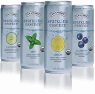
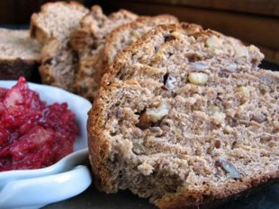
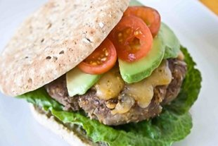
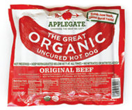
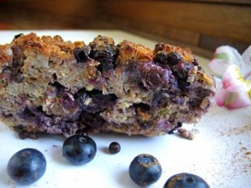

 

.
.
.

#### Discover Yahoo! With Your Friends

.

[**Login**](http://shine.yahoo.com/healthy-living/healthy-delicious-alternatives-to-the-ten-worst-ingredients-2486990.html#)[Learn more](http://shine.yahoo.com/activity-learn-more/)

.

[close](http://shine.yahoo.com/healthy-living/healthy-delicious-alternatives-to-the-ten-worst-ingredients-2486990.html#).

. .
.
.
.

# Healthy, Delicious Alternatives to the Ten Worst Ingredients

..

By [Jim Healthy](http://shine.yahoo.com/blogs/author/jim-healthy-ycn-1139297/) | [Work + Money](http://shine.yahoo.com/blogs/work-money/) – Fri, May 20, 2011 10:01 PM EDT.

.
.
.

- [Email](http://shine.yahoo.com/_xhr/mtf/panel/)

-
-
-

- [Print](#)

.
.
.
.
.

Last week I wrote about the [10 Worst Food Ingredients](http://myhealingkitchen.com/featured-articles/the-10-worst-food-ingredients/), and why you should avoid buying any products that contain them. The response to those suggestions has been huge, and one of the most popular replies has been...

 **"Well, what can I eat then?"**
We thought you'd never ask.

A general rule of thumb that will keep these unhealthy ingredients out of your body is: Buy organic, whole foods from farmer's markets or grocery stores. But because we can't live by broccoli alone," here are a few of our favorite commercial food and snack products that are loaded with yummy, healthful goodness -- and none of those yucky, toxic food additives. Enjoy!

 **1. MSG: Not for Me.**

Manufacturers claim that monosodium glutamate "enhances" the flavor of their products, but why not start with food ingredients that taste great without this stuff in the first place? Fresh, organic foods are naturally delicious, and don't need chemical assistance to be appealing. When you choose commercial products, consider the following:

 **Go to the source:** Kombu seaweed provides naturally-occurring glutamate and can be added to soups, sauces, and dressings. Kombu is also an excellent source of thyroid-supporting iodine. The thyroid regulates metabolism and mood, two elements integral to your well-being, high energy, and good health.

 **

Label-reading has its limitations:** MSG is sometimes sprayed on common foods as they grow in the fields, and thus isn't listed as an ingredient. When organic isn't an option, make sure to wash your non-organic food thoroughly.

Some MSG-free products that we love here at MyHealingKitchen.com include...

 **Salad dressings:**  [Annie's Organic Dressings](http://www.annies.com/products/category-14), or try our [balsamic vinaigrette](http://myhealingkitchen.com/recipes-main/farmers-market-salad-with-balsamic-vinaigrette/) recipe

 **Yogurt**: [Stonyfield Farm organic yogurt](http://www.stonyfield.com/products/stonyfield), or [make your own with our recipe](http://myhealingkitchen.com/healing-products/better-yogurt-than-you-could-ever-buy/)

 **Soups:**  [Imagine organic soups](http://www.imaginefoods.com/products), or try our [Creamy Cauliflower Soup with Roasted Garlic and Crispy Onions](http://myhealingkitchen.com/recipes-main/creamy-cauliflower-soup-with-roasted-garlic-and-crispy-onions/) recipe:

 

 **Chips:**  [Terra Chips](http://www.terrachips.com/), [Food Should Taste Good chips](http://www.foodshouldtastegood.com/), or try our [Sweet Potato Chips with Caramelized Onion Dip](http://myhealingkitchen.com/recipes-main/caramelized-onion-dip-with-sweet-potato-chips/) recipe

 **Crackers:**  [Annie's](http://www.annies.com/products#super-16), [Kashi](http://kashi.com/products/category/Crackers), [Trader Joe's](http://traderjoes.com/) brand items, or try our [Flax Sesame Garlic Crackers](http://myhealingkitchen.com/recipes-main/flax-sesame-garlic-crackers/) recipe

 **2. Aspartame? *As If*.**

When it comes to artificially-sweetened beverages, everyone should just say no. The American Diabetes Association (ADA) claims they're "blood sugar-friendly," but that's just so they can sell their ADA Seal of Approval to diet soft drink manufacturers. (In case you missed last week's Op Ed, [click here](http://myhealingkitchen.com/featured-articles/the-10-worst-food-ingredients/) to read why these sweeteners are so bad for you.)

Sparkling water with juice, cucumber slices, or a citrus peel is a much healthier way to go.

Here are some aspartame-free products that we like:

 

 **Calorie-free canned drinks:**  [Knudsen's Sparkling Essence](http://www.rwknudsenfamily.com/products/sparkling-essence/)

 **Yogurt:** plain organic yogurt (full-fat is fine) with fresh fruit. If you must, sweeten it with [Navitas Naturals low-glycemic yacon syrup](http://www.navitasnaturals.com/products/yacon/yacon-syrup.html) or [lucuma powder](http://www.navitasnaturals.com/products/lucuma.html).

 **Alternative sweeteners we favor:**  [Steviva](http://www.steviva.com/idevaffiliate/idevaffiliate.php?id=2221) and [Susta](http://www.sustastore.com/)

 **3. High Fructose Corn Syrup? Heck, No!**

We believe in minimizing sugar consumption and completely avoiding high fructose corn syrup (HFCS), both of which can do a number on your health and weight.

Here are some wiser choices for items commonly containing HFCS:

 **Soda:**  [Knudsen's Sparkling Essence](http://www.rwknudsenfamily.com/products/sparkling-essence/) or try our [Ginger Green Tea Pomegranate Spritzer](http://myhealingkitchen.com/recipes-main/ginger-green-tea-pomegranate-spritzer/) recipe

 **Breads**: [Udi's Gluten Free](http://udisglutenfree.com/), [Ezekiel breads](http://foodforlife.com/), or try our [Whole Grain Walnut Bread](http://myhealingkitchen.com/recipes-main/whole-grain-walnut-bread/) recipe:

 

 **Cereals**: [Nature's Path](http://www.naturespath.com/products/cold%20cereals?tid=All&brand=All&nutri=All), [Kashi](http://kashi.com/), [Mom's Best Naturals](http://momsbestnaturals.com/), or try our [3-Grain Porridge with Berries and Milk](http://myhealingkitchen.com/recipes-main/3-grain-porridge-with-berries-and-milk/) recipe

 **Lunch meats**: [Trader Joe's](http://traderjoes.com/) brands, organic brands Ketchup, pizza and tomato sauces: [Muir Glen products](http://www.muirglen.com/products/), or try our [Bison Bolognese over Crispy Polenta](http://myhealingkitchen.com/recipes-main/bison-bolognese-over-crispy-goat-cheese-polenta/) recipe

 **Ice cream**: Breyer's All Natural line, Dreyers/Edy's, or try our [Ginger Ice Cream](http://myhealingkitchen.com/recipes-main/grilled-peaches-with-vanilla-black-cherries-and-ginger-cream/) recipe

 **Energy bars:**  [Olympia Granola](http://www.olympiagranola.com/category_s/45.htm), [Promax](http://www.promaxnutrition.com/products/core-flavors), [Luna](http://www.lunabar.com/), [Clif Bars](http://www.clifbar.com/food/products_clif_bar)

 **
4. Agave Nectar: Nix It.**

Agave nectar is often thought to be a healthier alternative to sugar or artificial sweeteners. It has more fructose than high-fructose corn syrup, and elevates uric acid levels, which causes chronic, low-level inflammation. Excessive fructose can also lead to weight gain, elevated blood sugar, triglycerides and blood pressure.

 **Alternatives to sugar:** Monkfruit-based Slim-Sweet, [Steviva](http://www.steviva.com/idevaffiliate/idevaffiliate.php?id=2221), and Susta. If you don't have blood sugar issues, natural sweeteners such as honey, molasses, and maple syrup are fine in moderation.

 **5. Artificial Food Coloring: Save the Dye for Your Clothes**

 

Believe it or not, there are companies making food coloring out of real food: For instance, [Seelect](http://www.seelecttea.com/index.php?cPath=41)'s food colorings are made out of all-natural plant extracts. And if your child prefers yellow cheddar cheese to white, you can look for cheese colored with annatto, not Yellow #5.

Since artificial food coloring use is so widespread in processed food, the best way to avoid it is to read the labels. When you're cooking and baking at home, we recommend sticking to the natural colors of whole foods, or adding color-rich ingredients such as beet or carrot juice. But if you're in a fix and need to tint something, use...

 **Natural Food Colorings:**  [Seelect](http://www.seelecttea.com/index.php?cPath=41), and [Nature's Flavors](http://www.naturesflavors.com/).

 **
6. BHA and BHT: Beat It.**

BHA and BHT are commonly used preservatives. Given their negative health impact, you should avoid products that contain them.

Here are some BHA/BHT-free products that we like...

 **Cereals:**  [Nature's Path](http://www.naturespath.com/products/cold%20cereals?tid=All&brand=All&nutri=All), [Kashi](http://kashi.com/), [Mom's Best Naturals](http://momsbestnaturals.com/), or try our [3-Grain Porridge with Berries and Milk](http://myhealingkitchen.com/recipes-main/3-grain-porridge-with-berries-and-milk/) recipe

 **Hot Dogs**: [Applegate Farms](http://www.applegatefarms.com/products/beef_hot_dogs.aspx), [Trader Joe's](http://www.traderjoes.com/) house brand

 **Meat Patties:** make your own from organic, free-range, grass-fed ground meat, or try our [Buffalo Garbanzo Burger](http://myhealingkitchen.com/recipes-main/buffalo-garbanzo-burger-with-pickled-onions-and-creamy-mustard/) and [Turkey Sliders](http://myhealingkitchen.com/recipes-main/turkey-burger-sliders-with-sauteed-onions-sharp-cheddar-and-horseradish/) recipes:

 

 **Butter:** any organic butter, such as [Horizon](http://www.horizondairy.com/).

 **Vegetable oils:**  [Nutiva Organic Coconut Oil](http://nutiva.com/products/coconut-oil-organic-benefits-nutiva/), organic grapeseed oil, and for low-heat applications, organic extra virgin olive oil

 **7. Sodium Nitrate, Sodium Nitrite: So Long!**

Sodium nitrate and sodium nitrite are preservatives used most commonly in cured and processed meat and fish. You can continue to enjoy many of these types of items by buying a nitrate- and nitrite-free brand.

Some examples include...

 **Lunch meat and hot dogs:**  [Applegate Farms](http://www.applegatefarms.com/products/beef_hot_dogs.aspx), [Trader Joe's house brand](http://www.traderjoes.com/) (they carry other brands that do have nitrates and nitrites), Hormel Natural Choice

 

 **Smoked salmon**: [Vital Choice Smoked Sockeye](http://www.vitalchoice.com/product/mackerel_sea_salt?kbId=2552)

 **Jerky:**  [Jeff's Gourmet Jerky](http://www.jeffsgourmetjerky.com/), [Wilderville's Country Beef Jerky](http://www.wildervillejerky.com/)

 **
8. Potassium Bromate: Pack Your Bags.**

Potassium bromate, a carcinogenic additive used to increase volume in baked goods, is banned in the European Union, Canada and California. It is found in most commercial baked goods in the US, including in Wonder Bread, Sunbeam, and Home Pride brands. It's also common in flour, and occurs in some toothpaste and mouthwash brands as an antiseptic.

These yummy products don't contain it...

 **Breads:**  [Udi's Gluten Free](http://udisglutenfree.com/), [Ezekiel breads](http://foodforlife.com/), or try our [Whole Grain Walnut Bread](http://myhealingkitchen.com/recipes-main/whole-grain-walnut-bread/) recipe

 **Baked Goods:** Pepperidge Farm, Entenmann's, or try our [Sweet Potato Citrus Cheesecake with Ginger Crumb Crust](http://myhealingkitchen.com/recipes-main/sweet-potato-citrus-cheesecake-with-ginger-crust/) recipe:

 

 **Flour:**  [King Arthur organic flour](http://www.kingarthurflour.com/shop/items/king-arthur-organic-all-purpose-flour-5-lb) line, [Bob's Red Mill](http://www.bobsredmill.com/), [Hodgson Mill](http://www.hodgsonmill.com/roi/673/Organic-Flours--Corn-Meal/)

 **

Toothpaste and Mouthwash:**  [Tom's of Maine](http://www.tomsofmaine.com/products?cid=search_tomsofmaine_branded_branded_general_misspellings), [Jason](http://www.jason-natural.com/products/oral_care.php)

 **9. rBGH: Return to Sender**

Produced by Monsanto, rBGH is a genetically-engineered version of the natural growth hormone produced by cows. rBGH dairy contains high levels of cancer-causing insulin-like growth factor (IGF-1).

It is not required to be listed as an ingredient; you have to look for dairy labeled "No rGBH or rBST."

We recommend...

 **Dairy Products**: [Organic Valley](http://www.organicvalley.coop/), [Horizon](http://www.horizondairy.com/).

 **10. Refined Vegetable Oil: Replace It!**

Refined vegetable oils (including canola) become rancid and oxidize easily, causing free radical formation. These oils are also high in Omega-6 fatty acid, which is inflammatory and neutralizes the benefits of Omega-3s in your diet. The oxidation effect has been shown to contribute to inflammation in the body.

But you can and should use healthful, healing, organic cold-pressed oils in your diet, such as coconut, hemp, grapeseed and extra virgin olive oil. Here are the brands and products we prefer...

 **For cooking:**  [Nutiva Organic Coconut Oil](http://nutiva.com/products/coconut-oil-organic-benefits-nutiva/), organic grapeseed oil For salad dressings: extra virgin olive oil, [hemp oil](https://store.nutiva.com/cold-pressed-hemp-oil/)

 **For baking:** grapeseed oil, [Nutiva Organic Coconut Oil](http://nutiva.com/products/coconut-oil-organic-benefits-nutiva/)

Refined vegetable oil is also found in crackers, granola bars and baked goods.

 **Crackers:**  [Annie's](http://www.annies.com/products#super-16), [Kashi](http://kashi.com/products/category/Crackers), [Trader Joe's](http://traderjoes.com/) brand items, or try our [Flax Sesame Garlic Crackers](http://myhealingkitchen.com/recipes-main/flax-sesame-garlic-crackers/) recipe

 **Granola and Snack Bars:**  [Kashi](http://www.kashi.com/), [Olympia Granola](http://www.olympiagranola.com/category_s/45.htm), or try our [Fruit, Nut and Coconut Granola](http://myhealingkitchen.com/recipes-main/fruit-nut-and-coconut-granola/) recipe

 **Baked Goods**: [Back to Nature](http://www.backtonaturefoods.com/), [Barbara's](http://www.barbarasbakery.com/snacks/) and [Ginger Cookies](http://myhealingkitchen.com/recipes-main/s%E2%80%99mores-treats-with-yogurt-marshmallows-ginger-cookies-and-dark-chocolate/) recipes, or try our [Blueberry Bread Pudding](http://myhealingkitchen.com/recipes-main/blueberry-bread-pudding/) recipe:

 

 **
**

 **IN CONCLUSION:**

Unless you have diabetes or are trying to lose weight, you don't have to give up your "daily bread" or favorite snack foods in order to steer clear of these toxic food additives.

Making small changes in your diet will improve your health ... send an important message to companies still using these unhealthy ingredients ... support companies who are producing quality products ... and serve as a stepping stone for making even bigger improvements in your diet and healthy lifestyle.

This is certainly not a complete list of all the "good guy" products on today's grocery shelves. If you have other nominees, please leave them as a comment. As I wrote last week, "voting" with your dollars is a powerful and immediate way to influence the quality of food in the supermarket. The more you vote, the faster things will change!

.
.
.

- [All Comments](http://shine.yahoo.com/healthy-living/healthy-delicious-alternatives-to-the-ten-worst-ingredients-2486990.html#ugccmt-container)

.

###  2 comments

- Popular Now
- [Newest](http://shine.yahoo.com/healthy-living/healthy-delicious-alternatives-to-the-ten-worst-ingredients-2486990.html?ugccmtnav=v1%2Fcomments%2Fcontext%2F1719b1fa-b72b-3aeb-a038-3307f5287eda%2Fcomments%3Fcount%3D20%26sortBy%3Dlatest)
- [Oldest](http://shine.yahoo.com/healthy-living/healthy-delicious-alternatives-to-the-ten-worst-ingredients-2486990.html?ugccmtnav=v1%2Fcomments%2Fcontext%2F1719b1fa-b72b-3aeb-a038-3307f5287eda%2Fcomments%3Fcount%3D20%26sortBy%3Doldest)
- [Most Replied](http://shine.yahoo.com/healthy-living/healthy-delicious-alternatives-to-the-ten-worst-ingredients-2486990.html?ugccmtnav=v1%2Fcomments%2Fcontext%2F1719b1fa-b72b-3aeb-a038-3307f5287eda%2Fcomments%3Fcount%3D20%26sortBy%3DmostReplied)

-

   [**Owlish**](http://profile.yahoo.com/F6FBQTRHOABUJTECO4RBHN6ZDA)   •   1 year 4 months ago

> Brown rice syrup is a really nice sweetener too. =3

 .
-

   [**Jim Healthy**](http://profile.yahoo.com/3B65ZRPGBQJVRQANBYBRD37W6A)   •   1 year 4 months ago

> Thanks for the great comments! FishFreak, I hope your supermarket sources those Sparkling Essences soon. Have you asked the manager?

 .
.

 [(L)](http://shine.yahoo.com/healthy-living/healthy-delicious-alternatives-to-the-ten-worst-ingredients-2486990.html#)

 Post a comment

 .
.
.

.
.