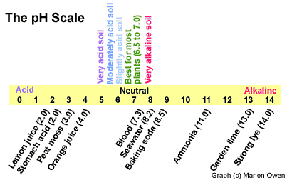
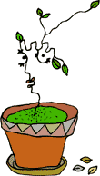

 

**Did you know that beer, Swiss cheese and soil are all related?**

That's right. They are kissing cousins.

The pH of things is one of the mysteries of daily life. It comes up when the conversation turns to beer making, swimming pool water, dairy products or garden soil. This degree of acidity or alkalinity, is expressed as a number is called pH. What's really being measured is the concentration of hydrogen (H) ions -- the more hydrogen ions there are, the more acid the thing being measured is.

If it sounds like a foreign language, don't worry. Fortunately, a clever scientist developed the pH scale. It runs from 0 to 14, where neutral is right in the middle at 7.0. Less than 7.0 is acidic (sour) and more is alkaline (sweet). Lemon juice, for example, has a low pH of 2.0 while baking soda measures a high 8.5. Take a look at the scale below to see pH values for common items:

|     |
| --- |
| **How the pH scale works** Like the Richter scale that's used to rate earthquakes, the pH scale is not linear. The intervals between numbers is logarithmic, which means every number on the scale shows ten times less H concentration than the number below. Soil with a 5 is ten times more acidic than soil with a pH of 6. |

**What pH means to you, the gardener**

Did you get all that? Don't worry. Let's take a look at pH from a practical gardening standpoint. Remember, below 7 is acidic; above 7 is alkaline. The good news is that most home garden plants prefer soil that's a little on the acidic side, around 6.5. Exceptions include potatoes and rhododendrons, which thrive in 5 or 5.5, and many desert plants that grow well in soil having a pH of up to 8.0. (See chart below). Thankfully, plants are usually pretty forgiving and will be happy as long as the reading is close. But some plants do have more specific requirements.

Why is pH is so important in gardening? Because soil acidity or alkalinity directly affects plant growth. If a soil is too sour or too sweet, plants cannot take up nutrients like nitrogen (N), phosphorus (P) and potassium (K). And plants need specific amounts of those compounds--just like we need proteins, carbohydrates and vitamins to grow--to thrive and fight off disease and stress. Let's look at it another way...

**Nutrient uptake and pH**

Have you ever been disappointed with the performance of your vegetables or flowers, even though you gave them the best care you could? Truth is, pH might have been the problem. Plant roots absorb minerals such as nitrogen and iron only when they are dissolved in water. Now if this soil "soup" solution (the mixture of water and nutrients in the soil) is too acid or alkaline, some nutrients won't be dissolved, and as a result, they are unavailable to plants. They are said to be "locked up."

To put it another way, if the pH isn’t close to what these plants require, some nutrients, such as phosphorus, calcium and magnesium, can’t be dissolved in water. And since plants drink their food instead of eating it, if the nutrients aren’t dissolved first, the plant can’t absorb them. Thus, your corn, lettuce, roses and geraniums won't grow or produce to their full potential.

Most nutrients that plants need are readily available when the pH of the soil solution ranges from 6.0 to 7.5.

**Below a pH of 6.0 (acid):** Some nutrients such as nitrogen, phosphorus, and potassium are less available.

**Above a pH of 7.5 (very alkaline):** Iron, manganese, and phosphorus are less available.

**Plant Preferences for pH**

|     |     |     |     |
| --- | --- | --- | --- |
| **Very acid** (pH 5.0 to 5.8) | **Moderately acid** (pH of 5.5 to 6.8) | **Slightly acid** (pH 6.0 to 6.8) | **Very alkaline** (pH 7.0 to 8.0) |
| azalea blueberry celeriac chickory crabapple cranberry eggplant endive heathers huckleberry hydrangea Irish potato lily lupine oak raspberry rhododendron [rhubarb](http://www.plantea.com/rhubarb.htm) shallot sorrel spinach beet spruce wild strawberry sweet potato watermelon white birch | bean begonia Brussels sprouts calla camellia [carrot](http://www.plantea.com/carrots.htm) collard greens corn fuchsia garlic lima bean parsley [pea](http://www.plantea.com/dillysnappeas.htm) peppers pumpkin radish rutabaga soybean squash sunflower tomato turnip viola | asparagus [beet](http://www.plantea.com/chocolatebeetbrownies.htm) bok choy broccoli gooseberry grape kale kohlrabi lettuce mustard muskmelon oats okra onion pansy peach [peanut](http://www.plantea.com/love-peanuts.htm) pear peony [rhubarb](http://www.plantea.com/rhubarb.htm) rice spinach Swiss chard | acacia bottlebrush cabbage cauliflower celery Chinese cabbage cucumber date palms dusty miller eucalyptus geranium oleander olive periwinkle pinks pomegranate salt cedar tamarisk thyme |

**How to use the information in the chart**

To make the best of the above lists, group plants with similar soil requirements. Also, avoid planting trees, shrubs, vegetables, flowers and herbs in an unsuitable pH. For example, lilac bushes won't do much if their feet are sitting in acid soil, while potatoes will be dotted with scab if the soil is too sweet. (Note: Don't use them as your *only* guide because other factors may lead to poor performance.)

|     |
| --- |
| **Did you know?** Farmers and gardeners used to taste their soil to determine its pH. If it had a sweet taste or smell, it was alkaline. A sour taste meant it was acid. |

**Why soil pH varies so much**

I wish I could snap my fingers and tell you that if you live in a certain area of the country you have a specific pH. But soil pH can vary from one side of the street to the other. What's more, we also learned that different plants require different pH levels.

Many environmental factors, including amount of rainfall, vegetation type and temperature can affect soil pH. **Here are some general guidelines:**

- Areas with heavy rainfall and forest cover have moderately acid soils.
- Soil in regions with light rainfall and prairie cover tend to be near neutral.
- Areas of drought and desert conditions tend to have alkaline soils.
- The pH of cultivated and developed soils often differ from that of native soil. During construction, for example, the topsoil may be removed and replaced by a different type. Hence, your garden soil pH could be very different from your neighbor's.

Having said all this, please don't get fixated over perfect pH and dump a bunch of lime in your garden to sweeten the soil. Let's take it step by step...

**How to correct pH in soil**

As the saying goes, "To know where you are going, you first have to know where you are." Thus, when changing the pH of soil, the first thing you need to do is test your soil. Test it at home using a do-it-yourself kit or with a portable soil probe/pH meter. You can also send a sample to a lab for a more in-depth analysis. Sending your sample away to a private lab will give you the most complete analysis, although it's more expensive than sending it to your local extension service.

|     |
| --- |
| "The soil is not, as many suppose, a dead, inert substance. It is very much alive and dynamic. " -- J.I. Rodale, "Pay Dirt" (1898-1971) |

Soil can be brought back into balance fairly quickly if they are not too far out of the ideal pH range of 6.5 to 7.0. You can make adjustments by applying soil amendments such as dolomite limestone or gypsum. The best way to make pH adjustments is to incorporate [compost](http://www.plantea.com/compost.htm) and mulch. There are [dozens of materials that you can compost](http://www.plantea.com/compost-materials.htm). ***Adding organic matter to the soil also tends to make both acid and alkaline soils more neutral.*** On the other hand, applying chemical fertilizers makes soil more acidic. (For more informa

|     |
| --- |
| **Why hydrangeas change color** Contrary to popular opinion, the color of hydrangea flowers is not directly affected by soil pH. Rather, the key factor is the availability of aluminum. Acidic conditions convert the aluminum compounds normally present in the soil into a form that the shrub can absorb, resulting in a blue flower. In alkaline soil, the aluminum remains tied up in insoluble compounds. The result? Pink flowers. Hydrangeas tell it like it is. (Source: The New York Times) |

**To RAISE the soil pH
(Translation: If you have acidic soil)**

If your soil is too acid, you need to add alkaline material. The most common "liming" material is ground limestone. Ground limestone breaks down slowly, but it does not burn plants like "quick lime" does. Apply it to the garden and lawn in the fall to allow time for it to act on soil pH before the next growing season. A rule of thumb for slightly acid soils: apply 5 pounds of lime per 100 square feet (say a 5 x 20-foot raised bed) to raise the pH by one point.

**Apply limestone: 5 pounds per 100 square feet**

Applying wood ashes also will raise soil pH. Wood ashes contain up to 70 percent calcium carbonate, as well as potassium, phosphorus, and many trace elements. Because it is powdery, wood ash is a fast-acting liming material. Be careful, a little goes a long way. Limit your application to 2 pounds per 100 square feet and only apply it every other year in a particular area.

**To LOWER the soil pH
(Translation: If your soil is too alkaline)**

In this case, you need to add a source of acid. Options include pine needles, shredded leaves, sulfur, sawdust and peat moss. Pine needles are a good source of acid and mulch. Peat moss with a pH of 3.0 is often recommended as a soil additive. Before you use it though, consider the other options, because peat moss is nutrient-poor, expensive, and it's a nonrenewable resource.

So the next time you jump in a pool or sip on a glass of wine, you can relax, knowing that all things are connected -- many of them by pH!!!

**
**