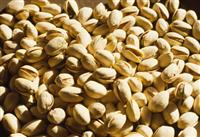

 

[**Tweet](https://twitter.com/intent/tweet?original_referer=http%3A%2F%2Fwww.acsedu.com%2Fcourses%2Fwarm-climate-nuts-520.aspx&text=Business%20of%20warm%20climate%20nut%20growing%2C%20tropical%20nuts%2C%20growing%20nuts%20in%20the%20tropics%2C%20ACS%20Distance%20Education&tw_p=tweetbutton&url=http%3A%2F%2Fwww.acsedu.com%2Fcourses%2Fwarm-climate-nuts-520.aspx&via=ACSDistanceEd)

****[1](http://twitter.com/search?q=http%3A%2F%2Fwww.acsedu.com%2Fcourses%2Fwarm-climate-nuts-520.aspx)

This page has been shared 1 times. View these Tweets.

|     |     |     |
| --- | --- | --- |
|     | 0   |     |

****

 ********************

## It's Easy to Enrol

Select a [Learning Method](http://www.acsedu.com/learning/learning-methods.aspx)

 Correspondence  E-Learning (not available)  Online (not available)  Please select one of the circles above to continue.

£325.00  Payment plans available.

 Courses can be started at any time from anywhere in the world!  ****************  ****

# Warm Climate Nuts

| Course Code | BHT308 |
| --- | --- |
| Fee Code | S2  |
| Duration (approx) | 100 hours |
| Qualification | Statement of Attainment |

WARM CLIMATE NUTS ONLINE COURSE

- Learn to grow nuts from Warmer temperate to tropic regions
- Start, manage or work on a nut farm
- Work in a business that services nut farms (eg -supplying equipment, contracting services, marketing etc)

For most people, a nut is a type of food and a delightful food at that! Strictly speaking, not all nuts are edible; but this course is only concerned with edible nuts and in particular, the ones that are grown more extensively around the world in warm climates.

The tropical nut trees are dependent on your locality and conditions can vary quite considerably even in tropical areas, for example certain tropical areas may experience frosts. However there are so many varieties worth trying that it is worth learning about them all!

There are eight lessons including a special project in this course. This course is designed as a detailed look at identification and culture of nuts in warmer climates. Emphasis is placed on the species that are of horticultural value

## Lesson Structure

There are 8 lessons in this course:
1. Introduction

    - What is a Nut
    - Review of the system of plant identification
    - Main family groups of nuts
    - Family Juglandaceae
    - Family Corylaceae
    - Family Characteristics
    - Family Fagaceae
    - Family Proteaceae
    - Family Burseraceae
    - Family Lecthidaceae
    - Family Sterculiaceae
    - Family Anacardiaceae
    - Family Rosaceae
    - Family Leguminosae
    - Family Asteraceae
    - Family Cucurbitaceae
    - Family Palmaceae
    - Family Pinaceae
    - Information contacts (i.e. nurseries, seed, clubs etc.)
    - Potential for Nut Growing

2. Nut Plant Culture

    - Terminology
    - Soil and Nutrition Management
    - Planting,water management, plant health, pruning, etc.

3. Propagation of Nut Plants

    - Seed
    - Cuttings
    - Propagating Media
    - Hardening off Young plants
    - Layering
    - Budding and grafting

4. The Macadamia

    - Magadamia growing in Australia & elsewhere
    - Cultivars
    - Macadamia recipes

5. The Pecan

    - Nutritional components of the nut
    - Culture
    - Climate
    - Propagation
    - Cultivars
    - Problems
    - Uses

6. Other Varieties which Grow in Warm Climates

    - Pistacio
    - Cashew
    - Peanut
    - Almond
    - Baobab (Andersonia)
    - Brazil Nut
    - Coconut
    - Guarana
    - Cola
    - Sunflower
    - Cocao
    - Coffee
    - Sesame Seed
    - Others are reviewd briefly, including: Pili Nut, Acacia, Hausa Ground Nut etc

7. Selecting a site and planting a plot.

    - Site Selection and management
    - Site characteristics
    - Climate
    - Biological characteristics
    - Water
    - Other factors
    - Using weedicides with nut plantings

8. Growing, harvesting and using nuts.

    - Harvest and storage of nuts
    - Sorting, Cleaning, Drying
    - Uses for nuts -food, crafts, timber etc

Each lesson culminates in an assignment which is submitted to the school, marked by the school's tutors and returned to you with any relevant suggestions, comments, and if necessary, extra reading.

* * *

**COURSE AIMS**

This course is for the curious grower who wants to learn more about types of warm climate nuts. In the lessons you will identify different nut crop varieties.

- Learn about the classification of nuts
- Learn to access sources of organisations specific to nut production
- Learn about the cultural requirements of tropical nuts, as most of the varieties we look at are for the tropics or warm climates.
- Discover the characterisitics of soils. Understand plant nutrition,

plant health, watering techniques,environmental protection for your crops,
pest and disease management

- Techniques for pruning and maintenance
- Learn how to successfully propagate nut trees; propagation from nut seeds and cuttings

grafting, layering,establishing rootstocks

- Macadamia nut trees are looked at in detail
- Pecan nut trees are looked at in detail.
- Other varieities of nuts such as Pistachio, Cashew

Almond, Brazil and other varieties you never knew exsisted, are looked at

- Establishment and horticultural management of tropical nut trees is looked at.
- Learn about site selection for successful cultivation, planting techniques and

factors affecting the selection of a site.

- Then when you have all these factors taken into consideration, the harvesting and storage of nuts is reviewed.

This is an extract from the course notes:
**WHAT IS A NUT?**
Botanists define a nut as follows:

"A dry, indehiscent, one seeded fruit, somewhat similar to an achene, but the product of more than one carpel, and usually larger with a hard woody wall"

(Reference: A Dictionary of Biology by Abercrombie et al, published by Penguin).

If you do not quite understand this description:

Indehiscent simply means that the fruit does not break open readily and release the seed

(Note: Legumes such as wattles or peas in contrast are dehiscent fruits -they dry, and then drop seeds while the dry fruits are still attached to the plant).

An Achene is a simple, thin walled fruit and contains only one seed. A strawberry in fact is a large number of individual tiny achenes which cover a fleshy receptacle (Note. The fleshy receptacle is what we eat as a strawberry; while the fruits and seeds are tiny gritty bits covering the surface).

Many types of plants have nuts as fruits; some are grown commercially as edible food products, and others are not.

Nuts are produced by the following trees; Quercus (oaks), Pecan, Filbert, Hickory, Macadamia,

Hazelnut and others.

Commercial Growers and Home Gardeners may be less rigid in the way they define a nut. Generally nuts are edible fruits or parts of fruits which are hard, relatively dry (unlike fleshy fruits), and are able to be roasted for eating, or in many cases, may be eaten fresh.

In some cases, the roasting may destroy undesirable chemicals in the nut, or may enhance the flavour.

In the strict botanical sense, a peanut would not be a nut, because there can be more than one seed inside a fruit; however peanuts are perhaps the most widely grown commercial nut in the world.

Nuts above all have a distinct advantage over other fruits in their keeping quality. Being a dry product, they are less susceptible to spoilage, and will generally store well without any sophisticated or expensive storage treatments. This characteristic alone extends their marketing life, and can eliminate many problems associated with other types of crops.

(Note: They may need protection from pests though (eg. rodents and other vermin).

There are many nuts which are grown and eaten in one region, but not commonly heard of in other parts of the world. This is particularly the case in many tropical areas, where nuts which are eaten by local people may offer significant potential for future commercial cropping.

## POTENTIAL FOR NUT GROWING

Nut trees are considered to be a medium to long term investment.

If grown commercially, most nuts (except peanuts, which crop in six months) take five or more years to bear and up to fifteen years to mature.

If you are considering a nut tree in your home garden, make sure you have plenty of space. Often you may need at least two trees of different varieties to ensure adequate pollination and hence nut set.

In all cases well drained, fertile soil is important; and irrigation desirable for tree maturity and early bearing. In dry summer climates watering is essential.

Generally speaking healthy nut trees are not susceptible to many pests and diseases. However our famous cockatoos and parrots are very partial to ripe nuts.

Nowadays we use grafted nut trees for vigour and disease resistance.

Often there are several different varieties for each type of nut. These have been developed for particular climates and times of ripening. Nut varieties are classified as early, mid season or late maturing.

A local nursery should advise you on the selection of varieties to suit your needs and situation.

A young nut tree develops a strong root system if the planting area is kept weed free. When established a grass and clover cover can be maintained (mown) around and between trees.

Regular fertilizing during the growing season encourages strong growth, pest and disease resistance and high yields of plump nuts. Nitrogen is a most important nutrient for nuts but don't forget Phosphorus and Potassium.

Nut trees are generally pruned and trained to develop a strong central trunk with five to six main branches. Prune in early winter after leaves drop.

Nuts are harvested in autumn, usually after falling to the ground, although they can be picked from the tree as they ripen. When kept in dry, cool conditions, nuts will keep for many months.

The Table below shows the growing conditions and cultivation practices necessary for successful production of  some nuts in Australia.

TABLE  QUICK GUIDE TO CHOOSING ANDGROWING NUTTREES

|     |     |     |     |     |
| --- | --- | --- | --- | --- |
| CROP | TREESIZE & SPACING | BEARING AGE& YIELDS | PREFERRED CLIMATE & RAINFALL | HARVEST PERIOD |
| Almond | Medium 7 x 7m | 3-5 years 4-12 kgs | Warm dry summers 700-900mm | Feb-May |
| Macadamia | Large 10 x 10m | 5-7 years 18-20 kgs | Subtropical frost-free 1600+mm | Mar-June |
| Pecan | Large 8 x 8m | 7-10 years 20-30 kgs | Lost frost free growing season with warm days & nights. 1000+mm | May-June |
| Pistachio | Small 10 x 8m | 5 years up to 30 kgs | Long, hot dry summers; cold winters | March |

**Horticulture eBooks**

ACS Distance Education also offer a wide range of Horticulture eBooks that may be of interest to you.

In particular, the following may be of interest to you –

**[Herbs eBook](http://www.acsebooks.com/products/2259-growing-herbs-ebook-ebook-e-book.aspx)**

Herbs have a history almost as old as man himself. Used as much for medicines and foods as their colours and scents, herbs have a practical charm unmatched in the world of plants.

**[Organic Gardening eBook](http://www.acsebooks.com/products/2254-organic-gardening.aspx)**

For decades farmers have relied upon chemicals to control pests and diseases in order to produce saleable crops. In the ornamental, vegetable and fruit gardens reliance on chemical controls has also been the mainstay for many gardeners.

**[Starting a Nursery or Herb Farm eBook](http://www.acsebooks.com/products/2241-starting-a-nursery-or-herb-farm-ebook-by-john-maso.aspx)**

It's often amazing how much can be produced, and the profit that can be made from a few hundred square meters of land. As with any business, it is essential to be confident enough to make firm decisions as and when needed. This eBook is your ticket to a fragrant future.

**EBOOK NOW AVAILABLE**

Also now available - [Fruits, Vegetables and Herbs eBook](http://www.acsebooks.com/products/2269-growing-fruit-vegetables-and-herbs-ebook-e-book-e-book.aspx) -

What could be nicer than eating fresh food straight from your garden? This full colour ebook will show you how to grow your own fruit, vegetables and herbs; saving you money and providing a source of joy and relaxation.

We also offer a range of [Business eBooks](http://www.acsebooks.com/category/96-business.aspx) that you may find of interest.

 ********************

### What Next?

 [**Enrol in  the Course**  Click here to enrol online, or call us to enrol over the phone.   In UK: 0800 328 4723  Int: +44 1384 442752](http://www.acsedu.com/courses/enrol.aspx?id=520)  [**Talk to  an Expert**  Our tutors are highly qualified, with years of industry experience.  Click here to get personalised advice.](http://www.acsedu.com/advice/course-counselling.aspx)  [**View Sample  Course Notes**  What do our courses look like?    Click here to view sample course notes.](http://www.acsedu.com/learning/sample-course-notes.aspx)  [**Send Details  to a Friend**  Is this course perfect for someone you know?   Click here to send them this information.](http://www.acsedu.com/courses/email_a_friend.aspx?id=520)     ****************  ****