
 

|     |     |
| --- | --- |
| >    >  Directorate>  Communication> | > > |

Cultivation of macadamias

> Macadamias can be produced successfully in areas where avocados, papayas, mangoes and bananas do well.>

> The trees flower during spring from August to September. The further development of the fruit lasts 31 weeks.>

> Select high-quality nursery trees by inspecting the:

- >  plant container and roots
- >  soil mixture
- >  leaves
- >  internodes
- >  graft union
- >  shape of the tree.

## > Plant container and roots>

>

|     |     |
| --- | --- |
| > The size of the container is very important. If the container is too small, the tree becomes pot-bound and the taproot might be distorted. The tree may appear healthy in the nursery, but has little chance of reaching its full potential in the orchard. The weakened root system cannot provide the growing tree with sufficient water and nutrients. > > | >   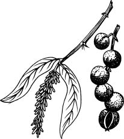> |

|     |
| --- |
| > >         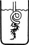>   > Strangled           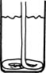>  Twist           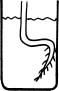> Crank handle > > > >         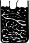>  Pot-bound         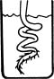>  Spiral          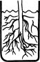> Well developed    > > > |

**> Distorted root systems**

## > Climatic and soil requirements>

### *> Soil>   *

> Most soil types are suitable for the production of macadamias, provided they are well drained and have no restrictive layers in the top 1 m of the soil. Poorly-drained clay soils are not suitable.>

### *> Temperature>   *

> The ideal temperature for macadamias is between 16 and 25 °C. Although the trees can survive when temperatures drop below 3 °C, they should not be regarded as frost resistant.>

## > Height above sea level>

> Height above sea level influences nut quality and production. Production declines dramatically above 600 m. Above 640 m growth is slower and trees take longer to produce.>

> Cultivars suitable in areas between 600 and 640 m above sea level are Mauka, Kau and Keaau.>

> Cultivars recommended nearer to the coast, 90 to 300 m above sea level, are Purvis, Makai and Keaau.

## > Cultivars>

> The cultivars recommended are: Keaau, Kakea, Kau, Purvis, Pahala, Mauka and Makai. They are regarded as superior to Nelmak 1 and Nelmak 2 for commercial processing and marketing. Their oil content is usually higher than 73 % and the sugar content is low enough to ensure an even, cream colour after the nuts have been baked. Under ideal circumstances the crack-out percentage will be higher than 40 %.>

## > Soil preparation>

- >  If the physical properties of the soil, namely depth (0,8­1,0 m), drainage, etc are suitable for growing macadamias, the soil must be prepared carefully and well in advance.
- >  The soil must be loosened as deeply as possible. It should then not be necessary to make large planting holes.
- >  If the soil in the planting holes is compacted, the roots could become rootbound.
- >  An investigation should be done after the planting of macadamia trees to ensure that root growth is not restricted.
- >  Do not fertilise recently planted trees. They must first become well established and grow vigorously. It is wise to wait one year before applying fertiliser.

## > Planting distances>

- >  Macadamia cultivars have different growth patterns. They are usually either spreading or upright growers.
- >  The size of each cultivar's drip area (surface area below leaf canopy) depends on the altitude, soil type, rootstock, rainfall, temperature and relative humidity.
- >  The planting distance for each cultivar will therefore differ from place to place. Various guidelines can be followed with respect to spreading and upright growers.

> As soon as the competition for light becomes too great, production will decrease.>

> To allow for tractors to move between the trees, the hedgerow planting system is used. With this system:

- >  Upright growers are planted 3,5 m apart within the row with 7 m between rows.
- >  Spreading cultivars are planted 10 m apart within the row with 6 m between the rows.

**> Tree shape of some macadamia trees>   **

|     |     |
| --- | --- |
| **> Cultivar** | **> Tree shape** |
| > > Keauhou> > Kakea > > Keaau > > Ikaika > > Kau > > Mauka > > Makai | > > Spreading (umbrella)> > Spreading (broad) > > Upright (broad-upright) > > Spreading (broad-upright) > > Upright (upright) > > Upright (broad-upright) > > Spreading (umbrella) |

|     |     |
| --- | --- |
|     |  |
|     | **> Umbrella**>     **> Broad**>      **> Broad-upright** |
|     |
|     | 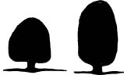 |
|     | **> Pyramidal**>      **> Columnar** |

**> Various tree shapes**

## > Intercropping>

> Other crops are sometimes cultivated between young macadamia trees. There are 3 main aspects to be considered before planting an intercrop.

- >  Cultivation of the intercrop could damage or adversely affect the growth of the tree or injure roots and should be avoided.
- >  Tall-growing plants could crowd out or overshadow the young macadamia trees and should not be planted.
- >  No other crops should be planted between bearing macadamia trees. Once this stage has been reached, the macadamia trees should receive the attention and treatment necessary to ensure maximum growth and production.

## > Leaf analysis>

- >  Macadamia leaf samples must be taken during October and November. The time of sampling is critical. The correct leaf must be sampled.
- >  When submitting a leaf sample from a particular orchard for the first time, it must be accompanied by a soil sample. Thereafter it is advisable to send in soil samples annually. It is essential to consider the results of both soil and leave samples when making fertilisation adjustments.
- >  Only leaves from healthy plants must be sampled. They must be free from sunburn, insect damage or any deficiency symptoms or signs of disease.

### *> Method of sampling>   *

>

|     |     |
| --- | --- |
| - >  Select approximately 20 healthy trees, well distributed throughout the orchard, homogeneous in appearance, and representative of the orchard as a whole. - >  The selected trees must be clearly marked with, for instance, paint. In this way it is possible to take soil samples at the same places and leaf samples from the same tree every year. - >  Four leaves are taken from alternate sides of the trees giving a sample of 80 leaves. > | 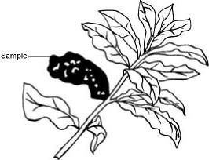 >   **> The leaf that should be sampled**> |

>

## > Fertilisation>

> Do not fertilise young, transplanted trees too soon. They must first become well established and start growing vigorously before any applications are made, preferably after at least 1 year.>

> Never apply fertilisers against the stem of young trees.>

> Fertiliser must be broadcast evenly from about 0,2 m from the stem to about 0,5 m outside the drip area of the tree.>

> Macadamia trees are very sensitive to root damage, therefore each fertiliser application must be followed by a light, controlled irrigation.>

> Fertilisers must not be worked into the soil.>

> When the trees are established and start growing, fertiliser must be applied regularly according to the table.>

**> Quantity of fertiliser according to age (kg/tree/year)>   **

|     |     |     |     |
| --- | --- | --- | --- |
| **> Tree age (years)>   **> | **>  LAN 28 % >   **> | **>  Superphosphate >   **> | **>  Potassium chloride>   **> |
| > > 1> > 2 > > 3-5 > > 6-8 > > 9-11 > > 12-14 > > 15+ | > > 0,2> > 0,4 > > 0,6 > > 1,0 > > 1,5 > > 2,0 > > 3,75 | > > 0,2> > 0,2 > > 0,3 > > 0,5 > > 0,75 > > 1,0 > > 1,35 | > > 0,1> > 0,3 > > 0,5 > > 0,5 > > 0,75 > > 1,0 > > 1,25 |

** *Zinc and boron sprays  ***

Because most soils are naturally low in zinc, or the zinc is not available, this element must be applied every year. The following concentrations are recommended:

- Zinc oxide at 200 g/100 l water, or
- NZn at 150 ml/100 l water.

Many macadamia orchards are also low in boron and it is desirable to spray the trees every 2 years with 100 g borax or 75 g Solubor/100 l water right from the start.

## Irrigation

Water stress often limits tree growth, as well as the set, growth and quality of macadamia nuts. It is important to know how much water to apply and when to apply it if it does not rain.

### *Water requirements  *

**The approximate water requirements for macadamia trees (mm/month)  **

|     |
| --- |
| Tree age |
| Years | Month |
|     | Aug. | Sept. | Oct. | Nov. | Dec. | Jan. | Feb. | March | Apr. | May | Jun. | Jul |
| 5   | 16  | 20  | 24  | 27  | 29  | 29  | 24  | 21  | 14  | 9   | 9   | 9   |
| 10  | 46  | 57  | 69  | 77  | 81  | 81  | 67  | 59  | 38  | 26  | 26  | 26  |

## Diseases and pests

### Phytophthora *root rot *

This disease usually occurs as a result of mechanical damage causing injury. These areas usually become infected. Trees suffering some kind of stress such as drought conditions may also get the disease.

### *Nut borer  *

Nut borer is the common name for the larvae of 4 types of moths that can either burrow into the green husks of macadamia nuts or feed on the kernels. The damage can easily be recognised, but the moths are small and inconspicuous and seldom seen in an orchard.

- Adult larvae are about 10 mm long and pale red or grey.
- An infested nut can be recognised by a small hole in the husk which is surrounded by excreta.
- Affected nuts, especially young developing nuts, usually drop as a result of damage to the husks.
- Susceptibility to attack by moth larvae differs among cultivars because of hardness and thickness of the shell.
- No insecticide is at present registered against nut borer. It can, however, be limited by planting fairly resistant cultivars such as Nelmak 1, Nelmak 2 and the Hawaiian cultivars.
- A natural enemy that plays a role in the control of false codling moth is the parasite *Trichogrammatoidea lutea,* which parasitises the eggs of the moth.

### *Stinkbugs  *

|     |     |
| --- | --- |
| Stinkbugs are the most important pest on macadamias in South Africa. Damage is caused by a stinkbug complex comprising at least 20 different types. The most important types are: two-spotted stinkbug, green vegetable stinkbug, coconut stinkbug, small green stinkbug, spotted stinkbug, yellow-edged stinkbug and yellow-spotted stinkbug. Stinkbugs can cause crop losses of up to 80 %. | 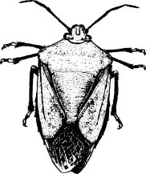 |

### *Damage  *

Most stinkbugs have 4 generations per year and each generation causes a different type of damage to the nuts.

- The first generation is the spring generation (August to September), and occurs during or after flowering. This generation can cause extensive flower and/or fruit drop of small macadamia fruit.
- The second generation is the summer generation (December). Damage occurs during fruit development or just before the fruit reaches mature size. Once the fruit has reached mature size, it remains on the tree even after stinkbugs have fed on it. When harvesting, these nuts will have large, sunken lesions on the kernels.
- The third generation, the autumn generation (February to March), is normally the largest. This generation feeds on the nuts before and during harvest. Although it causes lesions on the nut kernel, no fruit drop occurs. The size of the lesions depends on the type of stinkbug. The coconut, two-spotted, yellow-spotted, and spotted stinkbugs are capable of inflicting damage late in the season because of their longer mouthparts. Less trouble is experienced from other stinkbugs during autumn.
- The fourth generation stinkbugs (winter) do not normally cause problems because most nuts have been harvested and stinkbugs are not very active during this season. The damage evident at the end of the season (stung nut kernels) is inflicted from December to harvest. The hardness of the shell does not limit stinkbug feeding. Nuts must therefore be protected against stinkbugs throughout the year from flowering until harvest.

   ***Control**  *
Stinkbugs can be controlled chemically.

The shaking method is used to monitor the number of stinkbugs, especially the winter and spring generations when morning temperatures are low.

- Ten trees must be chosen weekly at random per control unit/block (a unit is not larger than 5 ha). All the lower branches which can be reached on each tree must be shaken and the stinkbugs counted.
- Trees must be shaken before the temperature exceeds 18 °C, otherwise the stinkbugs will fly away when the branches are shaken. The economic threshold value (in other words the level at which economic damage to harvest occurs) for this method is an average of 0,7 stinkbugs per tree.

There are also other signs which may indicate the presence of stinkbugs:

- An excessive number of fruit on the ground during spring and summer.
- Feeding marks (small brown or black sting marks) on the inside of the green shell.
- Egg masses on tree stems. Unparasitised eggs should be destroyed while those that have been parasitised should be left on the tree so that the parasites can hatch. Whenever chemical control is necessary pesticides should be applied judiciously. At present cypermethrin and endosulfan are the only active ingredients registered for use against stinkbugs.
- Cypermethrin is applied as a full cover spray at 20 ml/100 l water.
- Endosulfan can be applied at 120 ml/100 l water when the shaking method of monitoring shows 0,7 stinkbugs per tree. It has a residual effect of a few days compared to cypermethrin which has relatively long residual effects. Endosulfan can therefore be used until the end of the production season for the control of stinkbugs.

### *Recommended guidelines  *

- Monitor for stinkbugs before applying any pesticide.
- Spray cypermethrin after flowering to reduce the original population size.
- Follow up with an endosulfan treatment if the number of stinkbugs in the orchard warrants it.

|     |
| --- |
| ## Harvesting, storage and processing |
| - Macadamia nuts drop from trees when they are mature and are then collected from the ground. - The main crop is usually collected from March to July. - The area underneath the trees must be clear. Grass, old leaves, branches and other debris must be removed. - The nuts must be collected regularly, at least once a week. - Nuts remaining under the trees for too long lose quality and are susceptible to damage by mould, rats and other rodents. - During the main harvesting period the branches may be shaken to loosen the nuts. Never pick immature nuts. |  |

|     |     |
| --- | --- |
| ***Removal of husks**  * The green husks around the nuts must be removed as soon as possible after harvesting. | 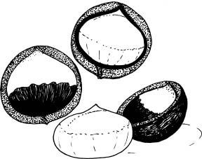 |

### *Drying  *

- Freshly harvested, dehusked nuts contain 25 % moisture and must be dried before they are stored in bulk.
- Wire frames containing 3 layers of nuts are used for drying.
- Air must circulate freely between the frames to prevent mould. A fan may be used.
- The nuts could also be sundried, but if the freshly harvested nuts are exposed to the sun immediately, the shells may crack. These cracks provide access to insects when the nuts are stored.
- If the nuts are not dried, but immediately stored in bags or other containers, fungal growth could occur.

### *Storage  *

- The hard, undamaged shells offer adequate protection against insects during storage. The kernels of shelled nuts are, however, susceptible to infestation.
- Because insects can infest stored nuts, the necessary preventive precautions should be taken.
- A reasonable degree of insect control is possible if packhouses and storage areas are kept absolutely clean.
- The shell offers total protection against insect damage and if nuts are to be stored for any length of time, it would be best to store them unshelled. Before they are stored, any cracked or broken nuts should be removed   because cracks in the shell will provide access to insects.
- Because shelled nuts are susceptible to insect damage, they can only be successfully kept in cold storage. The nuts should be packed into cartons as soon as possible after shelling. They can then immediately be placed in a cold store at 0 to ­4 °C. Cold storage prevents fungal growth and rancidity. This method is also recommended for the long-term storage of unshelled nuts.

### *Shelling  *

- For successful shelling, the nuts should be dried to a moisture content of about 1,5 % to ensure that kernels shrink away from the shells. Therefore, nuts should be dried before shelling. The final drying takes place in large containers through which hot air is circulated.
- The macadamia nut has a very hard shell, but is easily cracked mechanically between rotating steel rollers. A nutcracker or shelling machine works on the principle that nuts are cracked between a rotating steel roller and a fixed plate. The distance between the roller and the plate is adjustable according to the grading size of the nuts. The kernels of the nuts that have been properly dried, drop from the shells when the nuts are cracked.

### *Packaging  *

The fried or roasted nuts are packed in airtight bottles, tins or plastic containers for consignment and marketing.

For further information contact the
ARC-Institute for Tropical and Subtropical Crops
Private Bag X11208, Nelspruit 1200
Tel (013) 753 2071
Fax (013) 752 3854

This publication is also available on the website of the
National Department of Agriculture at:
www.nda.agric.za/publications
**ISBN 1-86871-070-X**
2000
Compiled by Directorate Communication,
National Department of Agriculture in cooperation with
ARC-Institute for Tropical and Subtropical Crops
Printed and published by National Department of Agriculture
and obtainable from Resource Centre, Directorate Communication,
Private Bag X144, Pretoria 0001, South Africa
