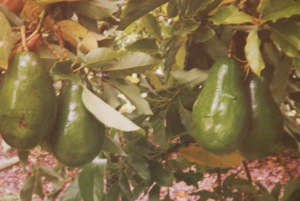

 

 

# ***Day Avocado***

*Persea americana*

* * *

Grafted, pretty ornamental, evergreen. Day is hardy to 22 degrees F when completely dormant. If your plant has active growth these low temps will kill it. The fruit is large, up to 16 oz. with buttery flesh. Produces July through September. Space @ 15'. Zone 9-10.

| Plant Characteristics |
| --- |
| Pest Resistance | Excellent |
| Disease Resistance | Very Good |
| Drought Tolerance | Very Good |
| Heat Tolerance | Excellent |
| Humidity Tolerance | Excellent |
| Sun Tolerance | Excellent |
| Wet Soil Tolerance | Poor |
| Shade Tolerance | Poor |
| No Spray | Good |
| Salt Tolerance | Poor |
| Fresh for Kids | Excellent |
| Plant Type | Tree |
| Soil Type | Adaptable |
| Edible Type | Fruit |
| Self Fertile | Yes |
| this information is accurate to the best of our knowledge, comments/opinions are always welcome |

* * *

Sorry, we are currently out of this item, please check back!
* *
Due to import restrictions we are unable to ship Day Avocado to CA...

* * *

Avocado Care Guide

Avocados do well in the mild-winter areas of California, Florida and Hawaii. Some hardier varieties can be grown in the cooler parts of northern and inland California and along the Gulf Coast. The northern limits in California is approximately Cape Mendocino and Red Bluff. Avocados do best some distance from ocean influence but are not adapted to the desert interior. West Indian varieties thrive in humid, tropical climates and freeze at or near 32° F. Guatemalan types are native to cool, high-altitude tropics and are hardy 30 - 26° F. Mexican types are native to dry subtropical plateaus and thrive in a Mediterranean climate. They are hardy 24 - 19° F. Avocados need some protection from high winds which may break the branches. There are dwarf forms of avocados suitable for growing in containers. Avocados have been grown in California (Santa Barbara) since 1871.

The avocado is a dense, evergreen tree, shedding many leaves in early spring. Growth is in frequent flushes during warm weather in southern regions with only one long flush per year in cooler areas. Grafted plants normally produce fruit within one to two years compared to 8 - 20 years for seedlings.

Avocado leaves are alternate, glossy, elliptic and dark green with paler veins. They normally remain on the tree for 2 to 3 years. The leaves of West Indian varieties are scentless, while Guatemalan types are rarely anise-scented and have medicinal use. The leaves of Mexican types have a pronounced anise scent when crushed. The leaves are high in oils and slow to compost and may collect in mounds beneath trees.

High in monosaturates, the oil content of avocados is second only to olives among fruits, and sometimes greater. Clinical feeding studies in humans have shown that avocado oil can reduce blood cholesterol.

Location: Avocados will grow in shade and between buildings, but are productive only in full sun. The roots are highly competitive and will choke out nearby plants. The shade under the trees is too dense to garden under, and the constant litter can be annoying. In cooler areas plant the tree where it will receive sun during the winter. Give the tree plenty of room--up to 20 feet. The avocado is not suitable for hedgerow, but two or three trees can be planted in a single large hole to save garden space and enhance pollination. At the beach or in windy inland canyons, provide a windbreak of some sort. Once established the avocado is a fairly tough tree. Indoor trees need low night temperatures to induce bloom. Container plants should be moved outdoors with care. Whitewashing the trunk or branches will prevent sunburn.

Soil: Avocado trees like loose, decomposed granite or sandy loam best. They will not survive in locations with poor drainage. The trees grow well on hillsides and should never be planted in stream beds. They are tolerant of acid or alkaline soil. In containers use a planting mix combined with topsoil. Plastic containers should be avoided. It is also useful to plant the tub with annual flowers to reduce excess soil moisture and temperature. Container plants should be leached often to reduce salts.

Irrigation: Avocado trees may not need irrigation during the winter rainy season, but watch for prolonged mid-winter dry spells. Over irrigation can induce root which is the most common cause of avocado failure. To test to see if irrigation is necessary, dig a hole 9 inches deep and test the soil by squeezing. If it is moist (holds together), do not irrigate; if it crumbles in the hand, it may be watered. Watch soil moisture carefully at the end of the irrigating season. Never enter winter with wet soil. Avocados tolerate some salts, though they will show leaf tip burn and stunting of leaves. Deep irrigation will leach salt accumulation.

Fertilization: Commence feeding of young trees after one year of growth, using a balanced fertilizer, four times yearly. Older trees benefit from feeding with nitrogenous fertilizer applied in late winter and early summer. Yellowed leaves (chlorosis) indicate iron deficiency. This can usually be corrected by a chelated foliar spray of trace elements containing iron. Mature trees often also show a zinc deficiency.

The trees are usually never pruned. Avocado fruit is self-thinning.

Pests and diseases: Rats and squirrels will strip the fruit. Protect with tin trunk wraps. Leaf-rolling caterpillars (Tortrix and Amorbia) may destroy branch terminals. Avocado Brown Mite can be controlled by powdered sulfur. Six-spotted Mite is very harmful; even a small population can cause massive leaf shedding. A miticide may be required if natural predators are absent. Snails can be a problem in California.

Two fungi and one virus cause more damage than any pests. Dothiorella (Botryosphaeria ribis) canker infects the trunk, causing dead patches that spreads to maturing fruit, causing darkened, rancid smelling spots in the flesh. Flesh injury begins after harvest and is impossible to detect on outside. Mexican types are immune to trunk cankers but the fruit is not. The disease is rampant near the coast and has no economical control. Root Rot (Phytophthora cinnamomi) is a soil-borne fungus that infects many plants, including avocados. It is a major disease problem in California. Select disease-free, certified plants and avoid planting where avocados once grew or where soil drainage is poor. The disease is easily transported by equipment, tools and shoes from infected soils. Once a tree is infected (signs include yellowing and dropping leaves), there is little that can be done other than cut back on water. Sun Blotch is a viral disease that causes yellowed streaking of young stems, mottling and crinkling of new leaves and occasional deformation of the fruit. It also causes rectangular cracking and checking of the trunk, as if sunburned. It has no insect vector but is spread by use of infected scions, contaminated tools and roots grafted with adjacent trees. It is important to use virus-free propagating wood.