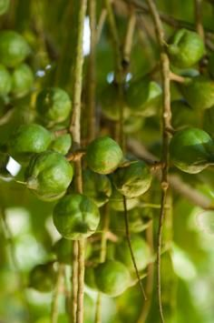

 

Macadamia nuts are obtained from trees which belong to the family Proteaceae. Out of the nine species belonging to the family, only two species namely, *Macadamia integrifolia* and *Macadamia tetraphylla* produce edible nuts. Rest of the species, like *M. Whelanii* and *M. Ternifolia* produce poisonous nuts that contain toxic cyanogenic glycosides. Macadamia trees are native to Eastern Australia, Sulawesi in Indonesia, and New Caledonia. The tree grows to a height of around 60 feet and bears commercial quantities of nuts only when it is 7 - 10 years old. That is why, a lot of patience is required for growing these nuts. But once the tree starts bearing nuts, it continues to bear them for 100 years or more. Growing macadamia tree is a moderately challenging task, but if done in the right manner, it can give amazing results in the form of delicious nuts.

 **How to Grow Macadamia Nuts**

 ***Requirements***

- Macadamia trees require specific climatic conditions to grow well. They grow best in temperate and tropical climates. The optimum temperature for their growth is 25ºC, not falling below 10ºC. They cannot stand frost and pools of water at their base.
- Soil quality can range from loam to sandy loam. However, the trees flourish well in soil rich in organic matter.
- Macadamia trees require plenty of sunlight with annual rainfall of 1000 - 2000mm. The soil must be well-drained with pH ranging from 5 - 6.

***Planting***

- The first step to obtain macadamia nuts is to plant its tree. The best time for planting is spring.
- Buy macadamia nut seeds from a nursery or garden supply store. Make sure you are buying the seeds of species that produce edible nuts.
- Make a groove on each seed using a hand file, to facilitate germination once, the seeds are sown in the soil.
- Add peat and sand to form a soil mixture that stays moist and not wet. Remember, macadamia seeds require a well-drained soil for proper growth.
- Sow the seeds in a container filled with prepared soil mixture and place it in full sunlight. Water the soil regularly to maintain the required moisture content for germination.
- When the seedlings start growing, it is time to transplant them in the ground. Look for an open area, where the tree can grow without any hindrance because it can grow up to 60 feet tall and 40 feet wide.
- To provide room for growth, plant the seedlings in rows keeping a distance of about 6m between each row, and 4m distance between each seeding.

***Protection***

- Protect young macadamia plants from frost as it can affect their growth.
- Use shelter belts to protect young trees from strong winds because they develop a shallow root system.
- Mature trees are also brittle in nature and require some kind of protection. But make sure, the shelter belts used to protect them are not large enough to hinder sunlight from reaching the trees properly.
- Protect macadamia trees from insects to prevent destruction. Some of the insects affecting these trees include; Ambrosia beetle, Macadamia shot borer, Longhorned grasshopper, Koa seed worm, Broad mite, Hawaiian flower thrips, and Southern green stink bug.
- When using chemicals for pest control, do not forget to comply with safety guidelines so as to minimize the risk of toxicity due to chemical residue formation on the tree and nuts.
- To protect the trees from weeds, use herbicide like 'Roundup' or regularly mow the ground using a mower.
- Rats and goats can also be a problem and must be controlled to avoid any harm to the trees.
- Maintain pest control and weed control records to keep a track of these activities because pests and weeds can significantly hamper the growth of trees.
- Green vegetable bug which affects macadamia trees stains the kernels brown, making them unfit for sale. To protect trees from this bug, gardeners use Deltaphor 25 EC which is sprayed thrice in a season, keeping an interval of 3 weeks between each spray sessions. Spraying is also done 3 weeks after flowering so that pollination can take place without any hindrance. Alternatively, they also use chickens or wasps to completely remove vegetable bug infestation.

***Fertilization***

- Fertilization must be done for the first time when the young trees are 6 months old. Subsequently, trees must be fertilized two times every year using a fertilizer with low nitrogen content.
- Organic manure and superphosphate can also be used to fertilize the soil. Husk obtained from nuts and leaves obtained by pruning can also be a good source of essential nutrients.
- Do not fertilize the soil with heavy amounts of nitrogen during summer months as it can promote vegetative growth around macadamia trees. This growth will share soil nutrients and affect the quality and quantity of nuts produced.

***Pruning***

- Pruning is necessary from time to time to allow sunlight to sufficiently reach all parts of the tree and maintain air flow at the center, which is otherwise blocked by excessive growth.
- Trimming can be done to the level of internal branches without hampering nut production.
- To facilitate easy picking of nuts from the trees, tree height can also be maintained to a certain level by pruning.

***Harvesting***

- It takes around 7 years for macadamia trees to produce nuts. Once the tree starts bearing nuts, it's time to harvest them. Nuts usually ripen by the month of June.
- Harvest mature nuts every two weeks in locations with dry and sunny weather, and every week in locations with wet weather conditions.
- Nuts can be collected either by hand-picking or by cutting the racemes from the tree. It is better to hand-pick ripe nuts in areas with wet weather conditions.

***Cracking***

- Cracking of nut shells must be done after they are dried for about 3 weeks. Drying can also be done in a food dehydrator for 2-3 days.
- After the drying period, check whether the nut shells have become brittle. If they have, use the macadamia nut cracker or a hammer to obtain the nut enclosed within the shell.

The [nutritional value of macadamia nuts](http://www.buzzle.com/articles/macadamia-nuts-nutrition.html) is very high and that is why, it is considered as high energy food with good amount of vitamins and minerals. The oil obtained from these nuts is also beneficial for health. To reap all the benefits associated with these nuts, macadamia trees must be taken care of, so that it can bear nuts for several years thereby, ensuring a source of income for many years to come.

http://www.maximacs.com/