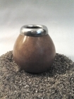
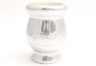
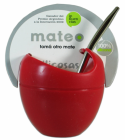
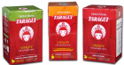
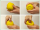

 

##### Handlekurv

**..er tom!**

##### Kategorier

- [Guayaki Yerba Mate](http://www.yerbamate.no/categories/guayaki-yerba-mate)
- [Taragui Mate Vitality](http://www.yerbamate.no/categories/mate-vitality)
- [Yerba Mate Økonomi Sett](http://www.yerbamate.no/categories/yerba-mate-okonomi-sett)
- [Termos,tekanne,teklyper++](http://www.yerbamate.no/categories/presskanne-tekanne)
- [Yerba Mate](http://www.yerbamate.no/categories/yerba-mate)
- [Yerba Mate Start Kit](http://www.yerbamate.no/categories/yerba-mate-start-kit)
- [Mate Tilbehør](http://www.yerbamate.no/categories/tilbehor)

-

    - [Mate Mateo designer kopp](http://www.yerbamate.no/categories/mate-mateo)
    - [Calabaza & Matekopper](http://www.yerbamate.no/categories/matekopper)
    - [Bombilla / Sugerør](http://www.yerbamate.no/categories/bombilla-sugeror)

- [Teposer - Te/Yerba Mate](http://www.yerbamate.no/categories/teposer)
- [Dulce de leche,alfajores +++](http://www.yerbamate.no/categories/dulce-de-leche-alfajores)
- [Club-Mate](http://www.yerbamate.no/categories/club-mate)

##### Facebook

##### Utsalgssteder

[Butikker som selger Mate](http://www.yerbamate.no/pages/butikker-som-selger-yerba-mate)

##### Tips en venn

Fortell noen du kjenner om dette produktet.

##### Bestselgere

[(L)](http://www.yerbamate.no/products/calabaza-ring)

###### Calabaza Ring

|     |
| --- |
|  |

**NOK 65,-**
[(L)](http://www.yerbamate.no/products/matekopp-rosamonte)

###### Matekopp Rosamonte

|     |
| --- |
|  |

**NOK 99,-**

##### Nye produkter

[(L)](http://www.yerbamate.no/products/mate-mateo-red2)

|     |
| --- |
|  |

[Mate Mateo Rød](http://www.yerbamate.no/products/mate-mateo-red2)
NOK 179,-
[Se flere nye produkter](http://www.yerbamate.no/new_products)

##### Engros/Butikker/Cafe

Vi importerer Mate og tilbehør direkte fra Sør-Amerika. Om du er interessert i å få tilsendt engros priser, **send epost til engros@yerbamate.no eller ring 99 79 88 69**

##### Artikler

|     |
| --- |
| [Artikler om Yerba Mate](http://www.yerbamate.no/pages/artikler-om-yerba-mate) |
| [Butikker som selger Yerba Mate](http://www.yerbamate.no/pages/butikker-som-selger-yerba-mate) |
| [Healthy Energy Beverage](http://www.yerbamate.no/pages/healthy-energy-beverage) |
| [Helsefakta](http://www.yerbamate.no/pages/helsefakta) |
| [Hva er Yerba Mate?](http://www.yerbamate.no/pages/hva-er-yerba-mate) |
| [Hvordan tilberede](http://www.yerbamate.no/pages/hvordan-tilberede) |
| [iHerb rabattkode](http://www.yerbamate.no/pages/iherb-rabattkode) |
|     |
| [Kjente som drikker Mate](http://www.yerbamate.no/pages/kjente-som-drikker-mate) |
| [Magasin artikkel om Mate](http://www.yerbamate.no/pages/magasin-artikkel-om-mate) |
| [Ord og uttrykk](http://www.yerbamate.no/pages/ord-og-uttrykk) |
| [Våre kunder sier](http://www.yerbamate.no/pages/vare-kunder-sier) |
| [Yerba Mate - The Other Green Tea](http://www.yerbamate.no/pages/yerba-mate-the-other-green-tea) |
| [Våre venner](http://www.yerbamate.no/pages/vare-venner) |

##### Tilbud

[(L)](http://www.yerbamate.no/products/-taragui-mate-vitality-green-teboks)

###### Taragui Mate Vitality Green Teboks

|     |
| --- |
|  |

Før: NOK 99,- Nå: **NOK 59,-**
[(L)](http://www.yerbamate.no/products/mate-vitality-set)

###### Mate Vitality Set

|     |
| --- |
|  |

Før: NOK 149,- Nå: **NOK 99,-**

[Hjem](http://yerbamate.no/)»[Mate Tilbehør](http://www.yerbamate.no/categories/tilbehor)»[Calabaza & Matekopper](http://www.yerbamate.no/categories/matekopper)»[Mate Mateo Rød](http://www.yerbamate.no/products/mate-mateo-red2)

[More Sharing ServicesShare](http://www.addthis.com/bookmark.php?v=250&username=xa-4cd7009c51d59167)|[Share on evernote](http://www.addthis.com/bookmark.php?v=250&winname=addthis&pub=xa-4cd7009c51d59167&source=tbx-250&lng=en&s=evernote&url=http%3A%2F%2Fwww.yerbamate.no%2Fproducts%2Fmate-mateo-red2&title=Mate%20Mateo%20designer%20kopp%20for%20Yerba%20Mate%20-%20YerbaMate.no&ate=AT-xa-4cd7009c51d59167/-/-/503ce4b8ad1430c8/1/4f9f0f4a1feb554a&frommenu=1&ips=1&uid=4f9f0f4a1feb554a&ct=1&pre=http%3A%2F%2Fwww.yerbamate.no%2Fpages%2Fyerba-mate-the-other-green-tea&tt=0)[Share on delicious](http://www.addthis.com/bookmark.php?v=250&winname=addthis&pub=xa-4cd7009c51d59167&source=tbx-250&lng=en&s=delicious&url=http%3A%2F%2Fwww.yerbamate.no%2Fproducts%2Fmate-mateo-red2&title=Mate%20Mateo%20designer%20kopp%20for%20Yerba%20Mate%20-%20YerbaMate.no&ate=AT-xa-4cd7009c51d59167/-/-/503ce4b8ad1430c8/2/4f9f0f4a1feb554a&frommenu=1&ips=1&uid=4f9f0f4a1feb554a&ct=1&pre=http%3A%2F%2Fwww.yerbamate.no%2Fpages%2Fyerba-mate-the-other-green-tea&tt=0)[Share on gmail](http://www.addthis.com/bookmark.php?v=250&winname=addthis&pub=xa-4cd7009c51d59167&source=tbx-250&lng=en&s=gmail&url=http%3A%2F%2Fwww.yerbamate.no%2Fproducts%2Fmate-mateo-red2&title=Mate%20Mateo%20designer%20kopp%20for%20Yerba%20Mate%20-%20YerbaMate.no&ate=AT-xa-4cd7009c51d59167/-/-/503ce4b8ad1430c8/3/4f9f0f4a1feb554a&frommenu=1&ips=1&uid=4f9f0f4a1feb554a&ct=1&pre=http%3A%2F%2Fwww.yerbamate.no%2Fpages%2Fyerba-mate-the-other-green-tea&tt=0)[Share on facebook](http://www.yerbamate.no/#)

[fra NOK 11,-/mnd](#)

# Mate Mateo Rød

NOK 179,-

- [Informasjon](http://www.yerbamate.no/#tab1)

**Mate Mateo Rød**
Vinner av den argentinske innovasjonsprisen i 2009

En matekopp som er enkel og perfekt til daglig bruk. Koppen er laget av høykvalitets silikon og dette materialet gir mange fordeler:

- Ingen missfarging av koppen
- Enkel å tømme og rengjøre. Under er det en knapp som man kan trykke på for å tømme
- Lang levetid
- Kommer med bombilla (sugerør) som ikke sitter fast. Man kan derfor bytte den med en annen bombilla.

Farge: Blå eller hvit
Materialet: Silikon
Bredde: ca. 7,5 cm
Høyde: ca. 8 cm
Munning: ca. 7 cm
Bombilla: Nikkel og bronse. Buet form. Ikke avtagbart filterhode

### Kommentarer