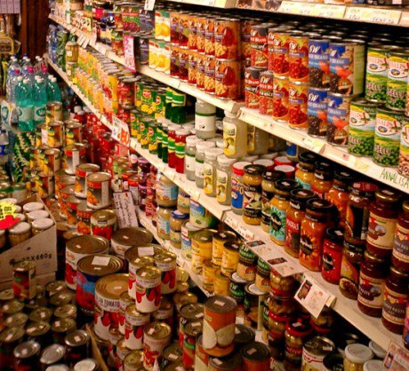
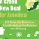

 

# [Home](http://www.facebook.com/?ref=logo)

[(L)](http://www.facebook.com/photo.php?fbid=352504494834353&set=a.205217742896363.51219.205204719564332&type=1#)

[(L)](http://www.facebook.com/photo.php?fbid=352504494834353&set=a.205217742896363.51219.205204719564332&type=1#)

[(L)](http://www.facebook.com/photo.php?fbid=352504494834353&set=a.205217742896363.51219.205204719564332&type=1#)

- [Yerbalicious**  **](http://www.facebook.com/yerbamategh?ref=tn_tnmn)
- [Home**  **](http://www.facebook.com/?ref=tn_tnmn)
- [(L)](http://www.facebook.com/editaccount.php?ref=mb&drop)

Account Settings
.
.
.

## Wall Photos

.

[Back to Album](http://www.facebook.com/media/set/?set=a.205217742896363.51219.205204719564332&type=1) · [Truth Beckons's photos](http://www.facebook.com/truthBECKONS?sk=photos) · [Truth Beckons's Page](http://www.facebook.com/truthBECKONS)

[Previous](http://www.facebook.com/photo.php?fbid=352512104833592&set=a.205217742896363.51219.205204719564332&type=1&permPage=1) · [Next](http://www.facebook.com/photo.php?fbid=352502698167866&set=a.205217742896363.51219.205204719564332&type=1&permPage=1)

.

**

Type any name

.

[**Like**](http://www.facebook.com/photo.php?fbid=352504494834353&set=a.205217742896363.51219.205204719564332&type=1#)[**Comment**](http://www.facebook.com/photo.php?fbid=352504494834353&set=a.205217742896363.51219.205204719564332&type=1#)

[Truth Beckons](http://www.facebook.com/truthBECKONS)

THE PREPPER MOVEMENT: Why Are Millions Of Preppers Preparing Feverishly For The End Of The World As We Know It?

In America today, there are millions of "preppers" that are working feverishly to get prepared for what they fear is going to happen to America. There is a very good chance that some of your neighbors or co-workers may be preppers. You may even have noticed that some of your relatives and friends have been storing up food and have been trying to convince you that we are on the verge of "the end of the world as we know it".

A lot of preppers like to keep their preparations quiet, but everyone agrees that the prepper movement is growing. Some estimate that there are four million preppers in the United States today. Others claim that there are a lot more than that. In any event, there are certainly a lot of preppers out there. So exactly what are all these preppers so busy preparing for?

Well, the truth is that the motivation for prepping is different for each person. Some preppers believe that a complete collapse of the economy is coming. Others saw what happened to so many during Hurricane Katrina are are determined not to let that happen to them. Some preppers just want to become more independent and self-sufficient. There are yet others that are deeply concerned about "end of the world as we know it" scenarios such as terrorists using weapons of mass destruction, killer pandemics, alien invasions, World War III or EMP attacks.

But whatever the motivation is, the prepper movement is clearly growing. Today, millions of Americans are converting spare rooms into storage pantries, learning how to grow survival gardens and stocking up on everything from gas masks to auxiliary generators.

Recently, the Salina Journal gathered together about two dozen preppers. What they found is that there is a tremendous amount of diversity among preppers, but that they also clearly share a common passion....

It was a diverse bunch. All different shapes, sizes, ages, gender and political persuasions.

Some were ex-military. Some never served. Some were unemployed, some had jobs. A few were retired.

But they all shared a common bond: They call themselves Preppers, and they had gathered to share ideas, demonstrate various skills, enjoy each other's company and to put faces to the online names they use to disguise their identity.

Never before in U.S. history have we seen anything like this. We are at peace and most of us still have a relatively high standard of living and yet millions of Americans feel called to start preparing for the worst.

A lot of preppers don't like to publicize the fact that they are prepping. As the Salina Journal discovered, a lot of preppers try very hard to keep their prepping to themselves.....

They are trying to keep their passion for prepping hidden from neighbors and, in some cases, employers who they said would frown on their association with such a group. Two admitted their appearance here would probably get them fired if their companies found out.

Many people believe that it takes a lot of money and resources to be a prepper, but that is not necessarily the case.

For some, the best way to get prepared is to radically simplify things.

For example, a recent article posted on Yahoo Finance profiled a man that lives in his RV and that survives on about $11,000 a year....

I had an apartment in Burbank and was the typical Los Angeles apartment dweller. I started to feel a strong desire to simplify my life. I had a garage full of stuff I never used, my closets were full, and I started to see that it was costing me money to have an apartment big enough to hold all the stuff I never use.

My initial plan was to scale back and move into a smaller apartment. Before long, I realized I didn't need too much to be happy. I could fit into a small space. That's when the RV idea occurred to me. I was just sitting in traffic and an RV pulled up. I said, "I could probably fit in that thing." The more I looked into it, the more I realized how practical it would be. For what I was paying for rent in LA, I could own my "house" free and clear and not pay rent, and own my car as well.

Other people make the most of what they already have. It is absolutely amazing what some families are able to do with limited resources.

For example, there is one family that is actually producing 6000 pounds of produce a year on just 1/10th of an acre right in the middle of Pasadena, California.

This family grows more food than they need and they sell the excess to restaurants in the surrounding area. You can see video of their amazing garden right here.

Other Americans take prepping to the other extreme. For example, Steven Huff is building a 72,000 square foot "home" (some call it a fortress) in Missouri. Huff is the chairman of Wisconsin-based TF Concrete Forming Systems, and he wants to show off what his firm is capable of. Huff claims that this will be "a home that uses very low energy, as well as having strong resistance to tornadoes, hurricanes, earthquakes, fire, flood and insect damage".

In reality, what Huff is building kind of resembles a castle. You can see pictures of this remarkable "home" right here.

But Huff is not the only one taking things to extremes.

In a recent article, I detailed how renowned Texas investor Kyle Bass appears to be very well prepared for the horrible economic collapse that he believes is coming. The following is how one reporter described his recent visit to the 40,000 square foot "fortress" owned by Bass....

"We hopped into his Hummer, decorated with bumper stickers (God Bless Our Troops, Especially Our Snipers) and customized to maximize the amount of fun its owner could have in it: for instance, he could press a button and, James Bond–like, coat the road behind him in giant tacks. We roared out into the Texas hill country, where, with the fortune he’d made off the subprime crisis, Kyle Bass had purchased what amounted to a fort: a forty-thousand-square-foot ranch house on thousands of acres in the middle of nowhere, with its own water supply, and an arsenal of automatic weapons and sniper rifles and small explosives to equip a battalion."

Do you think that Bass is taking things too far?

Well, there are other big names that are busy preparing for the worst as well.

For instance, Robert Kiyosaki, the best-selling author of the "Rich Dad, Poor Dad" series of books is now a full-fledged prepper.

He says that he is "prepared for the worst" and that he and his wife "have food, we have water, we have guns, gold and silver, and cash".

So should the rest of us be preparing?

Of course we should be. Our nation is drowning in debt, the U.S. economy is dying, the number of earthquakes and other natural disasters is increasing, and the entire globe is becoming an extremely unstable place. If you read my articles on a regular basis, then you know that there are a whole host of reasons to try to become more independent and self-sufficient.

So what can we all do to get prepared?

Well, in a previous article I listed a few things that can be done by most people....

#1 Become Less Dependent On Your Job

#2 Get Out Of Debt

#3 Reduce Expenses

#4 Purchase Land

#5 Learn To Grow Food

#6 Find A Reliable Source Of Water

#7 Explore Alternative Energy Sources

#8 Store Survival Supplies

#9 Protect Your Assets With Gold And Silver

#10 Learn Self-Defense

#11 Keep Yourself Fit

#12 Make Friends

For those interested in learning more about preppers and prepping, there are a lot of really great resources out there....

*American Preppers Network

*The Survival Mom

*In Case Of Emergency, Read Blog

*The Surburban Prepper

*Doom And Bloom

So what do you think about preppers?

Do you think that the prepper movement is going too far?

Do you think that the prepper movement is not going far enough?

Are there legitimate reasons why Americans should be preparing for difficult times ahead?

 [http://endoftheamericandream.com/archives/the-prepper-movement-why-are-millions-of-preppers-feverishly-preparing-for-the-end-of-the-world-as-we-know-it](http://www.facebook.com/l.php?u=http%3A%2F%2Fendoftheamericandream.com%2Farchives%2Fthe-prepper-movement-why-are-millions-of-preppers-feverishly-preparing-for-the-end-of-the-world-as-we-know-it&h=bAQGS8ill)

·  · [Share](http://www.facebook.com/ajax/sharer/?s=2&appid=2305272732&p[]=205204719564332&p[]=867617) · about an hour ago

- **
- [****](http://www.facebook.com/photo.php?fbid=352504494834353&set=a.205217742896363.51219.205204719564332&type=1#)

[Justin Hamilton](http://www.facebook.com/JustinHamilton15), [Jenn Martz](http://www.facebook.com/jenn.martz), [Casey May](http://www.facebook.com/beesley.bee) and [43 others](http://www.facebook.com/browse/likes/?id=352504494834353) like this.

.

- [**33 shares](http://www.facebook.com/shares/view?id=352504494834353)
- 6 of 14

******.
.

-

    - [(L)](http://www.facebook.com/photo.php?fbid=352504494834353&set=a.205217742896363.51219.205204719564332&type=1#)

[Amy Beth](http://www.facebook.com/Amy.BethCho1966)  Death will happen to everyone, but my dream is to have enough stored somewhere secret for those who may be left behind like in the movie "The Road" with Viggo, I may not be here but if I could leave something behind that could help those who are wandering around find a meal or recluse, my work has been done here on earth.

[about an hour ago](http://www.facebook.com/photo.php?fbid=352504494834353&set=a.205217742896363.51219.205204719564332&type=1&comment_id=943085&offset=0&total_comments=14) · \"}" style="font-size:11px;font-weight:normal;color:gray;"> · [**1](http://www.facebook.com/browse/likes/?id=352510601500409)

.

    - [(L)](http://www.facebook.com/photo.php?fbid=352504494834353&set=a.205217742896363.51219.205204719564332&type=1#)

[Kathy Cantrell](http://www.facebook.com/kathy.cantrell.10)  There was alot of preppers in the Bible ....Noah, Joseph, etc....Guess what they were the ones to survive. Food, weapons, clothing, like coats and stuff, tents and so on. It just is being prepared...If you die you die, but if not you are gonna live a little better then the other groups of people....who never prepares for change.

[59 minutes ago](http://www.facebook.com/photo.php?fbid=352504494834353&set=a.205217742896363.51219.205204719564332&type=1&comment_id=943090&offset=0&total_comments=14) · \"}" style="font-size:11px;font-weight:normal;color:gray;"> · [**2](http://www.facebook.com/browse/likes/?id=352510768167059)

.

    - [(L)](http://www.facebook.com/photo.php?fbid=352504494834353&set=a.205217742896363.51219.205204719564332&type=1#)

[Mike Mack](http://www.facebook.com/mike.mack.7)  it's a conspiracy by the canned food industry

[57 minutes ago](http://www.facebook.com/photo.php?fbid=352504494834353&set=a.205217742896363.51219.205204719564332&type=1&comment_id=943094&offset=0&total_comments=14) · \"}" style="font-size:11px;font-weight:normal;color:gray;"> · [**2](http://www.facebook.com/browse/likes/?id=352511084833694)

.

    - [(L)](http://www.facebook.com/photo.php?fbid=352504494834353&set=a.205217742896363.51219.205204719564332&type=1#)

[Frazier Donald](http://www.facebook.com/frazier.donald)  life as we know it might end but the world will forever spin

[52 minutes ago](http://www.facebook.com/photo.php?fbid=352504494834353&set=a.205217742896363.51219.205204719564332&type=1&comment_id=943107&offset=0&total_comments=14) · \"}" style="font-size:11px;font-weight:normal;color:gray;"> · [**1](http://www.facebook.com/browse/likes/?id=352512404833562)

.

    - [(L)](http://www.facebook.com/photo.php?fbid=352504494834353&set=a.205217742896363.51219.205204719564332&type=1#)

[Michael Johnson](http://www.facebook.com/profile.php?id=100000223773849)  Priority 1: Your Spiritual Center 2. Needs of others 3. Your needs. - - If you're not prepared, then you are not prepared, and you are at the mercy of anybody who is. Your ego will turn to fear as reality sets in.

[30 minutes ago](http://www.facebook.com/photo.php?fbid=352504494834353&set=a.205217742896363.51219.205204719564332&type=1&comment_id=943165&offset=0&total_comments=14) · \"}" style="font-size:11px;font-weight:normal;color:gray;">

.

    - [(L)](http://www.facebook.com/photo.php?fbid=352504494834353&set=a.205217742896363.51219.205204719564332&type=1#)

[Tara Rand-Gehring](http://www.facebook.com/tara.randgehring)  what i noticed is a lot of empty shelves at the store.

[26 minutes ago](http://www.facebook.com/photo.php?fbid=352504494834353&set=a.205217742896363.51219.205204719564332&type=1&comment_id=943172&offset=0&total_comments=14) · \"}" style="font-size:11px;font-weight:normal;color:gray;">

.

- 

.
.
.

Album:[Wall Photos](http://www.facebook.com/media/set/?set=a.205217742896363.51219.205204719564332&type=1)

Shared with:[**Custom](http://www.facebook.com/photo.php?fbid=352504494834353&set=a.205217742896363.51219.205204719564332&type=1#)

[View Larger](http://www.facebook.com/photo.php?fbid=352504494834353&set=a.205217742896363.51219.205204719564332&type=1)[Download](http://a3.sphotos.ak.fbcdn.net/hphotos-ak-ash4/386869_352504494834353_1471439704_n.jpg?dl=1)[Report this Photo](http://www.facebook.com/ajax/report.php?content_type=2&cid=352504494834353&rid=205204719564332&h=AfjXoxk3rR-e7oDz&is_permalink=1&ref=http%3A%2F%2Fwww.facebook.com%2F&media_pos=352504494834353&cs_ver=0&need_modal=0)

.
.

Facebook © 2012 · [English (UK)](http://www.facebook.com/ajax/intl/language_dialog.php?uri=http%3A%2F%2Fwww.facebook.com%2Fphoto.php%3Ffbid%3D352504494834353%26set%3Da.205217742896363.51219.205204719564332%26type%3D1)

[About](http://www.facebook.com/facebook) · [Create an Advert](http://www.facebook.com/campaign/landing.php?placement=pf&campaign_id=402047449186&extra_1=auto) · [Create a Page](http://www.facebook.com/pages/create.php?ref_type=sitefooter) · [Developers](http://developers.facebook.com/?ref=pf) · [Careers](http://www.facebook.com/careers/?ref=pf) · [Privacy](http://www.facebook.com/privacy/explanation) · [Cookies](http://www.facebook.com/help/cookies) · [Terms](http://www.facebook.com/policies/?ref=pf) · [Help](http://www.facebook.com/help/?ref=pf)

.

