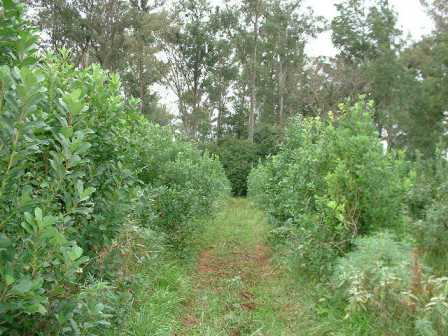
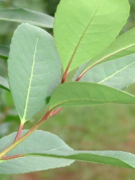
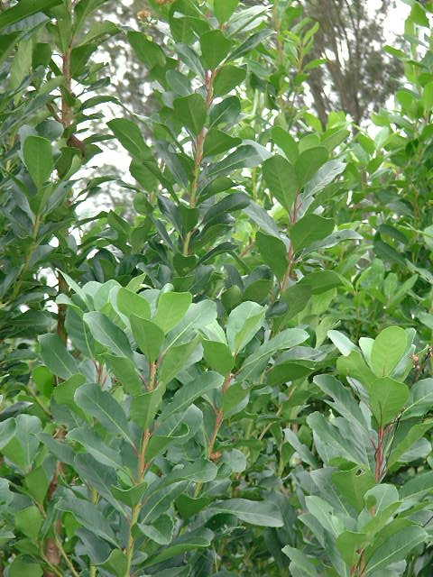

|     |
| --- |
| **PLANTATIONS**  Yerba grows wild or is planted in among trees of the selva (sub-tropical jungle) or in commercial plantations. It is very rare to find it planted in the jungle and none of the larger companies or exporters grow it in this manner. Of the commercial plantations some are hand planted and harvested while others are planted by machine specifically for machine harvest. The best yerba comes from superior varietals of consistent character grown in the best soil.  **HARVESTING** The yerba mate in the plantation is allowed to grow to a height of around 15 feet (shorter if machine harvested) though Ilex Paraguariensis in the wild will grow to about 30 feet. In most plantations a landlord pays workers per kilo for their cutting of the crop; quick hand picking is best for the superior plant and to maintain leaf humidity (no wilting, withering, or fermentation) before treatment of the leaves. The leafy stems, which grow in one season, are cut along with the leaves--unless a stronger mix is desired (a "despalada": literally "without sticks"). The leaf is quickly driven to the facility before wilting can occur. Traditional methods still practiced today in many large farms are for the workers to cut these branches with knives and carry them in folded white sheets upon their backs.   **DRYING & STATIONING (Mellowing)** The branches with leaves are hauled to the yerba "factory" and usually thrown onto conveyor belts. These pass the yerba through a quick-scorching kiln-fired by wood (these days pine or eucalyptus). The yerba rapidly passes over high heat which causes it to lose 20% of its water and open the pores of the leaf; it then passes over a conveyor to through moderate indirect heat for up to 8 hours. These processes treat the leaf so it is essentially completely dry and will not rot, ferment, or lose nutrition during the often lengthy curing period (up to two years in most cases of fine Argentinean yerba.) The yerba is first "pre-milled" into one-cm. pieces and bagged into open weave sacks (lienso). The curing allows unsavory gasses to escape from the yerba leaf and is considered essential for superb flavor and drinkability. There's really nothing like the heady, sweet, leafy smell of a yerba factory flash drying their freshly harvested crop! In the country, or in small processors, slow air-drying and storage in a cool dry place finishes the process. Many campesinos say this is the only true way to treat yerba, but it is seldom found in any commercial production. Yerba, say the Argentineans, cannot be drunk green and uncured; the Brazilians and Uruguayans say it is weak and has lost its flavor when cured for too long. You decide.  **MILLING** After stationing the dried yerba is run through a processor to create a uniform size of stick and leaf for the many various styles of yerba. (The most rigid control being needed for such things as tea bags or terere.) The many bags from a season are mixed to form a consistent blend and the fine powder is sifted off (from so-called superior Argentinean blends) to protect the quality. The milled yerba is then placed into packages and shipped. Often the reality is that many brands of yerba are packaged in the same facility, from the same stock of yerba, but of varying qualities. Cheaper (knock-off) brands often do not have the most consistent flavour or grind. Some North American start-up companies have furthered this concept by having the large company package "branded" yerba tea for their own label. In some cases this "branded" tea is of lower quality than the company's own traditional brand. Each brand's superb blend and cut of yerba is often labelled "Especial" and is sold as their "best" yerba; another side to this however is that these blends can be stronger--even too strong for some people's tastes. |