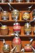
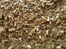
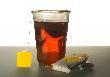

Proud partner of the Lance Armstrong Foundation

[Login](http://www.livestrong.com/login/) or [Register](http://www.livestrong.com/register/)

[(L)](http://www.livestrong.com/)

- [Food](http://www.livestrong.com/woman/food/)
- [Fitness](http://www.livestrong.com/man/fitness/)
- [Community](http://www.livestrong.com/community/)
- [Tools](http://www.livestrong.com/tools/)
- [Man](http://www.livestrong.com/man/)
- [Woman](http://www.livestrong.com/woman/)
- [Home](http://www.livestrong.com/)
- [Food & Drink](http://www.livestrong.com/food-and-drink/)
- [Beverages](http://www.livestrong.com/beverages/)
- [Yerba Mate](http://www.livestrong.com/yerba-mate/)

# Yerba Mate

## All About Yerba Mate

## [Is It OK to Drink Yerba Mate With Supplements?](http://www.livestrong.com/article/521838-is-it-ok-to-drink-yerba-mate-with-supplements/)

This herbal brew often is called ****yerba****  ****mate****, which means herb cup. Using ****mate**** with medication is tricky because certain combinations raise your risk for liver damage and interfere with or increase the side effects of drugs. Dri...

## [Yerba Mate for Blood Pressure](http://www.livestrong.com/article/512427-yerba-mate-for-blood-pressure/)

****Yerba****  ****mate**** is a native South American plant whose leaves are traditionally used to make a tea that is purported to give drinkers a wide variety of health benefits. ****Yerba****  ****mate**** contains a high concentration of caffeine-containing...

## [Benefits of Yerba Mate Leaf CS](http://www.livestrong.com/article/468766-benefits-of-yerba-mate-leaf-cs/)

********Yerba******  ****mate**** is a caffeine-laden beverage from South America that is brewed from the leaves of the ********yerba******  ****mate**** bush. ********Yerba******  ****mate**** tea, also simply called ****mate****, is now a popular drink in other parts of the world, including the United...******

## [Yerba Mate for Depression](http://www.livestrong.com/article/462087-yerba-mate-for-depression/)

****Yerba****  ****mate**** drinking has been a social and medicinal tradition in South America for centuries. ****Yerba****  ****mate**** tea, also called ****mate****, comes from the dried leaves and stems of Ilex paraguariensis, a type of holly tree. The tea is a st...

## [Tea Vs. Yerba Mate](http://www.livestrong.com/article/460712-tea-vs-yerba-mate/)

Both tea and ****yerba****  ****mate**** have been consumed for generations, yet that doesn't mean they are equally good for you. While one may prevent cancer, the other may play a role in causing it. Both have beneficial compounds, however, an...

## [Yerba Mate Tea & Cancer](http://www.livestrong.com/article/459948-yerba-mate-tea-cancer/)

Every nationality has its warm drink tradition. Americans and Europeans have their coffee houses, while the British and Asian have their teas. In South America, the tea called ****yerba****  ****mate**** plays a key role in the local culture a...

## [Is Excessive Consumption of Yerba Mate Bad?](http://www.livestrong.com/article/459103-is-excessive-consumption-of-yerba-mate-bad/)

In South American countries, particularly Argentina, Uruguay, Chile, Paraguay and Brazil, people wake up and brew their ****yerba****  ****mate**** in hot water. They pour the hot brew into ceramic or wooden cups, and drink it through a metal ...

## [Does Yerba Mate Make You Feel Better?](http://www.livestrong.com/article/457064-does-yerba-mate-make-you-feel-better/)

Proponents of ****yerba****  ****mate**** say it makes you feel better -- and gives you an energy lift without the jitters of stronger sources of caffeine. Pouring hot water over ground leaves and twigs from Ilex paraguariensis -- an evergreen...

## [Yerba Mate Problems](http://www.livestrong.com/article/450154-yerba-mate-problems/)

****Yerba****  ****mate**** is derived from ilex paraguariensis, a type of holly, an evergreen shrub. The tea contains ground leaves and twigs. ****Yerba****  ****mate**** contains less caffeine than coffee or tea. In South America, the tea serves as a social b...

## [What is Yerba Mate Extract?](http://www.livestrong.com/article/444095-what-is-yerba-mate-extract/)

****Yerba****  ****mate****, or Ilex paraguariensis, is a small shrub-like tree related to holly and native to parts of South America. The leaves and stems of the plant have been brewed as a tea by Native South Americans for thousands of years....

## [Yerba Mate Vs. Camellia Sinensis](http://www.livestrong.com/article/442899-yerba-mate-vs-camellia-sinensis/)

This plant is native to tropical regions in southeast Asia and China. ********Mate****** is a hearty and stimulating tea made from leaves of the tropical ****yerba****  ********mate****** tree. In South America, ****yerba****  ********mate****** is a traditional herbal remedy as well as...******

## [Yerba Mate & Migraines](http://www.livestrong.com/article/441985-yerba-mate-migraines/)

****Yerba****  ****mate**** is a South American tea used by many alternative medicine practitioners as a treatment for migraine headaches, although some people complain that consuming the tea often causes migraines to develop. ****Yerba****  ****mate**** -- als...

## [What Is Theanine & Does Yerba Mate Contain It?](http://www.livestrong.com/article/415127-what-is-theanine-does-yerba-mate-contain-it/)

All three come from the Camellia sinensi shrub. Green tea, which proponents claim has the highest antioxidant activity, is made from unfermented leaves. L-theanine may counteract the stimulating effects of caffeine in tea. The...

## [What Is Theanine & Does Yerba Mate Tea Contain It?](http://www.livestrong.com/article/413279-what-is-theanine-does-yerba-mate-tea-contain-it/)

L-theanine is a water-soluble, non-protein amino acid found in certain teas and mushrooms. Purified theanine, which is also available as an oral dietary supplement, is taken for a variety of health purposes. The levels of thean...

## [Is Yerba Mate Tea Herbal?](http://www.livestrong.com/article/413126-is-yerba-mate-tea-herbal/)

********Yerba******  ****mate**** tea is an herbal tea made from the leaves of the ********yerba******  ****mate**** plant, which is native to Paraguay, Uruguay and Argentina. This plant is also cultivated in parts of Spain and Portugal. The leaves are dried and powdered, ...****

## [Yerba Mate Preparation](http://www.livestrong.com/article/410185-yerba-mate-preparation/)

****Yerba****  ****mate**** is a tea whose consumption is deeply rooted in the cultures of Paraguay, Argentina, Uruguay and Brazil -- although it has become popular in North America and abroad. ****Yerba****  ****mate**** is enjoyed for both its distinctive smo...

## [Yerba Mate Health Facts](http://www.livestrong.com/article/404111-yerba-mate-health-facts/)

Brewed from the leaves of the perennial tree Ilex paraguariensis, ****yerba****  ****mate**** is a traditional beverage in many parts of South America, including Argentina, Paraguay and Brazil. Often passed around in a gourd to be sipped social...

## [White Tea Vs. Yerba Mate](http://www.livestrong.com/article/393625-white-tea-vs-yerba-mate/)

They differ only in preparation; whereas green tea is not fermented, oolong tea is partially fermented and black tea is fully fermented. Like green tea, white tea is not fermented. However, rather than the leaves, it is steeped...

## [What Is Yerba Mate Leaf?](http://www.livestrong.com/article/387198-what-is-yerba-mate-leaf/)

****Yerba****  ****mate****, known as the "drink of the Gods" in South America, comes from a bush called llex paraguariensis. It is not consumed as a raw product; instead, an infusion of the dried leaves of the bush is processed and made into a...

## [Yerba Mate Nutrition](http://www.livestrong.com/article/386676-yerba-mate-nutrition/)

********Yerba******  ****mate**** is a plant used widely throughout South America to make a tea-like concoction. This tea is made using hot but not boiling water, since boiling water can make the leaves taste bitter. In South America, ********yerba******  ****mate**** is s...****

## [How to Use Yerba Mate Tea](http://www.livestrong.com/article/375636-how-to-use-yerba-mate-tea/)

****Yerba****  ****mate****, a medium-sized, evergreen tree, is indigenous to regions of Argentina, Brazil, Uruguay and Paraguay. Native Indians in these regions have long used the tree's leaves to prepare a tea. ****Yerba****  ****mate**** is traditionally use...

## [Is Yerba Mate Bad for You?](http://www.livestrong.com/article/371332-is-yerba-mate-bad-for-you/)

****Yerba****  ****mate**** is plant that is used to make a drink that is popular with many South Americans. 16th century explorers first documented that Indians living in Paraguay used the leaves of the plant to ward off hunger and fatigue dur...

## [Yerba Mate Vs. Coffee](http://www.livestrong.com/article/367447-yerba-mate-vs-coffee/)

Introduced by the Guarani Indians of South America, ****yerba****  ****mate**** remains a popular drink consumed regularly as a hot beverage throughout Argentina, Uruguay, Paraguay and southern Brazil. Brewed from the dried leaves and stems of ...

## [The Uses of Yerba Mate](http://www.livestrong.com/article/367241-the-uses-of-yerba-mate/)

****Yerba****  ****mate**** has long featured in the daily habit of South Americans and remains the national drink for many countries in this region. Reports dating back centuries describe how locals traditionally used the leaves to ward of fat...

## [Yerba Mate Health Risks](http://www.livestrong.com/article/366906-yerba-mate-health-risks/)

****Yerba****  ****mate****, a South American plant frequently made into a hot beverage that is traditionally drunk out of gourds, is consumed for its stimulating effects as well as its purported health benefits, such as weight loss. ****Yerba****  ****mate****...

## [What Is Yerba Mate Tea?](http://www.livestrong.com/article/361762-what-is-yerba-mate-tea/)

The words ****yerba****  ********mate****** can literally be translated as "herbal cup." ********Mate****** is the name of the gourd used in place of a cup to drink this tea. In South America, ****yerba****  ********mate****** is more popular than coffee or tea as an energy drink. In th...******

## [Yerba Mate Contraindications](http://www.livestrong.com/article/332041-yerba-mate-contraindications/)

****Yerba****  ****mate**** is a type of plant whose leaves and branches can be used to create a tea-like drink when soaked in hot water. This popular South American drink contains caffeine and is purported to aid in weight loss as well as redu...

## [Yerba Mate Safety](http://www.livestrong.com/article/326780-yerba-mate-safety/)

The leaves of ****yerba****  ****mate****, a plant native to South America are traditionally brewed into a tea that retains stimulant properties. Marketing claims for ****yerba****  ****mate****, also called ****mate****, promise to provide energy and support weight lo...

## [Yerba Mate & Pregnancy](http://www.livestrong.com/article/318686-yerba-mate-pregnancy/)

Even things that are generally considered harmless to individuals who are not pregnant can potentially be dangerous during pregnancy. Pregnant women should talk to their doctors to learn what food and beverages to avoid during ...

## [How to Brew Yerba Mate Tea](http://www.livestrong.com/article/281286-how-to-brew-yerba-mate-tea/)

****Yerba****  ****mate**** is a traditional South American tea native to Argentina, Uruguay and Brazil. It has a distinctive, earthy aroma and flavor which can easily become an acquired taste, and also packs a caffeine "punch" similar to that ...

## [Information on Yerba Mate Tea](http://www.livestrong.com/article/279101-information-on-yerba-mate-tea/)

********Yerba******  ****mate**** acts as a strong central nervous system stimulant. The ********yerba******  ****mate**** plant is indigenous to subtropical South America, and ********yerba******  ****mate**** tea has been a popular beverage of people in many South American countries for quite ...******

## [How to Prepare Yerba Mate Tea](http://www.livestrong.com/article/278964-how-to-prepare-yerba-mate-tea/)

****Yerba****  ****mate**** tea is a traditional South American drink that is gaining popularity in the United States. Proponents of the tea believe the drink cleanses the blood, eases stress, fights fatigue, tones the nervous system, fights ag...

## [What Is Yerba Mate Good For?](http://www.livestrong.com/article/277098-what-is-yerba-mate-good-for/)

****Yerba****  ****mate****, a tea made from the plant Ilex paraguariensis, has been consumed in South American countries since the times of the ancient Indian civilizations, according to the Tropical Plant Database. Ilex paraguariensis is a me...

## [Yerba Mate Instructions](http://www.livestrong.com/article/277097-yerba-mate-instructions/)

A traditional South American drink with roots in Argentina, Brazil and Paraguay, ****yerba****  ****mate**** is available as a tea in the United States. Comparable in caffeine content to coffee, ****yerba****  ****mate**** is a natural drink accompanied by a un...

## [Yerba Mate Information](http://www.livestrong.com/article/275276-yerba-mate-information/)

****Yerba****  ****Mate**** is an herbal drink that is used for a variety of social and health purposes. It is derived from the ****Yerba****  ****Mate**** plant and is very popular in South America, similar to the way coffee is loved in the United States. Alth...

## [Green Tea vs. Yerba Mate Antioxidants](http://www.livestrong.com/article/270715-green-tea-vs-yerba-mate-antioxidants/)

If you're looking for a morning beverage that provides energy without the side effects of coffee, you might consider trying ****yerba****  ****mate****, the mostly widely consumed beverage in South America or green tea, enjoyed for centuries in...

## [What Is the Difference Between Yerba Mate Tea and Green Tea?](http://www.livestrong.com/article/270619-what-is-the-difference-between-yerba-mate-tea-and-green-tea/)

****Yerba****  ****mate**** tea, derived from holly plants in South America, and green tea, native to China, share weight-loss claims and avid followers. ****Yerba****  ****mate**** --- pronounced muh-tay --- enjoys greater popularity in Argentina than coffee d...

## [How to Brew Yerba Mate](http://www.livestrong.com/article/269463-how-to-brew-yerba-mate/)

****Yerba****  ****mate**** has been a favorite beverage of the Guarani Indians of northeastern Argentina, who introduced the tea to Jesuit Missionaries, who then began to cultivate it. ****Yerba****  ****mate**** has become popular throughout much of South Am...

## [Medicinal Benefits of Yerba Mate](http://www.livestrong.com/article/266341-medicinal-benefits-of-yerba-mate/)

********Yerba******  ********Mate****** is a type of tea made from the leaves of the ********yerba******  ********mate****** shrub. This tea is popular in South America, where the plant originates. ********Yerba******  ********mate****** is known to have many health benefits, although it should not be used as a t...************

## [Benefits of Yerba Mate Tea](http://www.livestrong.com/article/258209-benefits-of-yerba-mate-tea/)

****Yerba****  ****mate**** tea, used medicinally by the native people in Brazil, Argentina, and Paraguay, is considered by many, according to Guayaki.com, "the drink of the gods." This popular tea contains over 24 vitamins and minerals, 15 ami...

## [Is Yerba Mate Tea Better Than Green Tea?](http://www.livestrong.com/article/246845-is-yerba-mate-tea-better-than-green-tea/)

Teas provide antioxidants and essential vitamins and minerals that are thought to help prevent the development of certain diseases. While Asian-based green teas have long been the favorite tea of health advocates, the popular S...

## [Benefits of Yerba Mate](http://www.livestrong.com/article/240907-benefits-of-yerba-mate/)

The ****yerba****  ****mate**** tree (Ilex paraguariensis) provides the leaves for a type of infusion known as ****yerba****  ****mate**** tea. This tree grows naturally in areas of South America, where indigenous people consume it for health benefits. For many...

## [Bad Effects of Yerba Mate Tea](http://www.livestrong.com/article/26242-bad-effects-yerba-mate-tea/)

********Yerba******  ****mate**** tea is a drink made by steeping the leaves and twigs of the the rain-forest tree, ********yerba******  ****mate****, in hot water. The ********yerba******  ****mate**** tree is native to the subtropical forests of Paraguay, Brazil and Argentina, and the resident...******

## [Dangerous Side Effects of Yerba Mate](http://www.livestrong.com/article/151440-dangerous-side-effects-of-yerba-mate/)

********Yerba******  ****mate****, a South American beverage with a reputation for providing a quick burst of energy, is a popular alternative to coffee. A cup of ********yerba******  ****mate**** typically contains 50 to 100 mg of caffeine, according to Raintree Nutrition...****

## [The Health Effects of Yerba Mate](http://www.livestrong.com/article/134318-the-health-effects-yerba-mate/)

********Yerba******  ****mate**** is a tea that is made from a the leaves of a South American plant called Ilex paraguariensis. Consumed for thousands of years, ********yerba******  ****mate**** is typically sipped out of a hollowed out gourd with a metal straw. Although i...****

## [What Is Bombilla?](http://www.livestrong.com/article/119852-bombilla/)

A bombilla is a metal straw used in the drinking of ****yerba****  ****mate**** tea. Bombillas are traditionally made of silver but are also made of nickel and stainless steel. The bombilla is flat on the end with small holes and acts as a siev...

## [The Dangerous Side Effects of Yerba Mate](http://www.livestrong.com/article/119830-dangerous-side-effects-yerba-mate/)

****Yerba****  ****mate**** is a tea made from the stems and foliage of the Ilex paraguariensis plant. It has been used traditionally in South America for its stimulating properties, and is used today as an energy supplement and weight loss ai...

## [Effects of Yerba Mate](http://www.livestrong.com/article/111701-effects-yerba-mate/)

****Yerba**** maté is an evergreen plant and member of the holly family. Used as a beverage for centuries by natives of Brazil and Paraguay, it's now considered the national drink in several countries. Many people consume it as a ...

## [What Are the Dangers of Yerba Mate?](http://www.livestrong.com/article/96194-dangers-yerba-mate/)

****Yerba****  ****mate**** (Ilex paraguariensis) is an evergreen shrub native to Argentina, Bolivia, Paraguay and Brazil. The leaves and twigs of the plant are dried and steeped in hot water until a tea is formed. ****Yerba****  ****mate**** acts as a central ...

## [The Effects of Yerba Mate](http://www.livestrong.com/article/93865-effects-yerba-mate/)

********Yerba******  ****mate**** leaves come from the Ilex paraguanensis plant, native to South America. Brewed and sipped out of a hollowed gourd with a metal filter straw, or brewed using teabags, ********yerba******  ****mate**** is increasing in popularity throughout ...****

## [Benefits of Drinking Yerba Mate](http://www.livestrong.com/article/91419-benefits-drinking-yerba-mate/)

****Yerba****  ****mate**** is a tea made from the leaves and twigs of the ilex paraguariensis plant. It is a staple beverage in South America, and can easily be ordered online or purchased at health food stores. Though ****Yerba****  ****mate**** is best known...

## [About Yerba Mate](http://www.livestrong.com/article/86398-yerba-mate/)

****Yerba****  ****mate**** is a beverage similar to tea that has long been consumed in great quantities by the indigenous people of many South American countries. Increasingly, it is becoming consumed by more people throughout worldwide as wel...

## [Bad Effects of Yerba Mate Tea](http://www.livestrong.com/article/26242-bad-effects-yerba-mate-tea/)

********Yerba******  ****mate**** is a very popular social drink in South America. The dried ********yerba******  ****mate**** leaves are steeped and the tea is shared as a community drink among friends or consumed solo. ********Yerba******  ****mate**** has been promoted as being high in antiox...******

## [Heath Benefits of Yerba Mate](http://www.livestrong.com/article/25323-heath-benefits-yerba-mate/)

****Yerba****  ****mate**** is a South American plant that is similar in taste and consistency to green tea. In its traditional form, it's drunk by steeping leaves and twigs in hot water and served in a hollow gourd with a metal straw (called b...

## [Health Benefits of Yerba Mate](http://www.livestrong.com/article/21680-health-benefits-yerba-mate/)

********Yerba******  ****mate**** (Ilex paraguayensis) is a small shrub of the holly family native to South America. A drink is made from ********yerba******  ****mate**** by steeping the twigs and dry leaves in hot water. According to a report from Purdue University, in S...****

## [Yerba Mate Negative Side Effects](http://www.livestrong.com/article/21659-yerba-mate-negative-side-effects/)

****Yerba****  ****mate**** is widely consumed as a tea in South America, and it known for its health benefits. In other parts of the world, it is ingested as a dietary supplement in addition to its use as a tea. While the National Institutes o...

## [How to Use Yerba Mate Leaves](http://www.livestrong.com/article/16280-use-yerba-mate-leaves/)

****Yerba****  ****mate**** is a traditional drink that is made from the leaves of the Ilex paraguariensis tree, which is normally found in South America. ****Yerba****  ****mate**** is an herbal drink that has been used for centuries to stimulate the mind. It ...

Must see: Photo Galleries

[The Burn Fat Faster Workout](http://ad.doubleclick.net/click%3Bh%3Dv8/3c9b/3/0/%2a/q%3B245859423%3B0-0%3B0%3B48491456%3B15706-470/270%3B43905512/43923299/1%3Bu%3Dcat-fooddrink_scat-beverages_sscat-yerbamate_art-_dmd-CF61FCDB-C8C3-4B8C-9DC2-758398CB19A7%3B~aopt%3D2/1/5/0%3B~sscs%3D%3fhttp://www.livestrong.com/slideshow/557599-the-burn-fat-faster-workout/?utm_source=articlebottom&amp;utm_medium=1)

[23 Secrets From The World's Best Trainers](http://ad.doubleclick.net/click%3Bh%3Dv8/3c9b/3/0/%2a/q%3B245859423%3B0-0%3B0%3B48491456%3B15706-470/270%3B43905512/43923299/1%3Bu%3Dcat-fooddrink_scat-beverages_sscat-yerbamate_art-_dmd-CF61FCDB-C8C3-4B8C-9DC2-758398CB19A7%3B~aopt%3D2/1/5/0%3B~sscs%3D%3fhttp://www.livestrong.com/slideshow/557563-23-secrets-from-the-worlds-best-trainers/?utm_source=articlebottom&amp;utm_medium=2)

[Ultimate Summer Workout Playlist](http://ad.doubleclick.net/click%3Bh%3Dv8/3c9b/3/0/%2a/q%3B245859423%3B0-0%3B0%3B48491456%3B15706-470/270%3B43905512/43923299/1%3Bu%3Dcat-fooddrink_scat-beverages_sscat-yerbamate_art-_dmd-CF61FCDB-C8C3-4B8C-9DC2-758398CB19A7%3B~aopt%3D2/1/5/0%3B~sscs%3D%3fhttp://www.livestrong.com/slideshow/557509-ultimate-summer-workout-playlist/?utm_source=articlebottom&amp;utm_medium=3)

advertisement

## More in Beverages

## [Soy Milk](http://www.livestrong.com/soy-milk/)

## [Milk](http://www.livestrong.com/milk/)

## [Cranberry Juice](http://www.livestrong.com/cranberry-juice/)

## [Juice](http://www.livestrong.com/juice/)

## [Soft Drinks](http://www.livestrong.com/soft-drinks/)

## [Lemon Juice](http://www.livestrong.com/lemon-juice/)

## [Pomegranate Juice](http://www.livestrong.com/pomegranate-juice/)

## [Diet Soda](http://www.livestrong.com/diet-soda/)

## [Energy Drinks](http://www.livestrong.com/energy-drinks/)

## [Gatorade](http://www.livestrong.com/gatorade/)

## [Noni Juice](http://www.livestrong.com/noni-juice/)

## [Lemon Water](http://www.livestrong.com/lemon-water/)

## [Cow's Milk](http://www.livestrong.com/cows-milk/)

## [Red Wine](http://www.livestrong.com/red-wine/)

## [Milk Products](http://www.livestrong.com/milk-products/)

## [Water Consumption](http://www.livestrong.com/water-consumption/)

## [Yerba Mate](http://www.livestrong.com/yerba-mate/)

## [Fruit Juice](http://www.livestrong.com/fruit-juice/)

## [Monster Energy Drinks](http://www.livestrong.com/monster-energy-drinks/)

## [Cherry Juice](http://www.livestrong.com/cherry-juice/)

Follow Us

[(L)](http://www.facebook.com/pages/LIVESTRONGCOM/170615319988)  [(L)](http://twitter.com/LIVESTRONG_COM/)  [(L)](http://www.youtube.com/user/livestrong)  [(L)](http://www.livestrong.com/syndication/)  [(L)](https://plus.google.com/110346285354241363829/)

### Food & Drink Tools

## MyPlate

## Recipes

[Food](http://www.livestrong.com/woman/food/)  [Fitness](http://www.livestrong.com/man/fitness/)  [Community](http://www.livestrong.com/community/)  [Tools](http://www.livestrong.com/tools/)

Sign-up for our newsletter
Get the latest tips on diet, exercise and healthy living.
Your email is safe with us. We hate spam too!

[About](http://www.livestrong.com/aboutus/)  [Blog](http://www.livestrong.com/blog/)  [Contact us & FAQ](http://www.livestrong.com/contact-us/)  [Advertise with us](http://www.livestrong.com/advertise/)  [Press](http://www.livestrong.com/press/)  [Sitemap](http://www.livestrong.com/sitemap.html)

Copyright © 2012 Demand Media, Inc. Use of this web site constitutes acceptance of the LIVE**STRONG**.COM Terms of Use and Privacy Policy. The material appearing on LIVE**STRONG**.COM is for educational use only. It should not be used as a substitute for professional medical advice, diagnosis or treatment. LIVE**STRONG** is a registered trademark of the Lance Armstrong Foundation. The Lance Armstrong Foundation and LIVE**STRONG**.COM do not endorse any of the products or services that are advertised on the web site. Moreover, we do not select every advertiser or advertisement that appears on the web site-many of the advertisements are served by third party advertising companies. [Ad Choices]()