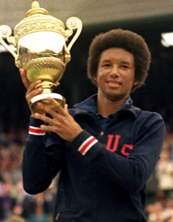

 

**Arthur Ashe**,  He was African-American and had millions of fans all over the world. He was not only a great player but also a thorough gentleman. In 1975, Ashe won Wimbledon, unexpectedly defeating Jimmy Connors. the legendary Wimbledon player, was dying of AIDS he had gotton he received during a blood transfusion for heart surgery in 1983.  He and his wife kept his illness private until 1992, when the news leaked. soon Ashe started getting lots of mail.  From world over, he received mail from his fans, one of which conveyed:

"Why does GOD have to select you for such a bad disease?"
To this Arthur Ashe replied: The world over:-
50,000,000 children start to play tennis,
5,000,000 learn to play tennis,
500,000 learn professional tennis,
50,000 come to the circuit,
5000 reach the grand slam,
50 reach Wimbledon,
4 to semi final,
2 to the finals.
When I was holding a cup, I never asked GOD **"Why me?"**
And today in pain I should not be asking GOD **"Why me?"**

After going through this story, I thought I would never question God’s plan and the sufferings he may have in store for me. But a human being is very weak in keeping his promise. “Why me” the question still torments my mind while I search for an answer.Arthur

