
 

[(L)](http://www.ikea.com/gb/en/catalog/products/50116263/#mainContent)

[(L)](http://www.ikea.com/gb/en/catalog/products/50116263/#mainContent)[(L)](http://www.ikea.com/gb/en/)[(L)](http://www.ikea.com/gb/en/catalog/news/range/)[(L)](http://www.ikea.com/ms/en_GB/site_index/site_index.html)[(L)](http://www.ikea.com/gb/en/catalog/products/50116263/#search)[(L)](http://www.ikea.com/ms/en_GB/customer_service/faq/faq.html)[(L)](http://www.ikea.com/ms/en_GB/customer_service/splash.html)[(L)](http://www.ikea.com/ms/en_GB/customer_service/contact_us/contact.html)

 

[(L)](http://www.ikea.com/gb/en/catalog/products/50116263/#)

Welcome to IKEA United Kingdom.

 [  Ask Anna]()

- [Your local IKEA store](http://www.ikea.com/ms/en_GB/ikny_splash.html)
- [IKEA FAMILY](http://www.ikea.com/ms/en_GB/ikea_family/index.html)
- [My Shopping List](http://www.ikea.com/webapp/wcs/stores/servlet/InterestItemDisplay?storeId=7&langId=-20)

- [Login]()
- [My Account](http://www.ikea.com/webapp/wcs/stores/servlet/UpdateUser?storeId=7&langId=-20)
- [Shopping trolley](http://www.ikea.com/webapp/wcs/stores/servlet/OrderItemDisplay?storeId=7&langId=-20&catalogId=11001&orderId=.&newLinks=true)  [(L)](http://www.ikea.com/webapp/wcs/stores/servlet/OrderItemDisplay?storeId=7&langId=-20&catalogId=11001&orderId=.&newLinks=true)

|     |     |     |     |     |     |     |     |     |
| --- | --- | --- | --- | --- | --- | --- | --- | --- |
|  [  All products](http://www.ikea.com/gb/en/catalog/allproducts/) |  [  *New*](http://www.ikea.com/gb/en/catalog/news/departments/) |  [  Outdoor](http://www.ikea.com/gb/en/catalog/categories/departments/outdoor) |  [  Living room](http://www.ikea.com/gb/en/catalog/categories/departments/living_room/) |  [  Bedroom](http://www.ikea.com/gb/en/catalog/categories/departments/bedroom/) |  [  Kitchen](http://www.ikea.com/gb/en/catalog/categories/departments/kitchen/) |  [  Children's IKEA](http://www.ikea.com/gb/en/catalog/categories/departments/childrens_ikea/) |  [  Textiles](http://www.ikea.com/gb/en/catalog/categories/departments/Textiles/) |  [   All departments]() |

- [Home](http://www.ikea.com/gb/en/)
- /
- [Dining](http://www.ikea.com/gb/en/catalog/categories/departments/dining/)
- /
- [Dining tables](http://www.ikea.com/gb/en/catalog/categories/departments/dining/21825/)
- /
- [Extendable tables](http://www.ikea.com/gb/en/catalog/categories/departments/dining/21829/)

-

View more images

[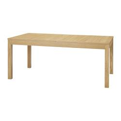]()
[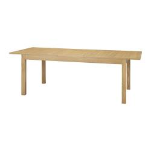]()
[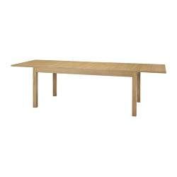]()

 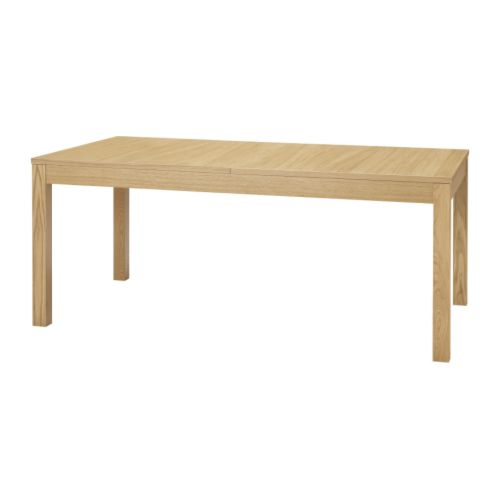

[Share]()

colour
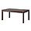
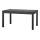
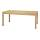
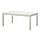

More Models

[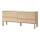](http://www.ikea.com/gb/en/catalog/products/70117025/)

[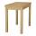](http://www.ikea.com/gb/en/catalog/products/50116847/)

[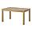](http://www.ikea.com/gb/en/catalog/products/80116266/)

[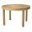](http://www.ikea.com/gb/en/catalog/products/00116779/)

[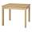](http://www.ikea.com/gb/en/catalog/products/10116811/)

[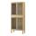](http://www.ikea.com/gb/en/catalog/products/10119169/)

#

BJURSTA
Dining table, oak veneer
£189

 *The price reflects selected options*

Article Number :
501.162.63

Extendable dining table with 2 extra leaves seats 6-10; makes it possible to adjust the table size according to need. [Read more]()

colour

-

- [(L)](http://www.ikea.com/gb/en/catalog/products/50116263/#)

[(L)](http://www.ikea.com/gb/en/catalog/products/50116263/#)

-

Complementary Products

+

- 
- 

-

[View all complementary products](#)

Buy at your local store

[(L)](http://www.ikea.com/gb/en/catalog/products/50116263/#)

Prices and products may vary in store and online

Assembly instructions

[BJURSTA Dining table](http://www.ikea.com/assembly_instructions/bjursta-dining-table-175-218-260x95-cm__6_SL10_PUB.PDF) (PDF)

Services

Finance service
Picking Service
Assembly Service

-
Matching Products

-
Complementary Products

-
Product information

-

- [(L)](http://www.ikea.com/gb/en/catalog/products/80154871/)

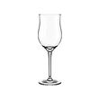

**HEDERLIG**

white wine glass **£1.29**

- [ ]()

[ ]()
[(L)](http://www.ikea.com/gb/en/catalog/products/S69805015/)
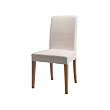

**HENRIKSDAL**

chair **£65**

- [(L)](http://www.ikea.com/gb/en/catalog/products/26312810/)

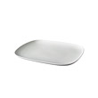

**IKEA 365+**

plate **£7.99**

- [(L)](http://www.ikea.com/gb/en/catalog/products/90103254/)

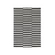

**IKEA STOCKHOLM RAND**

rug, flatwoven **£259**

More BJURSTA series

[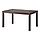](http://www.ikea.com/gb/en/catalog/products/90182307/)

[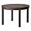](http://www.ikea.com/gb/en/catalog/products/60182304/)

[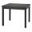](http://www.ikea.com/gb/en/catalog/products/50116809/)

[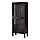](http://www.ikea.com/gb/en/catalog/products/40187557/)

[Go to BJURSTA series](http://www.ikea.com/gb/en/catalog/categories/series/10232/)

More Extendable tables

[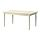](http://www.ikea.com/gb/en/catalog/products/70221423/)

[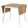](http://www.ikea.com/gb/en/catalog/products/20206806/)

[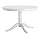](http://www.ikea.com/gb/en/catalog/products/80214257/)

[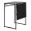](http://www.ikea.com/gb/en/catalog/products/10125113/)

[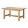](http://www.ikea.com/gb/en/catalog/products/30116872/)

[Go to Extendable tables](http://www.ikea.com/gb/en/catalog/categories/departments/dining/21829/)

 

 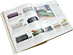

 [IKEA Catalogue & Brochures](http://www.ikea.com/ms/en_GB/virtual_catalogue/online_catalogues.html)

   [View online now!]()

[Customer Relations](http://www.ikea.com/ms/en_GB/customer_service/customer_relations.html)

[IKEA Services](http://www.ikea.com/ms/en_GB/customer_service/ikea_services/ikea_services.html)[Contact Us](http://www.ikea.com/ms/en_GB/customer_service/customer_relations.html)[Returns Policy](http://www.ikea.com/ms/en_GB/customer_service/ikea_services/change_your_mind.html)[Shop Online](http://www.ikea.com/ms/en_GB/customer_service/shop_online/all_about_shop_online.html)[Gift Card](http://www.ikea.com/ms/en_GB/customer_service/ikea_services/giftcard.html)[Site Map](http://www.ikea.com/gb/en/sitemap)

[About IKEA](http://www.ikea.com/ms/en_GB/about_ikea/index.html)

[People and the environment](http://www.ikea.com/ms/en_GB/the_ikea_story/people_and_the_environment/index.html)[Swedish heritage](http://www.ikea.com/ms/en_GB/about_ikea/the_ikea_way/swedish_heritage/index.html)[Our business idea](http://www.ikea.com/ms/en_GB/about_ikea/the_ikea_way/our_business_idea/index.html)[IKEA Foundation](http://www.ikea.com/ms/en_GB/the_ikea_story/people_and_the_environment/ikea_social_initiative.html)[The Kitchen](http://thekitchen.ikea.co.uk/)[IKEA Business]()

[Working at IKEA](http://www.ikea.com/ms/en_GB/the_ikea_story/jobs_at_ikea/index.html)

[Jobs available](http://www.ikea.com/ms/en_GB/the_ikea_story/jobs_at_ikea/index.html)[Co-worker stories](http://www.ikea.com/ms/en_GB/the_ikea_story/working_at_ikea/co_worker_stories.html)

[News room](http://www.ikea.com/gb/en/about_ikea/newsroom)
[Press release](http://www.ikea.com/gb/en/about_ikea/newsroom)[Image library]()

 

© Inter IKEA Systems B.V. 1999 - 2012 |  [Privacy Policy](http://www.ikea.com/ms/en_GB/privacy_policy/privacy_policy.html)