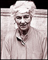

 

[Business Masters Home](http://www.woopidoo.com/biography/index.htm)  - [Woopidoo.com](http://www.woopidoo.com/)  -  [Info](http://www.woopidoo.com/biography/business-leaders.htm)

|     |     |
| --- | --- |
|   Business Leaders | ## Business Leaders & Masters in Business |

|     |
| --- |
| [ Bookmark]()  [ Quotes](http://www.woopidoo.com/business_quotes/index.htm)  [ Business Articles](http://www.woopidoo.com/business_articles/index.htm)  [ Business Leaders](http://www.woopidoo.com/biography/index.htm) |

|     |
| --- |
| Biographies of business leaders, entrepreneurs and investors worldwide. Woopidoo - Business articles, business quotes and resources online. |

** Business & Motivation - Profiles of Inspirational Leaders**

|     |     |
| --- | --- |
| Sponsored Links | **  ****The Biographies of Business Masters and Motivational Experts :** Each week we will add a new biography of a leader in business, finance or self-help. Each profile includes biographical information, famous business quotations, links to more information on the person, and recommended products relating to the expert.  [::: Woopidoo](http://www.woopidoo.com/)> *Business Leaders & Motivational Experts* |

** Biography - Information**

|     |     |
| --- | --- |
|  | **Peggy Guggenheim :** Influential American art collector and investor in modern art. Go to : [Peggy Guggenheim Biography](http://www.woopidoo.com/biography/peggy-guggenheim/index.htm) - [Peggy Guggenheim Quotations](http://www.woopidoo.com/business_quotes/authors/peggy-guggenheim/index.htm) |
|  | **Donald Trump :** Real Estate mogul and star of The Apprentice. Go to : [Donald Trump Biography](http://www.woopidoo.com/biography/donald-trump.htm) - [Donald Trump Quotations](http://www.woopidoo.com/business_quotes/authors/donald-trump-quotes.htm) - [All Donald Trump](http://www.woopidoo.com/biography/donald-trump/the-donald.htm) |
|  [View Biographies by Date published](http://www.woopidoo.com/biography/business-people.htm) |

** Business Leaders, Politicians & Motivational Experts - A to Z**

|     |
| --- |
|  **Roman Abramovich :** Personal finance author and best selling author. Go to : [Roman Abramovich Biography](http://www.woopidoo.com/biography/roman-abramovich/index.htm) - [Roman Abramovich Quotations](http://www.woopidoo.com/business_quotes/authors/roman-abramovich/index.htm) - [All Roman Abramovich](http://www.woopidoo.com/biography/roman-abramovich/life.htm)  **Giorgio Armani :** Famous Italian billionaire businessman and fashion designer. Go to : [Giogrio Armani Biography](http://www.woopidoo.com/biography/giorgio-armani/index.htm) - [Giorgio Armani Quotations](http://www.woopidoo.com/business_quotes/authors/giorgio-armani/index.htm)  **Bernard Arnault :** LVMH chairman, French businessman, and richest person in France. Go to : [Bernard Arnault Biography](http://www.woopidoo.com/biography/bernard-arnault/index.htm) - [Bernard Arnault Quotations](http://www.woopidoo.com/business_quotes/authors/bernard-arnault/index.htm)  **Julian Assange :** Controversial founder of the WikiLeaks website. Go to : [Julian Assange Biography](http://www.woopidoo.com/biography/julian-assange/index.htm) - [Julian Assange Quotations](http://www.woopidoo.com/business_quotes/authors/julian-assange/index.htm) - [All Julian Assange](http://www.woopidoo.com/biography/julian-assange/whistleblower.htm)  **David Bach :** Personal finance author and best selling author. Go to : [David Bach Biography](http://www.woopidoo.com/biography/david-bach/index.htm) - [David Bach Quotations](http://www.woopidoo.com/business_quotes/authors/david-bach-quotes.htm)  **Steve Ballmer :** American billionaire Chief Executive Officer (CEO) of Microsoft. Go to : [Steve Ballmer Biography](http://www.woopidoo.com/biography/steve-ballmer/index.htm) - [Steve Ballmer Quotations](http://www.woopidoo.com/business_quotes/authors/steve-ballmer-quotes.htm)  **Ben Bernanke :** Jewish American economist and Feral Reserve Chairman. Go to : [Ben Bernanke Biography](http://www.woopidoo.com/biography/ben-bernanke/index.htm) - [Ben Bernanke Quotations](http://www.woopidoo.com/business_quotes/authors/ben-bernanke/index.htm)  **Jeff Bezos :** Internet entrepreneur and Amazon.com founder. Go to : [Jeff Bezos Biography](http://www.woopidoo.com/biography/jeff-bezos/index.htm) - [Jeff Bezos Quotations](http://www.woopidoo.com/business_quotes/authors/jeff-bezos-quotes.htm)  **Joe Biden :** American democratic politician and Barack Obama running mate in 2008. Go to : [Joe Biden Biography](http://www.woopidoo.com/biography/joe-biden/index.htm) - [Joe Biden Quotations](http://www.woopidoo.com/business_quotes/authors/joe-biden/index.htm)  **Tim Blixseth :** Successful American billionaire businessman and entrepreneur. Go to : [Tim Blixseth Biography](http://www.woopidoo.com/biography/tim-blixseth/index.htm) - [Tim Blixseth Quotations](http://www.woopidoo.com/business_quotes/authors/tim-blixseth/index.htm)  **Richard Branson :** British entrepreneur and Founder of Virgin Music. Go to : [Richard Branson Biography](http://www.woopidoo.com/biography/richard_branson.htm) - [Richard Branson Quotations](http://www.woopidoo.com/business_quotes/authors/richard-branson-quotes.htm) - [All Richard Branson](http://www.woopidoo.com/biography/richard-branson/index.htm)  **Sergey Brin :** Internet entrepreneur and co-founder of the Google search engine. Go to : [Sergey Brin Biography](http://www.woopidoo.com/biography/sergey-brin/index.htm) - [Sergey Brin Quotations](http://www.woopidoo.com/business_quotes/authors/sergey-brin-quotes.htm)  **Eli Broad :** Jewish American billionaire philanthropist and art collector. Go to : [Eli Broad Biography](http://www.woopidoo.com/biography/eli-broad/index.htm) - [Eli Broad Quotations](http://www.woopidoo.com/business_quotes/authors/eli-broad/index.htm) - [All Eli Broad](http://www.woopidoo.com/biography/eli-broad/philanthropist.htm)  **Warren Buffett :** Successful American Investor and Stockmarket Guru. Go to : [Warren Buffett Biography](http://www.woopidoo.com/biography/warren_buffett.htm) - [Warren Buffett Quotations](http://www.woopidoo.com/business_quotes/authors/warren-buffett-quotes.htm) - [Buffett Philanthropy](http://www.woopidoo.com/biography/buffett/index.htm)  **Jack Canfield :** Success author and American motivational speaker. Go to : [Jack Canfield Biography](http://www.woopidoo.com/biography/jack-canfield/index.htm) - [Jack Canfield Quotations](http://www.woopidoo.com/business_quotes/authors/jack-canfield/index.htm) - [All Jack Canfield](http://www.woopidoo.com/biography/jack-canfield/author.htm)  **Andrew Carnegie :** Wealthy American industrialist and philanthropist. Go to : [Andrew Carnegie Biography](http://www.woopidoo.com/biography/andrew-carnegie/index.htm) - [Andrew Carnegie Quotations](http://www.woopidoo.com/business_quotes/authors/andrew-carnegie-quotes.htm)  **Carlos Castaneda :** Peruvian born American spiritual author of "The Teachings of Don Juan" Go to : [Carlos Castaneda Biography](http://www.woopidoo.com/biography/carlos-castaneda/index.htm) - [Carlos Castaneda Quotations](http://www.woopidoo.com/business_quotes/authors/carlos-castaneda/index.htm)  **Deepak Chopra :** Indian born American spiritual writer and motivational speaker. Go to : [Deepak Chopra Biography](http://www.woopidoo.com/biography/deepak-chopra/index.htm) - [Deepak Chopra Quotations](http://www.woopidoo.com/business_quotes/authors/deepak-chopra/index.htm) - [All Deepak Chopra](http://www.woopidoo.com/biography/deepak-chopra/author.htm)  **Bill Clinton :** 42nd President of the United States of America. Go to : [Bill Clinton Biography](http://www.woopidoo.com/biography/bill-clinton/index.htm) - [Bill Clinton Quotations](http://www.woopidoo.com/business_quotes/authors/bill-clinton-quotes.htm) - [All Bill Clinton](http://www.woopidoo.com/biography/bill-clinton/president.htm)  **Hillary Clinton :** Wife of the former President of America and New York Senator Go to : [Hillary Clinton Biography](http://www.woopidoo.com/biography/hillary-clinton/index.htm) - [Hillary Clinton Quotations](http://www.woopidoo.com/business_quotes/authors/hillary-clinton/index.htm)  **Stephen R. Covey :** Author of the 7 Habits of Highly Effective People Go to : [Stephen Covey Biography](http://www.woopidoo.com/biography/stephen-covey/index.htm) - [Stephen Covey Quotations](http://www.woopidoo.com/business_quotes/authors/stephen-covey-quotes.htm)  **Simon Cowell :** Wealthy British television personality and judge on the American Idol tv show. Go to : [Simon Cowell Biography](http://www.woopidoo.com/biography/simon-cowell/index.htm) - [Simon Cowell Quotations](http://www.woopidoo.com/business_quotes/authors/simon-cowell/index.htm)  **Mark Cuban :** Internet billionaire and owner of the Dallas Mavericks NBA basketball team. Go to : [Mark Cuban Biography](http://www.woopidoo.com/biography/mark-cuban/index.htm) - [Mark Cuban Quotations](http://www.woopidoo.com/business_quotes/authors/mark-cuban/index.htm)  **Charles Darwin :** English naturalist and writer on the theory of evolution. Go to : [Charles Darwin Biography](http://www.woopidoo.com/biography/charles-darwin/index.htm) - [Charles Darwin Quotations](http://www.woopidoo.com/business_quotes/authors/charles-darwin.htm) - [All Charles Darwin](http://www.woopidoo.com/biography/charles-darwin/evolution.htm)  **Richard Dawkins :** UK author, god skeptic and atheist. Go to : [Richard Dawkins Biography](http://www.woopidoo.com/biography/richard-dawkins/index.htm) - [Richard Dawkins Quotations](http://www.woopidoo.com/business_quotes/authors/richard-dawkins/index.htm) - [All Richard Dawkins](http://www.woopidoo.com/biography/richard-dawkins/author.htm)  **Michael Dell :** American billionaire and founder of the Dell computer company. Go to : [Michael Dell Biography](http://www.woopidoo.com/biography/michael-dell/index.htm) - [Michael Dell Quotations](http://www.woopidoo.com/business_quotes/authors/michael-dell-quotes.htm)  **Walt Disney :** Media mogul and founder of the Walt Disney Company. Go to : [Walt Disney Biography](http://www.woopidoo.com/biography/walt-disney/index.htm) - [Walt Disney Quotations](http://www.woopidoo.com/business_quotes/authors/walt-disney-quotes.htm)  **Peter Drucker :** Business author and business strategist. Go to : [Peter Drucker Biography](http://www.woopidoo.com/biography/peter-drucker/index.htm) - [Peter Drucker Quotations](http://www.woopidoo.com/business_quotes/authors/peter-drucker-quotes.htm) - [Peter Drucker Quotes 2](http://www.woopidoo.com/business_quotes/authors/peter-drucker-quotations.htm) - [All Peter Drucker](http://www.woopidoo.com/biography/peter-drucker/management.htm)  **Dr. Wayne W. Dyer :** Self Help expert, author and public speaker. Go to : [Wayne Dyer Biography](http://www.woopidoo.com/biography/wayne-dyer/index.htm) - [Wayne Dyer Quotations](http://www.woopidoo.com/business_quotes/authors/wayne-dyer-quotes.htm)  **Thomas Edison :** Prolific American Inventor that invented the light bulb Go to : [Thomas Edison Biography](http://www.woopidoo.com/biography/thomas-edison/index.htm) - [Thomas Edison Quotations](http://www.woopidoo.com/business_quotes/authors/thomas-edison-quotes.htm) - [All Thomas Edison](http://www.woopidoo.com/biography/thomas-edison/inventor.htm)  **Larry Ellison :** Jewish American billionaire founder of the technology company Oracle. Go to : [Larry Ellison Biography](http://www.woopidoo.com/biography/larry-ellison/index.htm) - [Larry Ellison Quotations](http://www.woopidoo.com/business_quotes/authors/larry-ellison-quotes.htm) - [All Larry Ellison](http://www.woopidoo.com/biography/larry-ellison/billionaire.htm)  **David Filo :** American internet billionaire and founder of the Yahoo! search engine and web portal. Go to : [David Filo Biography](http://www.woopidoo.com/biography/david-filo/index.htm) - [David Filo Quotations](http://www.woopidoo.com/business_quotes/authors/david-filo/index.htm)  **Henry Ford :** Founder of the Ford Motor Company Go to : [Henry Ford Biography](http://www.woopidoo.com/biography/henry-ford/index.htm) - [Henry Ford Quotations](http://www.woopidoo.com/business_quotes/authors/henry-ford-quotes.htm)  **Bill Gates :** Microsoft Founder and one of the worlds richest men. Go to : [Bill Gates Biography](http://www.woopidoo.com/biography/bill-gates.htm) - [Bill Gates Quotations](http://www.woopidoo.com/business_quotes/authors/bill-gates-quotes.htm) - [All Bill Gates](http://www.woopidoo.com/biography/bill-gates/life.htm)  **Melinda Gates :** Cofounder of the Bill & Melinda Gates Foundation and wife of Bill Gates. Go to : [Melinda Gates Biography](http://www.woopidoo.com/biography/bill-gates/melinda.htm) - [Melinda Gates Quotations](http://www.woopidoo.com/business_quotes/authors/melinda-gates/index.htm)  **Al Gore :** American politician and environmental activist. Go to : [Al Gore Biography](http://www.woopidoo.com/biography/al-gore/index.htm) - [Al Gore Quotations](http://www.woopidoo.com/business_quotes/authors/al-gore/index.htm)  **Alan Greenspan :** Federal reserve chairman of the United States. Go to : [Alan Greenspan Biography](http://www.woopidoo.com/biography/alan-greenspan/index.htm) - [Alan Greenspan Quotations](http://www.woopidoo.com/business_quotes/authors/alan-greenspan-quotes.htm)  **Peggy Guggenheim :** Influential American art collector and investor in modern art. Go to : [Peggy Guggenheim Biography](http://www.woopidoo.com/biography/peggy-guggenheim/index.htm) - [Peggy Guggenheim Quotations](http://www.woopidoo.com/business_quotes/authors/peggy-guggenheim/index.htm)  **Gerry Harvey :** Australian billionaire entrepreneur and retailer of "Harvey Norman". Go to : [Gerry Harvey Biography](http://www.woopidoo.com/biography/gerry-harvey/index.htm) - [Gerry Harvey Quotations](http://www.woopidoo.com/business_quotes/authors/gerry-harvey/index.htm)  **Stephen Hawking :** British physicist and mathematician with a physical disability. Go to : [Stephen Hawking Biography](http://www.woopidoo.com/biography/stephen-hawking/index.htm) - [Stephen Hawking Quotations](http://www.woopidoo.com/business_quotes/authors/stephen-hawking/index.htm)  **Louise Hay :** American self improvement author and founder of publishing company Hay House. Go to : [Louise Hay Biography](http://www.woopidoo.com/biography/louise-hay/index.htm) - [Louise Hay Quotations](http://www.woopidoo.com/business_quotes/authors/louise-hay/index.htm)  **Hugh Hefner :** American entrepreneur and founder of the Playboy magazine. Go to : [Hugh Hefner Biography](http://www.woopidoo.com/biography/hugh-hefner/index.htm) - [Hugh Hefner Quotations](http://www.woopidoo.com/business_quotes/authors/hugh-hefner/index.htm) - [All Hugh Hefner](http://www.woopidoo.com/biography/hugh-hefner/playboy.htm)  **Carlos Slim Helu :** The richest man in Mexico and wealthy businessman Go to : [Carlos Slim Helu Biography](http://www.woopidoo.com/biography/carlos-slim-helu/index.htm) - [Carlos Slim Helu Quotations](http://www.woopidoo.com/business_quotes/authors/carlos-slim-helu/index.htm)  **Napoleon Hill :** American self improvement author of the classic Think and Grow Rich book. Go to : [Napoleon Hill Biography](http://www.woopidoo.com/biography/napoleon-hill/index.htm) - [Napoleon Hill Quotations](http://www.woopidoo.com/business_quotes/authors/napoleon-hill/index.htm) - [All Napoleon Hill](http://www.woopidoo.com/biography/napoleon-hill/writer.htm)  **Conrad Hilton :** American businessman, hotelier, philanthropist, and founder of Hilton Hotels. Go to : [Conrad Hilton Biography](http://www.woopidoo.com/biography/conrad-hilton/index.htm) - [Conrad Hilton Quotations](http://www.woopidoo.com/business_quotes/authors/conrad-hilton/index.htm) - [All Conrad Hilton](http://www.woopidoo.com/biography/conrad-hilton/family.htm)  **Lee Iacocca :** American philanthropist, writer, business leader, and former CEO of Chrysler. Go to : [Lee Iacocca Biography](http://www.woopidoo.com/biography/lee-iacocca/index.htm) - [Lee Iacocca Quotations](http://www.woopidoo.com/business_quotes/authors/lee-iacocca/index.htm) - [All Lee Iacocca](http://www.woopidoo.com/biography/lee-iacocca/ceo.htm)  **Carl Icahn :** Activist investor and billionaire businessman. Go to : [Carl Icahn Biography](http://www.woopidoo.com/biography/carl-icahn/index.htm) - [Carl Icahn Quotations](http://www.woopidoo.com/business_quotes/authors/carl-icahn/index.htm)  **John Ilhan :** Famous Australian entrepreneur and retailer of the Crazy John's company. Go to : [John Ilhan Biography](http://www.woopidoo.com/biography/john-ilhan/index.htm) - [John Ilhan Quotations](http://www.woopidoo.com/business_quotes/authors/john-ilhan/index.htm)  **Jeffrey Immelt :** American businessman and CEO of the GE company. Go to : [Jeffrey Immelt Biography](http://www.woopidoo.com/biography/jeffrey-immelt/index.htm) - [Jeffrey Immelt Quotations](http://www.woopidoo.com/business_quotes/authors/jeffrey-immelt/index.htm)  **Magic Johnson :** African American businessman, entrepreneur, and retured NBA basketball player. Go to : [Magic Johnson Biography](http://www.woopidoo.com/biography/magic-johnson/index.htm) - [Magic Johnson Quotations](http://www.woopidoo.com/business_quotes/authors/magic-johnson/index.htm)  **Steve Jobs :** CEO of Apple Computers and Pixar media company. Go to : [Steve Jobs Biography](http://www.woopidoo.com/biography/steve-jobs/index.htm) - [Steve Jobs Quotations](http://www.woopidoo.com/business_quotes/authors/steve-jobs-quotes.htm) - [All Steve Jobs](http://www.woopidoo.com/biography/steve-jobs/leader.htm)  **Angelina Jolie :** Famous American actress, model, and humanitarian. Go to : [Angelina Jolie Biography](http://www.woopidoo.com/biography/angelina-jolie/index.htm) - [Angelina Jolie Quotations](http://www.woopidoo.com/business_quotes/authors/angelina-jolie/index.htm) - [All Angelina Jolie](http://www.woopidoo.com/biography/angelina-jolie/humanitarian.htm)  **Carl Jung :** Famous Swiss psychologist and author. Go to : [Carl Jung Biography](http://www.woopidoo.com/biography/carl-jung/index.htm) - [Carl Jung Quotations](http://www.woopidoo.com/business_quotes/authors/carl-jung/index.htm) - [All Carl Gustav Jung](http://www.woopidoo.com/biography/carl-jung/psychologist.htm)  **Ingvar Kamprad :** Swedish billionaire businessman of the Ikea furniture retail chain. Go to : [Ingvar Kamprad Biography](http://www.woopidoo.com/biography/ingvar-kamprad/index.htm) - [Ingvar Kamprad Quotations](http://www.woopidoo.com/business_quotes/authors/ingvar-kamprad/index.htm)  **Li Ka Shing :** Hong Kong billionaire investor and businessman Go to : [Li Ka Shing Biography](http://www.woopidoo.com/biography/li-ka-shing/index.htm) - [Li Ka Shing Quotes](http://www.woopidoo.com/business_quotes/authors/li-ka-shing-quotes.htm)  **Helen Keller :** Inspirational American deafblind author and activist. Go to : [Helen Keller Biography](http://www.woopidoo.com/biography/helen-keller/index.htm) - [Helen Keller Quotations](http://www.woopidoo.com/business_quotes/authors/helen-keller/index.htm)  **Martin Luther King :** Famous African American human rights activist. Go to : [Martin Luther King Biography](http://www.woopidoo.com/biography/martin-luther-king/index.htm) - [Martin Luther King Quotations](http://www.woopidoo.com/business_quotes/authors/martin-luther-king/index.htm) - [All Martin Luther King](http://www.woopidoo.com/biography/martin-luther-king/activist.htm)  **Robert Kiyosaki :** Investor, author and financial educator. Go to : [Robert Kiyosaki Biography](http://www.woopidoo.com/biography/robert-kiyosaki/index.htm) - [Robert Kiyosaki Quotes](http://www.woopidoo.com/business_quotes/authors/robert-kiyosaki-quotes.htm)  **Calvin Klein :** American jewish fashion designer and businessman. Go to : [Calvin Klein Biography](http://www.woopidoo.com/biography/calvin-klein/index.htm) - [Calvin Klein Quotations](http://www.woopidoo.com/business_quotes/authors/calvin-klein/index.htm)  **Ray Kroc :** McDonald's founder and entrepreneur. Go to : [Ray Kroc Biography](http://www.woopidoo.com/biography/ray-kroc/index.htm) - [Ray Kroc Quotations](http://www.woopidoo.com/business_quotes/authors/ray-kroc-quotes.htm) - [All Ray Kroc](http://www.woopidoo.com/biography/ray-kroc/entrepreneur.htm)  **Ralph Lauren :** Famous Jewish American billionaire businessman and fashion designer. Go to : [Ralph Lauren Biography](http://www.woopidoo.com/biography/ralph-lauren/index.htm) - [Ralph Lauren Quotations](http://www.woopidoo.com/business_quotes/authors/ralph-lauren/index.htm) - [All Ralph Lauren](http://www.woopidoo.com/biography/ralph-lauren/billionaire.htm)  **Abraham Lincoln :** 16th president of the United States of America. Go to : [Abe Lincoln Biography](http://www.woopidoo.com/biography/abraham-lincoln/index.htm) - [Abraham Lincoln Quotations](http://www.woopidoo.com/business_quotes/authors/abraham-lincoln-quotes.htm)  **Vince Lombardi :** Famous American football coach with an impressive winning record. Go to : [Vince Lombardi Biography](http://www.woopidoo.com/biography/vince-lombardi/index.htm) - [Vince Lombardi Quotations](http://www.woopidoo.com/business_quotes/authors/vince-lombardi/index.htm) - [All Vince Lombardi](http://www.woopidoo.com/biography/vince-lombardi/life.htm)  **Peter Lynch :** Fidelity Magellan Fund Manager and stock market investing author. Go to : [Peter Lynch Biography](http://www.woopidoo.com/biography/peter-lynch/index.htm) - [Peter Lynch Quotations](http://www.woopidoo.com/business_quotes/authors/peter-lynch-quotes.htm) - [All Peter Lynch](http://www.woopidoo.com/biography/peter-lynch/investor.htm)  **Bernard Madoff :** Jewish American investor fraud of a $50 billion ponzi scheme. Go to : [Bernard Madoff Biography](http://www.woopidoo.com/biography/bernard-madoff/index.htm) - [Bernie Madoff Quotations](http://www.woopidoo.com/business_quotes/authors/bernard-madoff/index.htm) - [All Bernard Madoff](http://www.woopidoo.com/biography/bernard-madoff/bernie.htm)  **Bill Maher :** American talk show host, comedian, and critic of religion. Go to : [Bill Maher Biography](http://www.woopidoo.com/biography/bill-maher/index.htm) - [Bill Maher Quotations](http://www.woopidoo.com/business_quotes/authors/bill-maher/index.htm) - [All Bill Maher](http://www.woopidoo.com/biography/bill-maher/comedian.htm)  **Nelson Mandela :** South African politician and human rights activist. Go to : [Nelson Mandela Biography](http://www.woopidoo.com/biography/nelson-mandela/index.htm) - [Nelson Mandela Quotations](http://www.woopidoo.com/business_quotes/authors/nelson-mandela/index.htm) - [All Nelson Mandela](http://www.woopidoo.com/biography/nelson-mandela/activist.htm)  **Og Mandino :** American motivational speaker and self help author. Go to : [Og Mandino Biography](http://www.woopidoo.com/biography/og-mandino/index.htm) - [Og Mandino Quotations](http://www.woopidoo.com/business_quotes/authors/og-mandino/index.htm) - [All Og Mandino](http://www.woopidoo.com/biography/og-mandino/salesman.htm)  **Karl Marx :** Influential writer, sociologist, and philosopher. Go to : [Karl Marx Biography](http://www.woopidoo.com/biography/karl-marx/index.htm) - [Karl Marx Quotations](http://www.woopidoo.com/business_quotes/authors/karl-marx/index.htm) - [All Karl Marx](http://www.woopidoo.com/biography/karl-marx/philosopher.htm)  **Abraham Maslow :** Notable American psychologist and author on psychology. Go to : [Abraham Maslow Biography](http://www.woopidoo.com/biography/abraham-maslow/index.htm) - [Abraham Maslow Quotations](http://www.woopidoo.com/business_quotes/authors/abraham-maslow/index.htm)  **John McCain :** American politician of the Republican party. Go to : [John McCain Biography](http://www.woopidoo.com/biography/john-mccain/index.htm) - [John McCain Quotations](http://www.woopidoo.com/business_quotes/authors/john-mccain/index.htm) - [All John McCain](http://www.woopidoo.com/biography/john-mccain/politician.htm)  **Michael Milken :** American financier, investor, philanthropist, and convicted criminal. Go to : [Michael Milken Biography](http://www.woopidoo.com/biography/michael-milken/index.htm) - [Michael Milken Quotations](http://www.woopidoo.com/business_quotes/authors/michael-milken/index.htm)  **Dan Millman :** Athlete, spiritual author and motivational speaker. Go to : [Dan Millman Biography](http://www.woopidoo.com/biography/dan-millman/index.htm) - [Dan Millman Quotations](http://www.woopidoo.com/business_quotes/authors/dan-millman-quotes.htm)  **Lakshmi Mittal :** Wealthy Indian born British billionaire and steel mogul. Go to : [Lakshmi Mittal Biography](http://www.woopidoo.com/biography/lakshmi-mittal/index.htm) - [Lakshmi Mittal Quotations](http://www.woopidoo.com/business_quotes/authors/lakshmi-mittal-quotes.htm)  **Rupert Murdoch :** Media mogul and founder of the News Corporation company. Go to : [Rupert Murdoch Biography](http://www.woopidoo.com/biography/rupert-murdoch.htm) - [Rupert Murdoch Quotations](http://www.woopidoo.com/business_quotes/authors/rupert-murdoch-quotes.htm) - [Rupert Murdoch Companies](http://www.woopidoo.com/biography/rupert-news-corporation.htm) - [All Rupert Murdoch](http://www.woopidoo.com/biography/rupert-murdoch/index.htm)  **Barack Obama :** African American politician of the Democrats. Go to : [Barack Obama Biography](http://www.woopidoo.com/biography/barack-obama/index.htm) - [Barack Obama Quotations](http://www.woopidoo.com/business_quotes/authors/barack-obama/index.htm) - [All Barack Obama](http://www.woopidoo.com/biography/barack-obama/politician.htm)  **Michelle Obama :** Wife of the Democrat politician Barack Obama. Go to : [Michelle Obama Biography](http://www.woopidoo.com/biography/michelle-obama/index.htm) - [Michelle Obama Quotations](http://www.woopidoo.com/business_quotes/authors/michelle-obama/index.htm)  **Suze Orman :** Certified Financial Planner and host of "The Suze Orman Show" Go to : [Suze Orman Biography](http://www.woopidoo.com/biography/suze-orman/index.htm) - [Suze Orman Quotations](http://www.woopidoo.com/business_quotes/authors/suze-orman-quotes.htm) - [All Suze Orman](http://www.woopidoo.com/biography/suze-orman/finance.htm)  **Amancio Ortega Gaona :** Richest man in Spain and fashion billionaire businessman. Go to : [Amancio Ortega Biography](http://www.woopidoo.com/biography/amancio-ortega/index.htm) - [Amancio Ortega Quotations](http://www.woopidoo.com/business_quotes/authors/amancio-ortega/index.htm)  **Kerry Packer :** Australia's richest man and media mogul. Go to : [Kerry Packer Biography](http://www.woopidoo.com/biography/kerry-packer.htm) - [Kerry Packer Quotations](http://www.woopidoo.com/business_quotes/authors/kerry-packer-quotes.htm)  **Larry Page :** Google search engine Cofounder. Go to : [Larry Page Biography](http://www.woopidoo.com/biography/larry-page/index.htm) - [Larry Page Quotations](http://www.woopidoo.com/business_quotes/authors/larry-page-quotes.htm)  **Sarah Palin :** American female politician and Governor of Alaska. Go to : [Sarah Palin Biography](http://www.woopidoo.com/biography/sarah-palin/index.htm) - [Sarah Palin Quotations](http://www.woopidoo.com/business_quotes/authors/sarah-palin/index.htm) - [All Sarah Palin](http://www.woopidoo.com/biography/sarah-palin/politician.htm)  **Norman Vincent Peale :** American spiritual teacher and author of positive thinking books. Go to : [Norman Vincent Peale Biography](http://www.woopidoo.com/biography/norman-vincent-peale/index.htm) - [Norman Vincent Peale Quotations](http://www.woopidoo.com/business_quotes/authors/norman-vincent-peale/index.htm)  **T Boone Pickens :** American investor and oil billionaire of the Pickens Plan energy solution. Go to : [T. Boone Pickens Biography](http://www.woopidoo.com/biography/t-boone-pickens/index.htm) - [T. Boone Pickens Quotations](http://www.woopidoo.com/business_quotes/authors/t-boone-pickens/index.htm) - [All T. Boone Pickens](http://www.woopidoo.com/biography/t-boone-pickens/billionaire.htm)  **Anthony Robbins :** Motivational speaker and self help coach Tony Robbins. Go to : [Tony Robbins Biography](http://www.woopidoo.com/biography/anthony_robbins.htm) - [Tony Robbins Quotations](http://www.woopidoo.com/business_quotes/authors/tony-robbins-quotes.htm)  **Anita Roddick :** British entrepreneur activist and founder of The Body Shop. Go to : [Anita Roddick Biography](http://www.woopidoo.com/biography/anita-roddick/index.htm) - [Anita Roddick Quotations](http://www.woopidoo.com/business_quotes/authors/anita-roddick-quotes.htm)  **Jim Rohn :** Self help author, Motivational Speaker and business coach Jim Rohn. Go to : [Jim Rohn Biography](http://www.woopidoo.com/biography/jim_rohn.htm) - [Jim Rohn Articles](http://www.woopidoo.com/articles_rohn.htm) - [Jim Rohn Quotations](http://www.woopidoo.com/business_quotes/authors/jim-rohn-quotes.htm)  **Joanne Rowling :** Famous British billionaire author of the Harry Potter series of books. Go to : [J.K. Rowling Biography](http://www.woopidoo.com/biography/jk-rowling/index.htm) - [JK Rowling Quotations](http://www.woopidoo.com/business_quotes/authors/j-k-rowling/index.htm)  **Kevin Rudd :** Australian prime minister and political leader of Australia. Go to : [Kevin Rudd Biography](http://www.woopidoo.com/biography/kevin-rudd/index.htm) - [Kevin Rudd Quotations](http://www.woopidoo.com/business_quotes/authors/kevin-rudd/index.htm) - [All Kevin Rudd](http://www.woopidoo.com/biography/kevin-rudd/politician.htm)  **Colonel Sanders :** American entrepreneur and founder of Kentucky Fried Chicken (KFC). Go to : [Colonel Sanders Biography](http://www.woopidoo.com/biography/colonel-sanders/index.htm) - [Colonel Sanders Quotations](http://www.woopidoo.com/business_quotes/authors/colonel-sanders/index.htm) - [All Harland Sanders](http://www.woopidoo.com/biography/colonel-sanders/kfc.htm)  **Albert Schweitzer :** Inspirational German humanitarian, physician, and philosopher. Go to : [Albert Schweitzer Biography](http://www.woopidoo.com/biography/albert-schweizer/index.htm) - [Albert Schweitzer Quotations](http://www.woopidoo.com/business_quotes/authors/albert-schweizer/index.htm) - [All Albert Schweitzer](http://www.woopidoo.com/biography/albert-schweizer/humanitarian.htm)  **George Soros :** Billionaire fund manager and Philanthropist Go to : [George Soros Biography](http://www.woopidoo.com/biography/george-soros/index.htm) - [George Soros Quotations](http://www.woopidoo.com/business_quotes/authors/george-soros-quotes.htm)  **Martha Stewart :** Martha Stewart Living program and entrepreneur. Go to : [Martha Stewart Biography](http://www.woopidoo.com/biography/martha-stewart/index.htm) - [Martha Stewart Quotations](http://www.woopidoo.com/business_quotes/authors/martha-stewart-quotes.htm) - [All Martha Stewart](http://www.woopidoo.com/biography/martha-stewart/info.htm)  **David Suzuki :** Canadian environmentalist, activist and published author. Go to : [David Suzuki Biography](http://www.woopidoo.com/biography/david-suzuki/index.htm) - [David Suzuki Quotations](http://www.woopidoo.com/business_quotes/authors/ben-bernanke/index.htm)  **Mr T :** Famous African American actor and entertainer. Go to : [Mr. T Biography](http://www.woopidoo.com/biography/mr-t/index.htm) - [Mr T Quotations](http://www.woopidoo.com/business_quotes/authors/mr-t/index.htm)  **Ratan Tata :** Indian billionaire and chairman of the Tata Group conglomerate. Go to : [Ratan Tata Biography](http://www.woopidoo.com/biography/ratan-tata/index.htm) - [Ratan Tata Quotations](http://www.woopidoo.com/business_quotes/authors/ratan-tata/index.htm) - [All Ratan Tata](http://www.woopidoo.com/biography/ratan-tata/life.htm)  **Mother Teresa :** Famous Christian humanitarian and Catholic nun. Go to : [Mother Teresa Biography](http://www.woopidoo.com/biography/mother-teresa/index.htm) - [Mother Teresa Quotations](http://www.woopidoo.com/business_quotes/authors/mother-teresa/index.htm) - [All Mother Teresa](http://www.woopidoo.com/biography/mother-teresa/nun.htm)  **Henry David Thoreau :** Famous American author, philosopher and early environmentalist. Go to : [Henry David Thoreau Biography](http://www.woopidoo.com/biography/henry-david-thoreau/index.htm) - [Henry Thoreau Quotations](http://www.woopidoo.com/business_quotes/authors/henry-david-thoreau/index.htm)  **Eckhart Tolle :** Best selling spiritual author of The Power of Now. Go to : [Eckhart Tolle Biography](http://www.woopidoo.com/biography/eckhart-tolle/index.htm) - [Eckhart Tolle Quotations](http://www.woopidoo.com/business_quotes/authors/eckhart-tolle/index.htm) - [All Eckhart Tolle](http://www.woopidoo.com/biography/eckhart-tolle/now.htm)  **Brian Tracy :** Self help author and business coach Brian Tracy. Go to : [Brian Tracy Biography](http://www.woopidoo.com/biography/brian_tracy.htm) - [Brian Tracy Articles](http://www.woopidoo.com/articles_tracy.htm) - [Brian Tracy Quotations](http://www.woopidoo.com/business_quotes/authors/brian-tracy-quotes.htm)  **Donald Trump :** Real Estate mogul and star of The Apprentice. Go to : [Donald Trump Biography](http://www.woopidoo.com/biography/donald-trump.htm) - [Donald Trump Quotations](http://www.woopidoo.com/business_quotes/authors/donald-trump-quotes.htm)  **Ivanka Trump :** Daughter of Donald Trump Go to : [Ivanka Trump Biography](http://www.woopidoo.com/biography/ivanka-trump/index.htm) - [Ivanka Trump Quotations](http://www.woopidoo.com/business_quotes/authors/ivanka-trump/index.htm)  **Mark Twain :** Famous American writer, novelist, and humorist. Go to : [Mark Twain Biography](http://www.woopidoo.com/biography/mark-twain/index.htm) - [Mark Twain Quotations](http://www.woopidoo.com/business_quotes/authors/mark-twain/index.htm)  **Sun Tzu :** Chinese philosopher, military strategist and author of The Art of War. Go to : [Sun Tzu Biography](http://www.woopidoo.com/biography/sun-tzu/index.htm) - [Sun Tzu Quotations](http://www.woopidoo.com/business_quotes/authors/sun-tzu-quotes.htm) - [All Sun Tzu](http://www.woopidoo.com/biography/sun-tzu/philosopher.htm)  **Sam Walton :** Wal-Mart founder and American entrepreneur. Go to : [Sam Walton Biography](http://www.woopidoo.com/biography/sam-walton/index.htm) - [Sam Walton Quotations](http://www.woopidoo.com/business_quotes/authors/sam-walton-quotes.htm) - [All Sam Walton](http://www.woopidoo.com/biography/sam-walton/wal-mart.htm)  **Jack Welch :** General Electric CEO of 20 years and respected business leader. Go to : [Jack Welch Biography](http://www.woopidoo.com/biography/jack-welch.htm) - [Jack Welch Quotations](http://www.woopidoo.com/business_quotes/authors/jack-welch-quotes.htm)  **Meg Whitman :** Former CEO of online auction website eBay. Go to : [Meg Whitman Biography](http://www.woopidoo.com/biography/meg-whitman/index.htm) - [Meg Whitman Quotations](http://www.woopidoo.com/business_quotes/authors/meg-whitman/index.htm)  **Noel Whittaker :** Investment planner, money columnist and personal finance writer. Go to : [Noel Whittaker Biography](http://www.woopidoo.com/biography/noel-whittaker/index.htm) - [Noel Whittaker Quotations](http://www.woopidoo.com/business_quotes/authors/noel-whittaker/index.htm) - [Noel Whittaker Interview](http://www.woopidoo.com/interviews/noel-whittaker/index.htm)  **Oscar Wilde :** Inspirational Irish poet, playwright, and novelist. Go to : [Oscar Wilde Biography](http://www.woopidoo.com/biography/oscar-wilde/index.htm) - [Oscar Wilde Quotations](http://www.woopidoo.com/business_quotes/authors/oscar-wilde/index.htm)  **Oprah Winfrey :** Talk show host and wealthy business woman. Go to : [Oprah Winfrey Biography](http://www.woopidoo.com/biography/oprah-winfrey.htm) - [The Oprah Winfrey Show](http://www.woopidoo.com/biography/oprah-winfrey/show.htm) - [Oprah Winfrey Quotations](http://www.woopidoo.com/business_quotes/authors/oprah-winfrey-quotes.htm) - [Quotes 2](http://www.woopidoo.com/business_quotes/authors/oprah-winfrey-quotations.htm)  **Steve Wynn :** Billionaire Las Vegas casino and resort developer. Go to : [Steve Wynn Biography](http://www.woopidoo.com/biography/steve-wynn/index.htm) - [Steve Wynn Quotations](http://www.woopidoo.com/business_quotes/authors/steve-wynn/index.htm)  **Sam Zell :** Billionaire real estate and media mogul. Go to : [Sam Zell Biography](http://www.woopidoo.com/biography/sam-zell/index.htm) - [Sam Zell Quotations](http://www.woopidoo.com/business_quotes/authors/sam-zell/index.htm) - [All Sam Zell](http://www.woopidoo.com/biography/sam-zell/life.htm)  **Zig Ziglar :** Motivational speaker and best selling self improvement author. Go to : [Zig Ziglar Biography](http://www.woopidoo.com/biography/zig-ziglar/index.htm) - [Zig Ziglar Quotations](http://www.woopidoo.com/business_quotes/authors/zig-ziglar-quotes.htm) Brief summary of each business leader with a listing of popular business quotes and comments by each individual.  **Mary Kay Ash :** Mary Cosmetics founder and sales woman. Go to : [Mary Kay Biography](http://www.woopidoo.com/biography/mary-kay-ash/index.htm) - [Mary Kay Ash Quotations](http://www.woopidoo.com/business_quotes/authors/mary-kay-ash-quotes.htm)  **Michael Bloomberg :** New York Mayor and Bloomberg business media company founder. Go to : [Micheal Bloomberg Biography](http://www.woopidoo.com/biography/michael-bloomberg/index.htm) - [Michael Bloomberg Quotations](http://www.woopidoo.com/business_quotes/authors/michael-bloomberg-quotes.htm)  **Dr Phil McGraw :** American talkshow host and motivational author. Go to : [Dr Phil Biography](http://www.woopidoo.com/biography/dr-phil/index.htm) - [Dr Phil Quotations](http://www.woopidoo.com/business_quotes/authors/phil-mcgraw/index.htm) |

** Related Business Leader Resources at Woopidoo.com**

|     |
| --- |
|  [Business Quotes](http://www.woopidoo.com/business_quotes/index.htm) : [Achievement](http://www.woopidoo.com/business_quotes/achievement-quotes.htm)   - [Business](http://www.woopidoo.com/business_quotes/business-quotes.htm) - [Business Ethics](http://www.woopidoo.com/business_quotes/business-ethics.htm) - [Capitalism](http://www.woopidoo.com/business_quotes/capitalism-quotes.htm)  - [Companies](http://www.woopidoo.com/business_quotes/company-quotes.htm) - [Customers](http://www.woopidoo.com/business_quotes/customer-quotes.htm)  - [Debt](http://www.woopidoo.com/business_quotes/debt-quotes.htm) - [Employee](http://www.woopidoo.com/business_quotes/employee-quotes.htm) - [Entrepreneurs](http://www.woopidoo.com/business_quotes/entrepreneur-quotes.htm)   - [Finance](http://www.woopidoo.com/business_quotes/finance-quotes.htm)   - [Hard Work](http://www.woopidoo.com/business_quotes/hard-work.htm)   - [Investing](http://www.woopidoo.com/business_quotes/investing-quotes.htm) - [Leadership](http://www.woopidoo.com/business_quotes/leadership-quotes.htm) - [Management](http://www.woopidoo.com/business_quotes/management-quotes.htm) - [Marketing](http://www.woopidoo.com/business_quotes/marketing-quotes.htm) - [Money](http://www.woopidoo.com/business_quotes/money-quotes.htm) - [Motivational](http://www.woopidoo.com/business_quotes/motivational-quotes.htm) - [Opportunity](http://www.woopidoo.com/business_quotes/opportunity-quotes.htm) - [Real Estate](http://www.woopidoo.com/business_quotes/real-estate.htm) - [Retailing](http://www.woopidoo.com/business_quotes/retailing-quotes.htm)   - [Rich](http://www.woopidoo.com/business_quotes/rich-quotes.htm) - [Risk](http://www.woopidoo.com/business_quotes/risk-quotes.htm)   - [Success](http://www.woopidoo.com/business_quotes/success-quotes.htm)   - [Work](http://www.woopidoo.com/business_quotes/work-quotes.htm)   - [All Motivational Quotes](http://www.woopidoo.com/business_quotes/inspirational/index.htm)  [::: Business Success Home](http://www.woopidoo.com/)> * Business Leaders & Motivational Experts* |

** Business Success**

|     |
| --- |
| Subscribe to receive a motivational business and finance quote three times each week. Includes quotes from International leaders in business, finance, and motivation. |
|     |
|     |
| Subscribe Unsubscribe |
|     |

|     |
| --- |
| [ Link to Us](http://www.woopidoo.com/linktous.htm)  [ About](http://www.woopidoo.com/about.htm)  [ Contact](http://www.woopidoo.com/contact.htm) |

|     |
| --- |
| [Woopidoo Business and Finance](http://www.woopidoo.com/) ::: [Business Articles](http://www.woopidoo.com/business_articles/index.htm) ::: [Motivational Quotes](http://www.woopidoo.com/business_quotes/index.htm) ::: [Business People](http://www.woopidoo.com/biography/index.htm) ::: [Business Glossary](http://www.woopidoo.com/glossary/index.htm) ::: See also Business Leaders by [Profession](http://www.woopidoo.com/profession/index.htm), by [Country](http://www.woopidoo.com/profession/country/index.htm), or [Leaders A to Z](http://www.woopidoo.com/business_quotes/leadership/index.htm)  [Business News Articles](http://www.woopidoo.com/reviews/news/index.htm) - [Rich List Reviews](http://www.woopidoo.com/reviews/news/rich-list/index.htm) - [Book Reviews](http://www.woopidoo.com/reviews/books/index.htm) |

### Famous Business People Biogs

 Copyright © Woopidoo.com - Learn from the leaders in business!