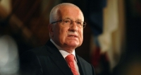

 

Monday, 24 September 2012 11:40

## EU in Final Phase of Destroying Democracy, Czech President Warns

Written by [Alex Newman](http://www.thenewamerican.com/world-news/europe/itemlist/user/68-alexnewman)

- font size[(L)](http://www.thenewamerican.com/world-news/europe/item/12951-eu-in-final-phase-of-destroying-democracy-czech-president-warns#)[(L)](http://www.thenewamerican.com/world-news/europe/item/12951-eu-in-final-phase-of-destroying-democracy-czech-president-warns#)
- [Print](http://www.thenewamerican.com/world-news/europe/item/12951-eu-in-final-phase-of-destroying-democracy-czech-president-warns?tmpl=component&print=1)

 

As European Union bosses now openly push for the complete elimination of national sovereignty in favor of a so-called “federation” with its own army, liberty-minded Czech Republic President Vaclav Klaus warned that the destruction of democracy and the nation-state within the EU has entered its final phases. The anti-communist hero has been sounding the alarm for years, but his recent public remarks represent the most forceful warning yet about the looming threat posed by the budding supranational regime in Brussels.

Klaus, who has a new book coming out entitled [*Europe: The Shattering of Illusions*](http://www.amazon.co.uk/Europe-Shattering-Illusions-Vaclav-Klaus/dp/1408187647), largely blamed “two-faced” politicians for allowing the precarious situation to develop. Included among the culprits is the Conservative Party in the United Kingdom, which purports to be skeptical of the EU but has so far refused to allow British voters — polls show they overwhelmingly oppose the institution — any say in the matter. The situation is also partly due to the fact that political leaders want to avoid responsibility and accountability to their constituents, Klaus added.

Opposition to the formation of an “ever-closer union” is growing throughout Europe. The new socialist president of France Francois Hollande and pro-integration extremist Chancellor Angela Merkel of Germany, however, both demanded last week that more political and economic power be handed over to the EU anyway. “We don’t have a choice, but to march toward the destiny that is ours, march toward a unified Europe,” [proclaimed](http://www.washingtonpost.com/world/europe/leaders-of-germany-france-gathering-to-celebrate-reconciliation-anniversary/2012/09/22/1b127660-04a5-11e2-9132-f2750cd65f97_story.html) Hollande.

Other officials called for an end to national veto powers over foreign and defense policies as part of an effort to pave the way for a single EU military. In addition, almost a dozen European governments called for changes in the way treaties are adopted to ensure that voters would no longer be able to halt the expansion of the sprawling super-state — not that they could before, as evidenced by the EU steamroller [marching on in spite of numerous rejections in referendums](http://www.thenewamerican.com/world-news/europe/item/8506-lisbon-treaty-builds-eu-super-state) from France and the Netherlands to Ireland.

Top European bosses echoed the calls for deeper integration as well. EU Commission President José Manuel Barroso, a former Maoist revolutionary, for example, demanded that national governments surrender even more sovereignty to erect what he called a federation. "We will need to move toward a federation of nation states. This is our political horizon,” he [announced](http://www.nasdaq.com/article/barroso-calls-for-eu-federation-20120912-00082) during a “state of the union” speech, adding that “unavoidable” changes to European treaties had to be made. “This is what must guide our work in the years to come."

For Klaus and other European leaders who support national sovereignty and limited government, however, the statements from EU leaders are troubling — to put it mildly. "We need to think about how to restore our statehood and our sovereignty. That is impossible in a federation,” Klaus [explained](http://www.telegraph.co.uk/news/worldnews/europe/czechrepublic/9559937/Vclav-Klaus-warns-that-the-destruction-of-Europes-democracy-may-be-in-its-final-phase.html) in an interview with the U.K. *Sunday Telegraph*. “The EU should move in an opposite direction."

Speaking about Barroso’s recently announced 2014 timeline for the creation of a full-blown federal regime ruling over Europe, Klaus pointed out that the long-term agenda was finally made public. However, that was the plan all along, as analysts and honest observers have been emphasizing for years — even decades.

"This is the first time he has acknowledged the real ambitions of today's protagonists of a further deepening of European integration. Until today, people, like Mr. Barroso, held these ambitions in secret from the European public," Klaus told the *Telegraph* in an exclusive interview from Prague. "I'm afraid that Barroso has the feeling that the time is right to announce such an absolutely wrong development. They think they are finalizing the concept of Europe, but in my understanding they are destroying it."

In an [earlier interview](http://www.euractiv.com/future-eu/czech-president-klaus-rejects-ba-news-514794) with the website Novinky, Klaus said he “firmly” rejected Barroso’s federation scheme. "The only thing I appreciate in his proposal is that the current advocates of deeper European integration have for the first time openly admitted their real goals,” he said, adding that the Czech Republic joined a union in 2004, “not a federation in which the provinces become meaningless.”

Klaus, an economist who served twice as Prime Minister before assuming the presidency, is known for, among other achievements, his role in bringing down the communist regime that ruled over what was then Czechoslovakia. While popular in his home country and among conservatives and libertarians worldwide, today he is one of the last European leaders seriously trying to beat back the EU. But he remains determined nonetheless.

"When it comes to the political elites at the top of the countries, it is true, I am isolated," he told the *Telegraph*. "Especially after our Communist experience, we know, very strongly and possibly more than people in Western Europe, that the process of democracy is more important than the outcome. It is an irony of history — I would never have assumed in 1989 that I would be doing this now: that it would be my role to preach the value of democracy."

His new book, published this month, calls for a fundamental transformation of the EU toward freer markets and national sovereignty as opposed to the current trajectory of perpetually bigger, more centralized government. He also attempts to explain part of the reason why national and European leaders have been willing to go along with the dangerous scheme despite the wishes of citizens and repeated lessons from history about the extreme threats posed by large central governments.

"Political elites have always known that the shift in decision-making from the national to the supranational level weakens the traditional democratic mechanisms (that are inseparable from the existence of the nation state), and this increases their power in a radical way,” he explains in the book. “That is why they wanted this shift so badly in the past, and that is why they want it today."

According to Klaus, the promoters of European integration managed to “short circuit the minds of the people” by creating the illusion of a link between Hitler’s National Socialist (Nazi) regime and the traditional sovereign nation-state. "Of the many fatal mistakes and lies that have always underpinned the evolution of the EU, this is one of the worst," the book points out.

While Klaus has been one of the chief supporters of liberty standing against the overwhelming force of the EU, he has also been one of the most prominent supporters of reason when dealing with global warming hysteria. In an [exclusive 2008 interview with *The New American* magazine](http://www.thenewamerican.com/tech/environment/item/6655-a-climate-of-repression-interview-of-czech-republic-president-klaus), the Czech president explained the ominous parallels between the “solutions” being advanced by climate alarmists and the enslavement of people under communist dictatorships.

“I am sensitive, maybe overly sensitive in this respect, but I listen to speeches of some global-warming alarmists — environmentalists in general. I hear sentences, ideas, which sound to me very familiar from the communist era,” he told *TNA*. “Again there is someone who wants to orchestrate our life, again someone who knows better than the rest of us what is good for me, for us, and who tries to regulate, control, mastermind human society and in this respect there is a structural similarity with my experiences from the past.”

Proponents of [discredited UN theories](http://www.thenewamerican.com/tech/environment/item/6820-global-warming-alarmism-dying-a-slow-death) about carbon dioxide and global warming are [on the run after the spectacular implosion of the so-called “science.”](http://www.thenewamerican.com/tech/environment/item/11998-%E2%80%9Cclimate-science%E2%80%9D-in-shambles-real-scientists-battle-un-agenda) However, advocates of an all-powerful European super-state — despite being widely opposed by average citizens — are [marching forward with their scheme](http://www.thenewamerican.com/world-news/europe/item/11371-uk-leader-in-european-parliament-says-eu-on-the-verge-of-cataclysm) at[break-neck speed](http://www.thenewamerican.com/world-news/europe/item/12822-german-high-court-approves-step-towards-european-dictatorship). Voters in the U.K. [want out](http://www.thenewamerican.com/world-news/europe/item/12428-uk-may-soon-vote-to-leave-eu-despite-massive-pressure), as do citizens in many other countries. And public opposition in the region is growing.

Still, if courageous political leaders and outraged citizens do not stand up soon, Klaus fears that the ultimate destruction of national sovereignty and self-government in Europe could be much closer than analysts are willing to admit. No matter how bleak the picture, though, activists say it is not too late just yet.

*Photo of Czech Republic President Vaclav Klaus: AP Images*

*Related articles:*

[A Climate of Repression: Interview of Czech Republic President Klaus](http://www.thenewamerican.com/tech/environment/item/6655-a-climate-of-repression-interview-of-czech-republic-president-klaus)

[UK Leader in European Parliament Says EU on the Verge of Cataclysm](http://www.thenewamerican.com/world-news/europe/item/11371-uk-leader-in-european-parliament-says-eu-on-the-verge-of-cataclysm)

[Lisbon Treaty Builds EU Super-state](http://www.thenewamerican.com/world-news/europe/item/8506-lisbon-treaty-builds-eu-super-state)

[U.K. May Soon Vote to Leave EU Despite Massive Pressure](http://www.thenewamerican.com/world-news/europe/item/12428-uk-may-soon-vote-to-leave-eu-despite-massive-pressure)

[Klaus Says Global Warming "New Religion"](http://www.thenewamerican.com/tech/environment/item/6783-klaus-says-global-warming-new-religion)

[German High Court Approves Step Toward European Dictatorship](http://www.thenewamerican.com/world-news/europe/item/12822-german-high-court-approves-step-towards-european-dictatorship)

More in this category:[« Spain’s Catalonia Region Demands Independence](http://www.thenewamerican.com/world-news/europe/item/12933-spain%E2%80%99s-catalonia-region-demands-independence)

Login to post comments

[back to top](http://www.thenewamerican.com/world-news/europe/item/12951-eu-in-final-phase-of-destroying-democracy-czech-president-warns#startOfPageId12951)