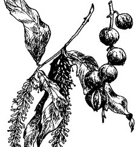

 

# MACADAMIA

## *Macadamia* spp.

## *Proteaceae*

**Common Names:**Macadamia, Australian nut, Queensland Nut.

**Species:** "Smooth-shelled Macadamia" (*Macadamia integrifolia* Maiden & Betche), "Rough-shelled Macadamia" (*M. tetraphylla* L. Johnson). Hybrid forms exist between the two species.

**Distant Affinity:** Helicia nut (*Athertonia diversifolia*), Chilean Hazel (*Gevuina avellana*), Australian Rosenut (*Hicksbeachia pinnatifolia*).

**Origin:**  *Macadamia integrifolia* is native to southeastern Queensland where it grows in the rain forests and close to streams. *M. tetraphylla* is native to southeastern Queensland and northeastern New South Wales, growing in rain forests, in moist places and along stream banks. At the point where the two species meet, there are types that appear to be natural hybrids. The macadamia was introduced into Hawaii about 1881 where it was used as an ornamental and for reforestation. The Hawaii Agricultural Experiment Station named and introduced several promising selections in 1948, which led to the modern macadamia industry in Hawaii. In California two seedling macadamias were planted in the early 1880's and are still standing on the Berkeley campus of the University of California. The importation of improved and named varieties into California from Hawaii began about 1950. Macadamias are also commercially important in Australia, South Africa and Central America.

**Adaptation:** Macadamias are ideally suited to a mild, frost-free climate with abundant rainfall distributed throughout the year, roughly the same climate suitable for growing coffee. Both species, however, grow well in the coastal areas of California, although varieties often respond differently to a given location. Mature macadamia trees are fairly frost hardy, tolerating temperatures as low as 24° F, but the flower clusters are usually killed at 28° F. Young trees can be killed by light frosts. *M. tetraphylla* appears to be slightly more cold-tolerant. Consistently high summer temperatures will reduce yields, although again *M. tetraphylla* shows more tolerance. When grown in a large tub, macadamias make suitable container plants.

## DESCRIPTION

**Growth Habit:** Macadamias are large, spreading evergreen trees reaching 30 to 40 ft. high and almost as wide. More upright types are known and being selected because of their suitability for closer planting. The bark is rough but unfurrowed, brown and dark red when cut. The macadamia has proteoid roots, dense clusters of short lateral rootlets in well defined rows around the parent root axis. The prime function of such roots appears to be in increasing the surface area of the root system for maximum absorption. The vigor of seedlings appears to be related to the degree of proteoid root development.

**Foliage:** The two species are fairly easily distinguished by their foliage. The leaves of *M. integrifolia* are 8 to 11 inches in length and occur usually in whorls of 3. The adult leaves are entire with few spines. New growth is pale green. The spiny, often sessile leaves of *M. tetraphylla* usually appear in whorls of 4 and may grow to 20 inches long. The new growth is bronzy pink. Growth in mature trees of both species occurs in two flushes, in spring and midsummer. In young trees four flushes may occur.

**Flowers:** Flowers are borne on long narrow racemes arising from the axils of leaves or the scars of fallen leaves. They may be borne on the new growth if it is mature, but more often on the two, or three season's growth preceding the most recently matured flushes. The flowers, about 1/2 inch long, are perfect but incomplete in that they have no petals, but four petaloid sepals.*M. integrifolia* has creamy white flowers borne in clusters 6 to 12 inches long, while the flowers of *M. tetraphylla* are cream-colored or pink and borne in clusters up to 15 inches long. Macadamias can self-pollinate, although varieties vary from being totally self-compatible to being almost self-sterile. Wind pollination may play some role, but bees are apparently the major agent in pollination. Cross-pollination by hand has been shown to increase nut set and quality.

**Fruit:** Macadamia nuts have a very hard seed coat enclosed in a green husk that splits open as the nut matures. As the common name indicates, this seed coat is smooth in the case of *M. integrifolia.* It holds a creamy white kernel containing up to 80% oil and 4% sugar. When roasted it develops a uniform color and texture. Although *M. tetraphylla* is often referred to as the rough-shelled macadamia, the seed coat of some cultivars are smooth, while others are rough and pebbled. The quality of the kernels of *M. tetraphylla*are also more variable. The oil content ranges from 65% to 75% and sugar content ranges from 6% to 8%. These factors result in variable color and texture when the the nuts are roasted under the same conditions as those of*M. integrifolia.*  *M. tetraphylla* is well suited to the home garden, however, and has been planted for commercial production in California.

## CULTURE

**Location:** Macadamias do best in full sun, although in hot climates partial shade can be beneficial. Windy locations should also be avoided. The brittle branches can be damaged by wind, especially when laden with a heavy crop of nuts.

**Soil:** Macadamias will perform on a wide range of soil types from open sands and lava rock soils to heavy clay soils, as long as the soil is well drained. They do best, however, in deep, rich soils with a pH of 5.5 to 6.5. Macadamias will not tolerate soil or water with high salt concentrations. In areas with low annual rainfall, leach the soil regularly.

**Irrigation:** Macadamias can withstand periods of drought, but the harvests will be small and of low quality. Irrigation seems to be more important during certain critical periods in the crop cycle, particularly from the time of nut set, through nut filling and through the vegetative growth period in midsummer. The trees should receive at least as much water as is normally provided an avocado tree. The actual amount depends on the soil. Young trees also have higher water requirements than mature trees. In general it is important to water macadamias regularly and deeply during dry periods.

**Fertilization:** Since macadamias grow slowly, they do not require large quantities of nitrogen fertilizer. Six months after planting out the trees should receive light applications of a balanced fertilizer such as a citrus mix or fish emulsion which contains no more than 1% nitrogen. Applications should be made at least twice a year. A mature tree should receive approximately 5 pounds of citrus mix per application and young trees proportionally less. Too much nitrogen may result in chlorosis. Micronutrient deficiencies are common in some areas, but these can be corrected with chelated sprays.

**Pruning:** The object of pruning a macadamia is to form a tree with a single main stem and a framework of horizontal branches, starting at 3 ft. above the ground and from there at intervals of about 1-1/2 ft. In *M. integrifolia*there are 3 buds in a vertical row in each of the three leaf axils of a node. When the stem is is topped, all three upper buds will grow straight up. Only one of them must be allowed to remain and to continue the main stem, the other two being clipped off to a stub of about 3/8 inch. Now the buds below those two stubs will grow out in a more or less horizontal direction. Only these branches will flower and fruit. This process is repeated until a good framework has been established. Macadamias will take heavy pruning but this may drastically reduces yields.

**Frost Protection:** Frost protection is more critical for young trees than more mature ones. While they are still on the small side, the plants can be given the standard methods of protection, such as plastic sheeting and such draped over a frame around the tree. As the trees get larger, they are more difficult to cover, but they also become more tolerant of mild frosts

**Propagation:** Macadamias are easily grown from seed, but the seedlings may take 8 to 12 years to bear a crop and the quality of the nuts is unpredictable. Grafting is the most common method of producing nursery trees and is best done in spring or autumn. The wood of macadamia is hard, however, requiring the propagator to have experience to be successful. The scionwood is girdled some 6 to 8 weeks beforehand, the preferred wood being healthy mature material of the previous flush. The recommended graft is the simple whip, using material 3/8 to 5/8 inch thick. The side graft is also successful, and tip, wedge or cleft grafting is used under greenhouse conditions for working small seedlings up to 1 ft. high. Budding is also possible as well as propagation from softwood cutting and air-layering. Cutting-grown trees take some time to develop an adequate root system and will need staking when young. Some grafted varieties of macadamias begin bearing within 2 years, while others not for 7 to 8 years.

**Pests and Diseases:** In Australia there are a host of pests and diseases that afflict macadamias, but in the U.S. there are few problems in home gardens. Occasionally, thrips, mites and scale may be troublesome, and anthracnose can infect leaves and nuts in humid climates. Canker can also result from wounds to the tree. Macadamias are fairly resistant to *Phytophthora cinnamoni*, and are sometimes used to replant avocado orchards infected with the fungus. The roots of the macadamia do not appear to be very attractive to gophers, but deer will browse on the new foliage.

**Harvest:** Mature macadamia nuts will fall to the ground from late fall to spring. It is best to harvest fallen nuts, since shaking the trees to dislodge the nuts may also bring down immature nuts. A long pole can be used to carefully knock down mature nuts that are out of reach. A reasonably good tree will produce 30-50 pounds of nuts at 10 years age and gradually increase for many years.

Harvested nuts should be dehusked and spread in a dry place protected from the sun and allowed to dry for 2 or 3 weeks. To finish drying put the nuts in a shallow pan and place in the oven at the lowest temperature setting (100° to 115° F) for about 12 hours. Stir occasionally and watch that the nuts do not cook. Excessive heating will damage nut quality. Store the nuts in a cool, dry area. A heavy plastic bag will prevent nuts from reabsorbing moisture. When the nuts are dry, the shells can be removed with a nutcracker. A cottage industry of sorts has developed around designing nutcrackers that can best cope with the hard shells.

To home-roast macadamia nuts, place shelled nuts (whole kernels or halves only) in a shallow pan no more than two deep. Roast 40 to 50 minutes, stirring occasionally. Watch carefully and remove from the oven as soon as they start to turn tan. After roasting, the nuts store nicely, salted or unsalted, in airtight jars at 40° to 65° F. They can also be frozen. Macadamia nuts are excellent raw or roasted. In addition to being a quality snack, they can be used in almost any recipe that calls for nuts, including stuffings, fruit salads, cakes, etc.

**Commercial Potential:** Macadamia nuts are considered by many to be the prime edible nut. Even at the high prices demanded, twice that of cashews, the market remains unfilled. This demand for macadamia nuts has spurred a flurry of plantings in areas all over the world where macadamias will thrive. There is a limited but significant commercial production of the nuts in Southern California.

## CULTIVARS

**Beaumont** (Dr. Beaumont)

Hybrid. Originated in Australia. Discovered by Dr. J. H. Beaumont. Introduced in 1965 by the California Macadamia Society. Round, medium to large nut, 65 to 80 per pound. Shell medium-thick, kernel 40% of nut, with a high percentage of grade A kernels. Some nuts may split on the tree and be ruined. Texture and flavor very good. Tree upright, ornamental. New leaves reddish, flowers bright pink, borne on long racemes. Nuts drop over a long period. Recommended for home gardens.

**Burdick**

*M. tetraphylla.* Originated in Encinitas, Calif. Large nut, averaging 40 per pound. Shell thin, about 1/16 inch thick, well-filled. Kernel averages about 34% of total nut weight, quality good. Matures in October. Tree bears annually. Not widely planted these days. Has been superseded by better cultivars. Also used as a rootstock.

**Cate**

*M. tetraphylla.* Originated on the property of William R. Cate, Malibu, Calif. Nuts medium to large. Shell average thickness. Kernels 40% of nut, cream colored, crisp in texture, flavor good to very good. Ripens in late October and November continuing over a period of 6 to 8 weeks. Tree precocious, moderately hardy, shows no alternate bearing tendencies. The most widely adapted cultivar for commercial use in California.

**Dorado**

*M. integrifolia.* Originated in Hawaii. Introduced by Rancho Nuez Nursery. Medium-sized, uniform nuts, 7/8 to 1 inch in diameter. Kernel averages 35% of nut, oil content 75%. Tree medium-tall, upright, attractive. Begins to bear after 5 years, self-harvesting, cold resistant. Very productive, often yielding 65 or more pounds of nuts per year.

**Elimbah**

Originated in Australia. Imported into California by E. Westree. Thin shells. Kernel averages 45-50% of nut. Nuts tend to drop year-round.

**James**

*M. integrifolia.* Originated in La Habra Heights, Calif. Medium-sized, uniform nuts, about 1 inch in diameter. Kernel averages 40 to 42% of nut, quality high, flavor very good, oil content 75%. Tree very tall, columnar, precocious, often producing after 2 or 3 years. Self-harvesting. Yields more per acre than any other California cultivar, 60 or more pounds per tree when mature.

**Keaau**

*M. integrifolia.* Originated in Lawai Valley, Kalaheo, Kauai, Hawaii. Medium-sized nut, averaging about 80 nuts per pound; Shell smooth, medium brown, thin. Kernel 42-46% of nut, color light cream, quality good. Season August to November. Tree moderately vigorous, upright, very productive.

**Keauhou**

*M. integrifolia.* Originated in Kona, Hawaii by W.B. Storey. Medium to large nut, averaging about 54 nuts per pound. Shell very slightly pebbled, medium-thick. Kernel 37 to 40% of nut, quality tends to vary in different locations. Harvest season relatively short, with most of the crop maturing within about 3 months. Tree vigorous, yields well, extremely resistant to anthracnose.

**Vista**

Hybrid. Originated in Rancho Santa Fe, Calif. by Cliff Tanner. Small to medium-sized nut, 3/4 to 7/8 inch in diameter. Kernel averages 46% of weight of nut, flavor excellent, oil content 75%. Shell very thin, can be cracked in an ordinary hand cracker. Tree medium-sized, pyramidal, begins to bear after 3 years. Self-harvesting. Flowers pink. Recommended for both home garden and commercial plantings.

**Waimanalo**

*M. integrifolia.* Originated at the Hawaii Agricultural Experiment Station, Waimanalo, Hawaii. Large nuts, occasionally with twin halves. Shell relatively thick. Kernel 38-1/2% of nut, flavor good, oil content 75%. Tree medium-sized, pyramidal, productive, begins to bear after 5 years. Produces nuts in large clusters. Resistant to frost and disease. Grows well in cooler climates, particularly near the ocean. Also yields good crops inland.

## FURTHER READING

- Butterfield, Harry M. *A History of Subtropical Fruits and Nuts in California.*University of California, Agricultural Experiment Station. 1963.
- California Macadamia Society. *Macadamia Nut Trees for California Gardens.*Undated.
- California Macadamia Society. *Yearbook* 1955 to date.
- Facciola, Stephen. *Cornucopia: a Source Book of Edible Plants.* Kampong Publications, 1990. pp. 380-381.
- Hamilton, R. A. and E. T. Fukunaga. *Growing Macadamia Nuts in Hawaii.*University of Hawaii, Agricultural Experiment Station Bulletin 121. 1959.
- Ortho Books. *All About Citrus and Subtropical Fruits.* Chevron Chemical Co. 1985. pp. 59-61.
- Page, P. E., comp. *Tropical Tree Fruits for Australia.* Queensland Department of Primary Industries. 1984. pp. 150-160.
- Rosengarten, Frederick, Jr. *Book of Edible Nuts.* Walker and Co. 1984.
- Samson, J. A. *Tropical Fruits. 2nd ed.* Longman Scientific and Technical. 1986. pp. 282-284.

See [Index of CRFG Publications, 1969 - 1989](http://www.crfg.org/fg/xref/xref-m.html#macadamia) and annual indexes of [Fruit Gardener](http://www.crfg.org/fg/index.html) for additional articles on the macadamia.

* * *

[Here is the list of additional CRFG Fruit Facts.](http://www.crfg.org/pubs/frtfacts.html)

* * *

© Copyright 1997, [California Rare Fruit Growers, Inc.](http://www.crfg.org/index.html)

Questions or comments? [Contact us.](http://www.crfg.org/contact.html)