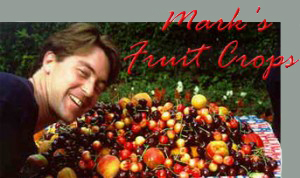
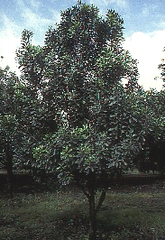
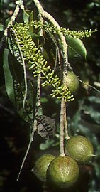
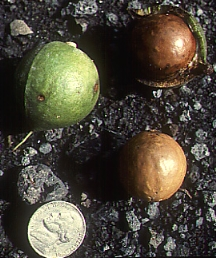

 

- [Fruit Trees For Sale – US Tree and Plant Nursery List](http://www.fruit-crops.com/trees-for-sale/)
- [Almond Tree – Prunus dulcis](http://www.fruit-crops.com/almond-prunus-dulcis/)
- [Apple Tree – Malus domestica](http://www.fruit-crops.com/apple-malus-domestica/)
- [Apricot Tree – Prunus armeniaca](http://www.fruit-crops.com/apricot-prunus-armeniaca/)
- [Banana Tree – Musa spp](http://www.fruit-crops.com/banana-musa-spp/)
- [Blackberry Shrub – Rubus spp](http://www.fruit-crops.com/blackberry-and-raspberry/)
- [Blueberry Shrub – Vaccinum spp](http://www.fruit-crops.com/blueberry-vaccinum-spp/)
- [Cacao (or Cocoa) Tree – Theobroma cacao](http://www.fruit-crops.com/cocoa-theobroma-cacao/)
- [Cashew Tree – Anacardium occidentale](http://www.fruit-crops.com/cashew-anacardium-occidentale/)
- [Cherry Tree – Prunus avium, Prunus cerasus](http://www.fruit-crops.com/cherry-prunus-avium-cerasus/)
- [Chestnut Tree – Castanea spp](http://www.fruit-crops.com/chestnut-castanea-spp/)
- [Coconut Tree – Cocos nucifera](http://www.fruit-crops.com/coconut-cocos-nucifera/)
- [Coffee Tree – Coffea arabica, Coffea canephora](http://www.fruit-crops.com/coffee-coffea-arabica-canephora/)
- [Cranberry Shrub – Vaccinium macrocarpon](http://www.fruit-crops.com/cranberry-vaccinium-macrocarpon/)
- [Currant Bush – Ribes spp](http://www.fruit-crops.com/currant-and-gooseberry-ribes-spp/)
- [Date Tree – Phoenix dactylifera](http://www.fruit-crops.com/date-phoenix-dactylifera/)
- [Fig Tree – Ficus carica L](http://www.fruit-crops.com/fig-ficus-carica-l/)
- [Gooseberry Bush – Ribes grossularia](http://www.fruit-crops.com/currant-and-gooseberry-ribes-spp/)
- [Grape Vine – Vitis spp](http://www.fruit-crops.com/grape-vitis-spp/)
- [Grapefruit Tree – Citrus paradisi Macf](http://www.fruit-crops.com/lemon-lime-orange-tangerine-grapefruit/)
- [Hazelnut Shrub – Corylus avellana L](http://www.fruit-crops.com/hazelnut-corylus-avellana/)
- [Juneberry Shrub – Amelanchier alnifolia Nutt](http://www.fruit-crops.com/juneberry-amelanchier-alnifolia-nutt/)
- [Kiwifruit Vine – Actinidia deliciosa (A. Chev.)](http://www.fruit-crops.com/kiwifruit-actinidia-deliciosa-a-chev/)
- [Kumquat Tree – Fortunella spp](http://www.fruit-crops.com/lemon-lime-orange-tangerine-grapefruit/)
- [Lemon Tree – Citrus limon Burm](http://www.fruit-crops.com/lemon-lime-orange-tangerine-grapefruit/)
- [Lime Tree – Citrus aurantifolia L](http://www.fruit-crops.com/lemon-lime-orange-tangerine-grapefruit/)
- [Loquat Tree – Eriobotrya japonica Lindl](http://www.fruit-crops.com/loquat-eriobotrya-japonica-lindl/)
- [Macadamia Tree – Macadamia integrifolia, M. tetraphylla](http://www.fruit-crops.com/macadamia-nut-integrifolia/)
- [Mango Tree – Mangifera indica](http://www.fruit-crops.com/mango-mangifera-indica/)
- [Mayhaw Tree – Cratagus spp](http://www.fruit-crops.com/mayhaw-cratagus-spp/)
- [Oil Palm Tree – Elaeis guineesis](http://www.fruit-crops.com/oil-palm-elaeis-guineesis/)
- [Olive Trees – Olea europaea](http://www.fruit-crops.com/olive-olea-europaea/)
- [Orange Trees – Citrus sinensis](http://www.fruit-crops.com/lemon-lime-orange-tangerine-grapefruit/)
- [Papaya Tree – Carica papaya](http://www.fruit-crops.com/papaya-carica-papaya/)
- [Peach Tree – Prunus persica](http://www.fruit-crops.com/peach-prunus-persica/)
- [Pear Tree – Pyrus communis, Pyrus pyfifolia](http://www.fruit-crops.com/pear-pyrus-communis-pyrus-pyfifolia/)
- [Pecan Trees – Carya Illinoensis](http://www.fruit-crops.com/pecan-carya-illinoensis/)
- [Pineapple – Ananas comosus](http://www.fruit-crops.com/pineapple-ananas-comosus/)
- [Pistachio Tree – Pistacia vera](http://www.fruit-crops.com/pistachio-pistacia-vera/)
- [Plum Tree – Prunus domestica, Prunus salicina](http://www.fruit-crops.com/plum-prunus-domestica-prunus-salicina/)
- [Pomegranate – Punica granatum L](http://www.fruit-crops.com/pomegranate-punica-granatum-l/)
- [Quince – Cydonia oblonga mill](http://www.fruit-crops.com/quince-cydonia-oblonga-mill/)
- [Raspberry Shrub – Rubus spp](http://www.fruit-crops.com/blackberry-and-raspberry/)
- [Strawberry Plant – Fragaria X ananassa](http://www.fruit-crops.com/strawberry-fragaria-x-ananassa/)
- [Tangerine Tree – Citrus spp](http://www.fruit-crops.com/lemon-lime-orange-tangerine-grapefruit/)
- [Walnuts – Juglans spp](http://www.fruit-crops.com/walnuts-juglans-spp/)
- [REVIEW – Identify Common Fruit Types](http://www.fruit-crops.com/identify-common-fruits/)
- [REVIEW – Nut Crops](http://www.fruit-crops.com/nut-crops-review/)
- [REVIEW – Pome Fruits](http://www.fruit-crops.com/pome-fruits-review/)
- [REVIEW – Small Fruits](http://www.fruit-crops.com/small-fruits-review/)
- [REVIEW – Tropical Fruits](http://www.fruit-crops.com/tropical-fruits-review/)
- [REVIEW – Stone Fruits](http://www.fruit-crops.com/stone-fruits-review/)
- [Introduction to Fruit Crops (Chapter 1 of text)](http://www.fruit-crops.com/chapter1/)
- [Strawberry example term project](http://www.fruit-crops.com/strawberry-example-term-project/)
- [Orchard Floor Management](http://www.fruit-crops.com/orchard-floor-management/)
- [Pruning Principles](http://www.fruit-crops.com/pruning-principles/)
- [Soil and Leaf Nutrient Analysis](http://www.fruit-crops.com/soil-and-leaf-nutrient-analysis/)
- [HORT 3020 Pome Fruits Quiz](http://www.fruit-crops.com/hort-3020-pome-fruits-quiz/)
- [Design and Management of a Fruit Farm](http://www.fruit-crops.com/design-and-management-of-a-fruit-farm/)
- [Pest Management in Fruit Production](http://www.fruit-crops.com/pest-management-in-fruit-production/)
- [Site Selection for Fruit Production](http://www.fruit-crops.com/site-selection-for-fruit-production/)
- [Training Systems – Maximize Bearing Surface](http://www.fruit-crops.com/training-systems/)
- [Soil and Leaf Analysis for Fruit Crops](http://www.fruit-crops.com/soil-and-leaf-analysis/)
- [Links to Other Fruit Sites](http://www.fruit-crops.com/links/)
- [Contact](http://www.fruit-crops.com/contact-us/)
- [Glossary -Fruit Crops terms and definations](http://www.fruit-crops.com/glossary-introduction-to-fruit-crops/)

#### Fruit-Crops.com

was developed as an online aid to the class 'Introduction to Fruit Crops' (HORT 3020) at UGA. The material is from the book that I wrote for HORT 3020 ('Introduction to Fruit Crops'), a book still used in the class today, and it is reliable as a reference for any internet-based or traditional college class.

Here you will find fruit horticulture and agriculture tips for an online hort degree program for distance learning but you don't need to be a horticulture major or even working on a bachelor's or Master's degree to use the site.

Over the years I have enjoyed hearing from students, teachers, professors, government officials, farmers, crop industry experts and others from all over the world about fruit crops. If you have a question or comment please do not hesitate to contact me.

Also, please feel free to cite this information without permission for non-commercial purposes.

Thanks for visiting,
Mark

About Mark:

On August 1, 2012, Mark Rieger took office as dean of the University of Delaware's College of Agriculture and Natural Resources.

Rieger served as associate dean and professor in the University of Florida's College of Agricultural and Life Sciences since 2006 and was interim dean in 2010-11. As associate dean, Rieger had major responsibilities in graduate programs, distance education, statewide degree completion programs, the honors program and international education.

Prior to joining the University of Florida faculty, he was a professor in the University of Georgia's Department of Horticulture from 1999-2006. He joined the University of Georgia faculty as an assistant professor in 1987 and was promoted to associate professor in 1993 and professor in 1999.

Rieger received a bachelor's degree in horticulture in 1982 from the Pennsylvania State University, a master's degree in horticulture in 1984 from the University of Georgia and a doctorate in horticultural sciences in 1987 from the University of Florida.

#

## Macadamia nut – *Macadamia integrifolia, M. tetraphylla*

### **MACADAMIA TAXONOMY**

Macadamia nuts belong to a relatively obscure family, the *Proteaceae*. Two species are cultivated for their nuts, although several others produce edible nuts:

1. *Macadamia integrifolia* Maiden and Betche.
2. *M. tetraphylla* L. Johnson.
**Cultivars**

Cultivars grown in Hawaii include ‘Kakea’, ‘Kau’, ‘Keaau’, ‘Makai’, ‘Mauka’, ‘Pahala’, and ‘Purvis’. Cultivars are distinguished by crown shape, and upright types, such as ‘Kau’ and ‘Keaau’, are being favored over more spreading types recently. ‘Keaau’ produces medium nuts with high percent kernel (44 percent) and is high yielding. ‘Cate’ is one of the most widely grown M. tetraphylla cultivars in California.

### **ORIGIN OF *MACADAMIA INTEGRIFOLIA*, HISTORY OF CULTIVATION**

Both species are native to the east coast of Australia, from rain forest-like climates; *M. integrifolia* is more tropical in its requirements than *M. tetraphylla*. The Hawaiian industry and tropical production is based on the former, whereas the small production in southern California is based on the latter. Nuts were brought to Hawaii and California in the late 1800′s, but only the Hawaiians developed nut culture, whereas the Californians used it initially as an ornamental.

### **WORLD AND UNITED STATES MACADAMIA PRODUCTION**

World – (2004 USDA FAS) 92,923 MT or 204 million pounds. Worldwide acreage is likely to be well under 100,000 acres. The top macadamia-producing countries (percent of world production) follow:

1. Australia (36)
2. United States (23)
3. South Africa (16)
4. Guatemala (11)
5. Kenya (6)

United States – (2004 USDA FAS) 21,133 MT or 46 million pounds. (in-shell nuts). Virtually all production is in Hawaii on about 18,000 acres. The small volume of rough-shell macadamia produced in California is not included in USDA statistics. The value of the industry in 2004 was $33.1 million. Price paid to growers is about 65¢/lb. Yields average about 3,000 pounds/acre. The United States consumes the majority of the world’s macadamia nuts, importing an amount almost equal to domestic production.

For the most up to date statistical data on United States and World production numbers please refer to the following two websites:

World: The Food and Agriculture Organization of the United Nations Statistics Division (FAOSTAT). [FAOSTAT](http://faostat3.fao.org/home/index.html)

United States: The United States Department of Agriculture National Agricultural Statistics Service (USDA Ag Stats). [USDA Ag Stats](http://www.nass.usda.gov/Statistics_by_Subject/index.php)

### **MACADAMIA BOTANICAL DESCRIPTION**

**Plant**: A medium sized, tropical evergreen tree, with spreading, full canopies, reaching widths of 30 ft and heights of 20-30 ft. Leaves are linear-obovate, 4-6″ long, sparsely dentate with sharp teeth, and thick; gives the overall impression of a large holly leaf.

**Flowers**: Flowers are perfect, and most cultivars are self-fruitful, but sometimes yield better when cross-pollinated. Flowering is not synchronized; trees may have flowers, immature and mature nuts all at one time. Flowers are borne on long, fragrant racemes (4-8″) of dozens of individual flowers, from lateral buds on 1-yr wood. Flowering occurs in mid-winter and nuts are harvested 7-8 months later in July-November, although some nuts mature more-or-less year round.

**Pollination**: Bees are the pollinators; cross-pollination is necessary for full production, but the degree of self-incompatibility varies.

**Fruit**: Botanically a drupe, the fleshy outer portion is removed to reveal the nut. Nuts number from 10-30 on crowded stalks, and are covered with thick, shiny green hulls (=mesocarp and exocarp), which are adherent to the shell (=endocarp). Nuts are round, with kernels enclosed in hard shells, with shelling percentages of 40%.

### **GENERAL CULTURE**

**Soils and Climate** – Deep, well-drained, soils with a pH of 5.5 to 6.5 are best, but trees are grown on a wide variety of soils. In Hawaii, they grow well on lava rock soils. Although tropical trees, macadamias tolerate mild freezing (28-32 F), and do not tolerate excessive heat; In Hawaii, cool ocean breezes allow cultivation at sea level, but inland in the tropics, trees must be grown at 1500 – 3500 ft. They have no chilling requirement, but a seasonal change in temperature may help to synchronize bloom.

Propagation – Whip grafts or side wedge grafts are made on young seedling rootstocks .

**Rootstocks** – Seedlings of rough-shelled (M. tetraphylla) cultivars are the best rootstocks because they are more vigorous and hardy than smooth-shelled seedlings.

Planting Design, Training, Pruning – Tree spacing depends on growth habit of the cultivar and the use of filler trees. Final spacings of 30 to 35 feet apart are typical. Closely spaced hedgerow orchards are sometimes used in Australia, with trees planted at 10 × 20 feet and later thinned to prevent overcrowding.

Macadamias are trained to a central-leader framework over a period of several years, as they grow slowly.

### **MACADAMIA HARVEST, POSTHARVEST HANDLING**

Nuts are harvested largely by picking up by hand, although mechanical harvesters are being evaluated. Harvesting may extend over a 6-12 week period. Harvested nuts are de-hulled mechanically and dried to low water contents (< 2%). Nuts are cracked and sorted to remove off-color kernels and pieces of shell. Kernels are graded into 2 classes flotation; Grade I kernels (>72% oil) float and Grade II (<72% oil) sink.

### **THE MACADAMIA’S CONTRIBUTION TO DIET**

Most of the crop is used for confectionery, but whole kernels are roasted and salted and sold in jars/cans, usually in “gourmet” sections of markets.

Macadamias are considered to be among the finest table nuts in the world. They contain high quantities of oil, and are therefore very fattening.

Dietary value, per 100 gram edible portion
Macadamia integrifolia
Water (%)
2
Calories 718
Protein (%) 7.9
Fat (%) 76
Carbohydrates (%) 13.8
Crude Fiber (%) 8.6
% of US RDA*
Vitamin A
0
Thiamin, B1 80
Riboflavin, B2 10
Niacin
12
Vitamin C 2
Calcium
8
Phosphorus
27
Iron 20
Sodium <1
Potassium 10

* Percent of recommended daily allowance set by FDA, assuming a 154 lb male adult, 2700 calories per day.