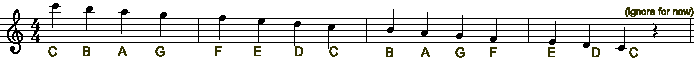
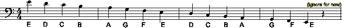

 

**The treble clef:

**
**
**
**
**
**Every Good Boy Deserves Favour, **
**
**
**F A C E**
**
**
**
**
**
The bass clef:

**

**
**
**Good Boys Deserve Fun Always**
**
**
**All Cows Eat Grass**
**
**
**
**
**
**
**
**
**http://www.wikihow.com/Read-Music **
**
**

[**http://www.piano-lessons-info.com/read-piano-notes.html**](http://www.piano-lessons-info.com/read-piano-notes.html)